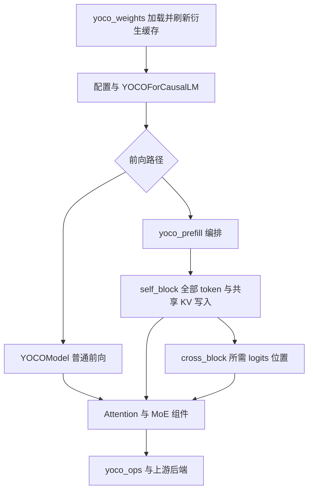

# YOCO 新版代码导读

当前目录 `vllm-yoco-version-0.29` 保留 YOCO 的模型入口和 Fast/Align 语义，
将原先集中在一个大文件里的实现拆到各自负责的模块。
`vllm/model_executor/models/yoco.py` 从审阅基线的 5,437 行缩到 1,040 行。
读模型时先看前向执行顺序；需要改哪类行为，再进入对应组件或算子。

## 这两轮主要改了什么

第一轮将完整开发快照 `dd465efd12` 迁到官方上游 `ca67438c08`，
该上游包含 `vllm/models/deepseek_v41`。重构提交为 `f7ab70e649`，
FA4 FP8 KV 补充修复为 `aab6d69e67`，验证报告提交为 `fa3d96d0f0`。

| 以前集中或隐含的职责 | 现在的落点 | 修改时的好处 |
| --- | --- | --- |
| 大模型文件里的归一化、RoPE、路由、投影 kernel | `layers/yoco_ops/` | 算子实现、fake 函数和注册放在一起 |
| 模型构造顺便更改后端设置 | `models/yoco_config.py` 的 decision/apply | 能分别测试后端选择与启动副作用 |
| 多处复制的 MoE 动态属性 | `config/yoco.py` 的 `YocoMoEPolicy` | 后端重建、fallback 时沿配置传递 |
| 模型文件里的 attention 与专家组合 | `layers/yoco_attention.py`、`layers/yoco_moe.py` | 组合逻辑与底层数学实现分开阅读 |
| checkpoint 映射与衍生权重缓存 | `models/yoco_weights.py` | 加载报告、缓存刷新有统一入口 |
| fast prefill、远端尾块、路由 dump | `yoco_prefill.py`、`v1/yoco_cache.py`、`yoco_diagnostics.py` | 缓存边界与诊断生命周期可单独核对 |

第二轮合入 `fhb-dev-9-18` 的 `7f4af5248d`、`e8cb46cf64`。
其中大量开发内容已在第一轮完整快照中，实际新增主要是两种精度的
decode 基准脚本、固定输入、性能资料，以及撤下 FP8 W2 的 M16 调参项。
本轮将两个脚本的公共实现放入 `tools/yoco_alignment/benchmark_fast_decode.py`，
两个命令入口只选择精度，计时方式和运行时审计共用一份代码。
具体差异与验证见[增量合并报告](fhb-dev-9-18-merge.md)。

## 第一次建议按这个顺序读

1. [模型入口](../../vllm/model_executor/models/yoco.py)：先找
   `YOCOForCausalLM.forward`、`YOCOModel.forward`、`YOCODecoderLayer`。
   前者选择普通或 fast-prefill 路径；后者展示 self layers 的循环、
   共享 K/V 的产生与 cross layers 的执行顺序。
2. [Fast prefill](../../vllm/model_executor/models/yoco_prefill.py)：读
   `_fast_prefill_forward`。Self 部分处理全部输入并写共享 KV；
   cross 部分只处理需要 logits 的位置。注意静态 buffer、padding 和 DP metadata 的恢复。
3. [Attention](../../vllm/model_executor/layers/yoco_attention.py)：读
   `YOCOSelfAttention` 与 `YOCOCrossAttention` 的构造和 `forward`，
   对照 self 滑窗、cross 共享 KV，以及投影和归一化的 dtype。
4. [MoE](../../vllm/model_executor/layers/yoco_moe.py)：读
   `YOCOMoE`、`YOCOSharedExperts` 和 latent input/output transform，
   看路由权重、shared/routed 专家及 latent 结果如何组合。
5. [配置](../../vllm/config/yoco.py)与
   [后端选择](../../vllm/model_executor/models/yoco_config.py)：确认 Fast/Align、
   dtype、设备、拓扑和量化条件在哪一步决定执行路径。
6. [权重加载](../../vllm/model_executor/models/yoco_weights.py)：最后读
   `load_weights`、`_YocoWeightLoader.load_one`、`refresh_derived_weight_caches`。
   此时再看对应的 `yoco_ops` kernel 和测试，容易把输入输出放回完整模型中理解。



完整 CUDA Graph 的 decode 会复用普通模型路径；fast prefill 的拆分路径
还有 warmup 与图捕获条件，应一起阅读函数中的分支，不能只按图推断所有调用。

## 要改一个功能，去哪里

以下路径均相对于仓库根目录。

| 想改的行为 | 首先修改/阅读 | 相邻验证入口 |
| --- | --- | --- |
| 层数、循环、self/cross 组合 | `models/yoco.py`，位于 `vllm/model_executor/` | `tests/model_executor/test_yoco_attention.py` |
| RMSNorm、clip、残差融合 | `vllm/model_executor/layers/yoco_ops/norm.py` | `tests/model_executor/test_yoco_normalization.py` |
| RoPE 与旋转权重 | `vllm/model_executor/layers/yoco_ops/rotary.py` | `tests/model_executor/test_yoco_rotary.py` |
| Top-k 与路由概率 | `vllm/model_executor/layers/yoco_ops/routing.py` | `tests/model_executor/test_yoco_routing.py` |
| Q/K/V 投影、lambda、小矩阵 GEMM | `vllm/model_executor/layers/yoco_ops/projection.py` | `tests/model_executor/test_yoco_projection.py` |
| 专家/latent/shared 组合 | `vllm/model_executor/layers/yoco_moe.py` | `tests/model_executor/test_yoco_moe_composition.py` |
| FP8 加权、permute、expert 执行 | `vllm/model_executor/layers/yoco_ops/fp8*.py` | `tests/kernels/moe/test_yoco_fp8*.py` |
| FP8 W2 的配置选择 | `vllm/model_executor/layers/fused_moe/experts/yoco_triton.py` 与 `yoco_configs/` | `tests/model_executor/test_yoco_fp8_w2_config.py`、`tests/kernels/moe/test_yoco_fp8_w2.py` |
| MoE 策略与后端门槛 | `vllm/config/yoco.py`、`vllm/model_executor/models/yoco_config.py` | `tests/model_executor/test_yoco_config.py`、`test_yoco_fast_decode.py` |
| checkpoint 名称、专家分片、缓存刷新 | `vllm/model_executor/models/yoco_weights.py` | `tests/model_executor/test_yoco_attention.py`、`test_yoco_conversion.py` |
| fast prefill 与远端 prompt 尾块 | `vllm/model_executor/models/yoco_prefill.py`、`vllm/v1/yoco_cache.py` | `tests/model_executor/test_yoco_prefill.py` 与 connector 测试 |
| 路由诊断 | `vllm/model_executor/models/yoco_diagnostics.py` | `tests/model_executor/test_yoco_diagnostics.py` |
| 两种精度的 decode 测量 | `tools/yoco_alignment/benchmark_fast_decode.py` | `tests/tools/test_yoco_decode_benchmark.py` 与真实 GPU 脚本 |

实际定位时可直接搜索符号，比依赖会移动的行号稳定：

```bash
rg -n 'class YOCOForCausalLM|def forward' vllm/model_executor/models/yoco.py
rg -n 'YocoMoEPolicy|yoco_policy' vllm/config vllm/model_executor
rg -n 'try_get_yoco_fp8_w2_config' vllm tests
```

## 维持这套结构的几个约定

**配置在构造阶段确定。** `get_yoco_execution_mode` 统一解析模式，
`YocoMoEPolicy` 是 frozen dataclass。增加策略应进入此配置，再通过
`FusedMoEConfig` 传给后端。需要派生不同策略时使用 `dataclasses.replace`；
forward 不逐层复制属性。`resolve_yoco_fast_moe_backend` 返回决策，
调用方显式 `apply(vllm_config)`，便于看到启动设置何时改变。

**组件组织计算，算子拥有数学实现。** 新 kernel 放进相应 `yoco_ops` 模块，
将 wrapper、fake implementation 和 custom-op registration 一起维护。
Attention/MoE 组件负责张量组合与调用条件，主模型负责层次和执行顺序。
已有精度辅助模块如 `yoco_attention_fp8.py`、`yoco_fast.py` 仍有各自职责，
先复用现有实现，再决定是否需要新文件。

**权重更新必须连同缓存生命周期考虑。** 上游专家权重现在属于
`RoutedExperts`，路径包括 `.experts.routed_experts.`。
Loader 接受历史 checkpoint 别名，返回实际加载的参数名，并保留加载报告。
更新权重后统一刷新旋转、router、shared-expert 等衍生缓存。
已捕获的 CUDA Graph 依赖稳定地址，不能随意用新张量替换缓存；
修改后需验证重载导致输出变化、恢复旧权重后输出恢复，以及地址保持稳定。

**数值边界随优化一起保留。** Fast 不保证 bitwise，Align 的保证也有已验证范围。
路由权重在 W2 前后的应用时机、clip、归约顺序、scale 布局与舍入点都是行为。
例如 YOCO 的 FP8 group amax floor 为 `1e-4`，应通过配置限于 YOCO，
不能把它改成所有模型的公共默认值。

**小 M 优化必须有明确回退。** 本次 W2 表只列 M1/M2/M4，M8/M16 使用原配置。
单算子更快不能证明整模型更快：M16 正是因整模型回退而撤下。
不要对未测 M 自动插值，也不要扩展到未验证的设备或并行拓扑。

**诊断在启动时选择。** `create_yoco_route_dumper` 在模型构造时检查是否启用，
生产 forward 不轮询文件系统。调试旧脚本仍可使用 `yoco_compat.py` 中的兼容导出；
新增调用直接导入拥有实现的模块，兼容层只承担迁移用途。

## 如何判断改动正确

先阅读仓库 [AGENTS.md](../../AGENTS.md)，使用 `uv` 和 `.venv/bin/python`。
修改行为后先运行相邻测试，再根据风险验证真实模型。例如本轮 W2 与脚本改动：

```bash
.venv/bin/python -m pytest \
  tests/model_executor/test_yoco_fp8_w2_config.py \
  tests/tools/test_yoco_decode_benchmark.py -q

# 以下需要 B200；覆盖分组/直接路由、padding、Graph 和独立数值参考。
.venv/bin/python -m pytest tests/kernels/moe/test_yoco_fp8_w2.py -q

# 在已安装本分支的单卡 B200 环境中分别运行，输出路径须尚不存在。
.venv/bin/python tools/yoco_alignment/benchmark_fast_bf16_decode.py \
  --model /path/to/yoco-checkpoint --output results/bf16.json
.venv/bin/python tools/yoco_alignment/benchmark_fast_fp8_decode.py \
  --model /path/to/yoco-checkpoint --output results/fp8.json
```

两种精度必须使用同一固定输入与计时边界。结果 JSON 中检查 `completed`、
实际专家/latent/KV dtype、后端、缓存命中、输出长度，以及源文件与数据哈希。
可加 `--profile-dir` 检查真实 CUDA Graph；配置写着启用 Graph 本身不是执行证据。
模型输出或数值路径变动还应补匹配输入的 logits/logprob 对照及模型评估；
导入成功、配置单测和吞吐数据各自只证明其覆盖的行为。

第一轮报告包含单 B200 数值、FP8/FP8 KV、Graph reload、同卡 1P1D 和 Qwen
回归；其拓扑、样本和 trace 限制见[迁移报告](migration-v029.md)。
当前上游的 P/D KV 布局与旧版不同，两端需一起升级；单卡验收不覆盖多卡并行。
DeepSeek V4.1 的算子也有不同的量化分组和缓存语义，是否复用应先核对合同。

## 查看本次实际差异

```bash
# 第一轮重构提交；使用第一父提交，便于查看迁到上游后做的整体改变。
git diff f7ab70e649^1 f7ab70e649 -- vllm/model_executor/models/yoco.py

# 本轮增量：最后一个第一轮文档提交到当前版本。
git diff --stat fa3d96d0f0 HEAD
git diff fa3d96d0f0 HEAD -- tools/yoco_alignment tests/model_executor/test_yoco_fp8_w2_config.py
```

从[模块职责](migration-v029.md#ownership-and-contracts)了解第一轮拆分，
从[本轮合并报告](fhb-dev-9-18-merge.md)查看新增内容和测试结果，
历史性能资料继续保存在 `docs/yoco/performance/`。
