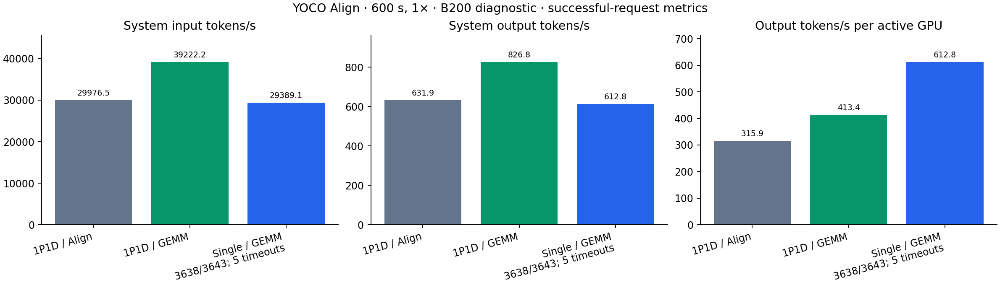
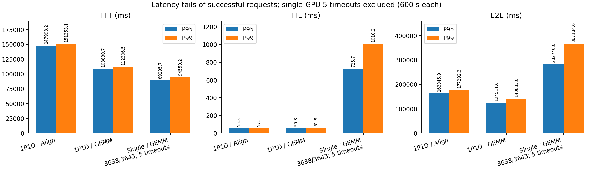
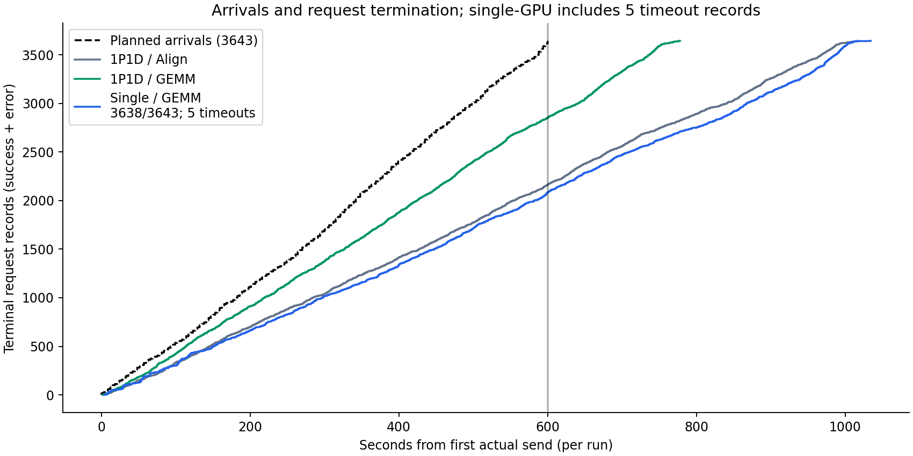

# 四卡 B200：Align 1P1D GEMM 优化与 llm-train 联动验证

日期：2026-09-07。所有性能轮次均启用 `--align`，使用同一 YOCO L3 checkpoint。

同卡1P1D输出吞吐从 **631.87** 变为 **826.76 tok/s**，变化 **+30.84%**。
TTFT P95变化 **-26.46%**，E2E P95变化 **-23.63%**；ITL P95变化 **+8.27%**。
数值与性能的验收范围分别列在下文。本轮是共享节点、单次配对、无预设延迟SLO的诊断实验。

## 资源切换

按用户授权删除 `yoco-align-prob-b200-20260901`，确认旧 Pod 消失后创建
`yoco-align-fast-vllm-vllm-train`，全过程维持四卡资源预算。

| 项目 | 新 Job |
| --- | --- |
| context / namespace | `oidc@msr02` / `bonete01` |
| Pod | `yoco-align-fast-vllm-vllm-train-master-0` |
| Pod UID | `505f46a3-597a-40c3-8260-d213fae60136` |
| 节点 | `slc01-cl02-hgx-0228` |
| GPU | 4 × NVIDIA B200，实际分配 GPU2/3/4/5 |
| 资源 | CPU48、memory959Gi、RDMA1 |
| 镜像 | 复用旧 Job 的不可变镜像摘要，见 `resource-switch/new-job.yaml` |
| 1P1D | TP1 Prefill GPU4 + TP1 Decode GPU5 |
| 训练验证 | GPU2；计时阶段 GPU2/3 保持空闲 |

CPU 从旧 Job 的51.5核调整到48核，满足当前服务端 GPU×12 资源规则。
没有修改测试的 OMP8、模型、调度参数或 trace。新旧 Job 恰好落到同一物理节点和四张GPU。
GPU0/1/6/7属于其他Pod且有负载，因此本实验仍属于 shared-node diagnostic。

旧 `/data` 是容器临时盘。删除前已将其归档到持久PVC，保留此前唯一的整模型 `.pt`
证据、运行源码及环境；仅排除已废弃的 `private-restore` 进程环境快照。
归档321290403840字节，SHA256
`a61bc7fa991a92b85bedc6212f8418f1e586fef8c5cf564c07aa7c32957003e2`。
读回SHA及tar结构校验已通过，证据见 `resource-switch/BACKUP_COMPLETE.json`。
归档路径：`/mnt/pvc/lidong1/yoco-align-fast-vllm-vllm-train-migration-20260907/old-data.tar`。
备份校验过程遇到两个索引写入者同名；原SHA校验已通过，之后独立目录校验采用本地临时输出，
再整体复制到PVC。冲突日志保留，没有把数据校验失败改写为通过。

## 运行环境复现

恢复后3660个vLLM文件及117个训练Python源文件校验通过。
旧容器系统目录后装的FlashInfer/Triton不属于基础镜像：先后发现FlashInfer缺失、
Triton回落至镜像的3.6.0。对应两次启动保留日志并退出，没有用于性能比较。
已将历史版本 `flashinfer-python==0.6.8.post1`、`triton==3.8.0` 恢复到独立venv，
移除服务PYTHONPATH对全局site-packages的强制优先级，并核对实际模块路径。

实际运行环境：Torch `2.11.0a0+eb65b36914.nv26.02`、CUDA13.1、Triton3.8.0、
Transformers4.57.6、FlashInfer0.6.8.post1。AIPerf仍使用原PVC上的独立0.12.0环境，
子进程不继承服务端PYTHONPATH。CUDA13.1兼容库搜索路径保持继承。

native验证额外使用隔离的 `more-itertools==10.8.0`；异步回归使用隔离的 `pytest-asyncio==0.24.0`。推理服务的依赖版本不受这两个测试目录影响。

## 优化思路与本轮修复

两端共用16项精确M的MoE launch配置，补齐2/4/16行decode尺寸，默认关闭。固定K tile32、split-K1、Top8按原顺序FP32累加和BF16落地边界；不采用跨K并行归约，也不按最近邻选配置。仅固定K划分不足以普遍证明bitwise，因此保留逐字节的实际模型检查。

profile SHA256：`7b5f496599475ce9f044af9557cdc482b6d6abe54e7fd67f268a3fe7982672dc`。两端通过 `VLLM_YOCO_ALIGN_MOE_CONFIG` 指向同一文件。原始Align关闭profile，GEMM候选显式开启。

首次真正1P1D测试发现Mooncake缺少YOCO最终提示块交接约定：2048-token的logits最大绝对差0.125，完整log-prob约0.24997；绕过传输的同一个D、以及单实例都通过105项字节比较。修复使P截断和D尾部重算边界一致，保留需要的滑窗历史。另修复空pull仅释放P缓存、却错误通知D接收完成的问题。详见 [修复分析](pd-tail-fix/FIX.md) 和 [代码补丁](pd-tail-fix/mooncake-tail-and-empty-recv.patch)。

当前截断P暂时跳过前缀缓存读取，沿用已有NIXL正确性策略。原始Align和GEMM候选均带相同修复；单实例仍可读取前缀缓存，因此单实例对照包含当前P/D缓存实现的代价，不能把差异全部归因于GEMM或KV传输。

## 数值验证

| 配置 | 检查 | 逐字节通过 |
| --- | --- | ---: |
| 原始1P1D | 服务实际连续8-token | 105/105 |
| 原始1P1D ↔ llm-train | 单条与九条packed，含CE | 72/72 |
| 候选1P1D | 服务实际连续8-token | 105/105 |
| 候选1P1D ↔ llm-train | 单条与九条packed，含CE | 72/72 |
| 候选单实例 | 服务实际连续8-token | 105/105 |
| 候选llm-train优化配置命中 | 追加因果后缀，实际命中profile | 72/72 |

提示长度覆盖33/129/512/2048及15/16/17/31/32块边界；服务逐条测试cold/hit，比较每条实际连续8个输出位置的hidden、154880维全量logits和FP32全量log-prob。训练使用实际生成token作teacher forcing，以train模式、启用梯度的单条和packed-nine前向对照全部位置及token CE。

每组服务105项由54项相对冻结单实例的连续8位置比较、27项cold/hit的连续8位置比较、24项相对历史训练已验证首位置的比较组成；训练侧72项为9条序列×单条/packed两种布局×hidden/logits/log-prob/CE四类张量。

另用因果后缀将训练侧MoE总M补齐到32/64/256/1024/4096，比较位置保持不变，并记录这些优化配置被实际选择；该额外72项在性能计时全部结束后运行。

字节检查不使用容差，不只比较argmax；结论限于同权重、输入、位置、mask、BF16、单rank和已测执行配置。尚未覆盖所有长输入、任意并发或CP/EP拓扑，不要求backward、梯度累加、SGD更新bitwise。新增16项边界/通知测试，连同既有Mooncake/HMA同步30项及异步8项全部通过。

## 开源 trace 与性能结果

Mooncake FAST’25 toolagent trace，源文件23608行，maxlen81920过滤去掉116行、保留23492行（99.51%）；再按时间窗保留3643行，占源trace的15.43%。源SHA256 `48a2db1a13d3bc05e6330140c64f604ba366df20d3c9e128b5c35a01c1fa5f71`。冻结源时间300–900秒、1×，3643请求，30518473输入token、643375输出token；按原ISL/OSL/hash_ids合成提示，保持前缀关系和到达时间。它不含真实工具交互或模型质量标签。

冻结trace SHA256 `680e526d49545258c0ca5b635d0004a44cce2ce990d533ac32024cefee1f0170`。名义负载6.072 req/s、50864.12 input tok/s、1072.29 output tok/s。AIPerf0.12.0，固定调度、ratio1.0、streaming、server token counts、concurrency512、workers32、timeout600、每轮独立cache_salt；默认BOS的实际输入计数另留逐请求证据。

相同GPU4/5、maxlen81920、maxseq256、P budget32768、D budget8192、memory.85、chunked prefill、KV sharing、最终FA2和FULL_DECODE_ONLY。单实例在同一GPU5、budget32768，其余客户端及trace参数相同。

| 指标 | 1P1D 原始 Align | 1P1D GEMM 候选 | 单实例 GEMM 候选 |
| --- | ---: | ---: | ---: |
| 实际推理GPU | 2 | 2 | 1 |
| 完成/计划请求 | 3643/3643 | 3643/3643 | 3638/3643 |
| 输入 tok/s | 29,976.53 | 39,222.23 | 29,389.12 |
| 输出 tok/s | 631.87 | 826.76 | 612.83 |
| 完成 req/s | 3.58 | 4.68 | 3.52 |
| 每推理GPU输出 tok/s | 315.94 | 413.38 | 612.83 |
| 按预留四卡摊销输出 tok/s/GPU | 157.97 | 206.69 | 153.21 |
| AIPerf总耗时 s | 1,018.19 | 778.17 | 1,034.49 |
| 末次计划到达后的完成耗时 s | 418.19 | 178.17 | 434.49 |
| 发送调度lag P99 ms | 265,905.39 | 60,833.25 | 295,920.39 |
| 最大in-flight | 512.00 | 512.00 | 512.00 |
| 调度降速 | 1.0 | 1.0 | 1.0 |
| 请求错误（含流式超时） | 0 | 0 | 5 |
| HTTP非2xx / OSL不符 | 0 / 0.0 | 0 / 0.0 | 0 / 0.0 |
| 逐请求token计数全通过 | True | True | False |
| 客户端门槛通过 | False | False | False |
| 服务/传输门槛通过 | True | True | True |

单实例有5条流式请求在HTTP200后达到600秒超时，成功完成3638/3643条，全量token核对失败；两组1P1D均完整成功。失败case和600秒timeout保持原样。单实例吞吐及TTFT/ITL/E2E来自成功请求，超时记录没有这些统计值；其尾延迟存在幸存者偏差。

以下只是各轮已报告吞吐的算术比值，不能作为完成同样工作的等成本效率结论：候选1P1D的总输出吞吐相对单实例变化 **+34.91%**；按实际参与推理的GPU归一化后变化 **-32.55%**。计时期间GPU2/3空闲。单实例仅使用GPU5，但整个Job仍预留四卡，所以另列吞吐÷4。

| 延迟，ms，P50 / P95 / P99 | 1P1D 原始 Align | 1P1D GEMM 候选 | 单实例 GEMM 候选 |
| --- | ---: | ---: | ---: |
| TTFT | 122,889.54 / 147,998.20 / 151,353.14 | 63,172.24 / 108,830.68 / 112,306.51 | 68,053.92 / 89,295.66 / 94,550.19 |
| ITL | 47.05 / 55.25 / 57.52 | 54.08 / 59.82 / 61.75 | 386.09 / 725.70 / 1,010.19 |
| E2E | 127,303.99 / 163,045.94 / 177,292.26 | 73,431.68 / 124,511.57 / 140,835.00 | 84,894.61 / 282,746.03 / 367,184.59 |

AIPerf原始records保留请求计数和HTTP时序，但request_chunks/response_chunks为空，没有全量trace输出概率。因此3643请求成功不能作为整个trace前向bitwise的证据；数值结论仅来自独立的上述张量捕获。

普通E2E从实际发送开始，不含客户端因并发上限等待的时间。调度降速时，末次计划到达后的耗时也包含迟发请求；不能把它全部称为服务端排空时间。客户端门槛失败的轮次不属于容量验证通过。

## 传输、缓存与系统审计

同卡1P1D A/B的服务命令、选定环境、GPU UUID和客户端参数核验通过，差异为显式MoE profile；单实例使用同一D GPU。冻结的3778个源文件在测试结束后SHA256全部匹配；四张分配GPU无计算进程，已检查的不可纠正ECC计数为0，测试时间段内可读取的内核日志未见GPU错误。见 [配置核验](pd-tail-fix/CONFIG_EQUIVALENCE.json) 与 [最终审计](pd-tail-fix/FINAL_AUDIT.json)。

| 配置 | 最大指标采集间隔 s | 采集错误 | 计数器重置 | 最终排空 |
| --- | ---: | ---: | ---: | --- |
| 1P1D 原始 Align | 1.234 | 0 | 0 | True |
| 1P1D GEMM 候选 | 1.294 | 0 | 0 | True |
| 单实例 GEMM 候选（5超时） | 1.226 | 0 | 0 | True |

| 配置/角色 | 传输次数 | 传输GiB | 传输P95 ms | 失败 | 最终队列 |
| --- | ---: | ---: | ---: | --- | --- |
| 1P1D 原始 Align/d | 0 | 0.00 | — | 0 | 0 |
| 1P1D 原始 Align/p | 2639 | 329.15 | 15.03 | 0 | 0 |
| 1P1D GEMM 候选/d | 0 | 0.00 | — | 0 | 0 |
| 1P1D GEMM 候选/p | 2200 | 329.07 | 17.38 | 0 | 0 |
| 单实例 GEMM 候选（5超时）/standalone | 0 | 0.00 | — | 0 | 0 |

| 配置/角色 | Prefix cache hit | Eager行加权profile命中 | 最大等待请求 |
| --- | ---: | ---: | ---: |
| 1P1D 原始 Align/d | 0.21% | 0.00% | 499 |
| 1P1D 原始 Align/p | 0.00% | 0.00% | 486 |
| 1P1D GEMM 候选/d | 0.23% | 2.05% | 488 |
| 1P1D GEMM 候选/p | 0.00% | 99.62% | 474 |
| 单实例 GEMM 候选（5超时）/standalone | 37.13% | 40.28% | 259 |

行加权命中率仅统计eager Python调用，不包括CUDA Graph重放，也不等于耗时占比。完整形状、设备遥测、缓存计数、指标连续性、逐请求token核对和原始延迟见 [JSON](pd-tail-fix/trace-comparison.json) / [CSV](pd-tail-fix/trace-comparison.csv)。

首轮smoke的50请求全部成功，但P在空闲后残留3条尚未消费的发送完成通知。原case保持失败。收尾脚本仅在传输任务已完成且无失败时，向P发一次不含KV转移参数的本地1-token控制请求，使正常调度器消费完成通知。正式P/D各轮均在AIPerf计时结束后执行并记录此收尾，随后验证队列全零；该控制请求不计入客户端吞吐、延迟或trace请求数。它会额外增加P服务计数，保留前后观测用于区分。当前服务自然空闲时自动回收该通知仍是后续实现优化项。

## 结论与后续优化

此次联动补齐了真实Mooncake P/D的尾块正确性，且原始/候选都通过实际生成与训练整批前向的已测字节检查。性能收益以本轮同卡trace表为准，不能用单个GEMM微测加速替代系统收益。

后续优先改进P前缀缓存对滑窗历史的保留约定，并处理空闲调度器的传输完成唤醒；再针对D端混合尾部prefill/decode的非2次幂M扩展精确配置。P端本轮绝大多数eager调用已为32768。本轮没有重新测训练backward/optimizer整步性能，不能从前向字节通过推断训练吞吐提高。要做容量或稳定kernel加速结论，需要独占节点、预设延迟SLO、较低无丢失负载及至少三组成对重复。

新四卡Job在测试后保留，测试进程停止；源码、数值/性能原始证据、最终GPU/Pod审计和PVC备份见同目录。代码及文档为本地修改，未commit/push。
