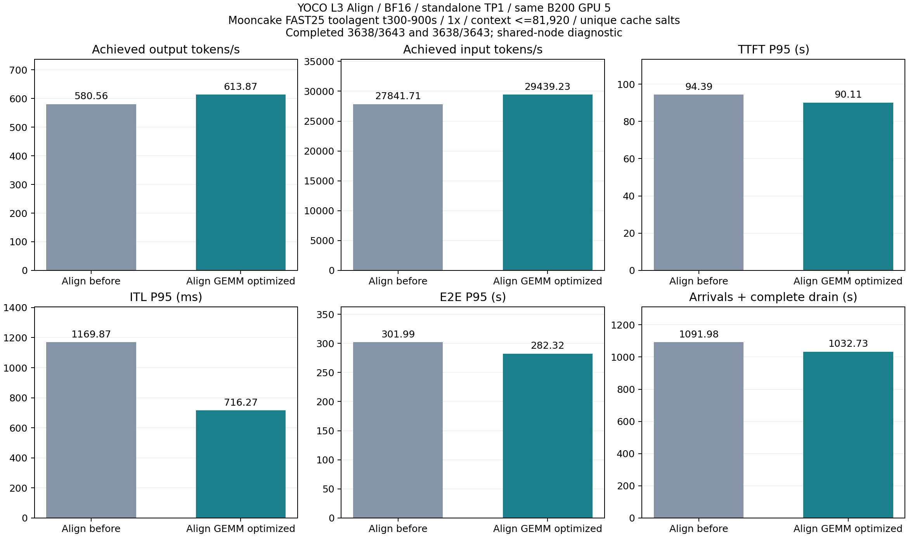
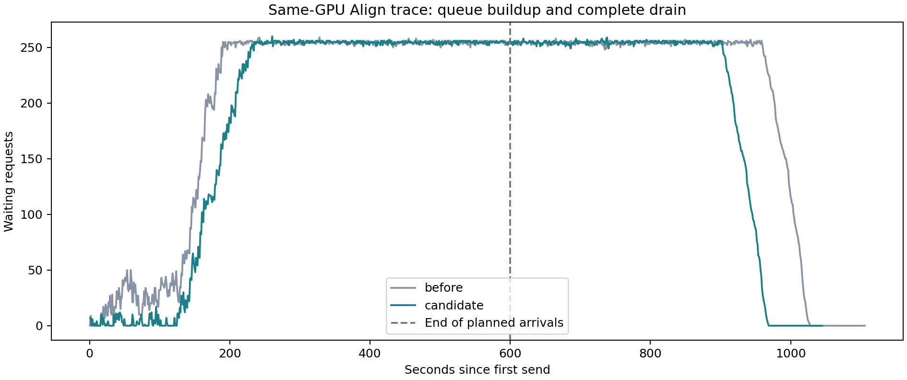

# Align GEMM B200 验证与性能

后续2/4/16行配置补测与双GPU资源状态见[小批次优化和1P1D进度](../align-1p1d-b200-20260906/REPORT.md)。
下文保留原13行profile的完整实验结果，不能把后续smoke差值替代这里的长trace测量。

日期：2026-09-06。用户指定 `yoco-align-prob-b200-20260901`，全程同一张 B200 GPU 5。

## 结果

- 计划内 **725 项整模型字节比较全部通过，最大差0**，含旧/新 Align、逐 token decode、prefill、带梯度训练、完整词表概率/CE，以及缓存/chunked/mixed 路径。
- 598组算子候选检查、80组两端 MoE 用例/470次字节比较和74项回归通过。没有将这些有限输入的结果推广为任意输入/部署的无条件保证。
- 同卡开源 trace：基线完成 3638/3643，候选 3638/3643；成功输出吞吐 580.56 → 613.87 tok/s（+5.74%）。
- TTFT/ITL/E2E P95 变化 -4.53% / -38.77% / -6.51%。负的延迟变化表示改善。
- 512/2048-token 训练整步吞吐变化分别 -0.50% / -0.15%，未观察到整步加速。

两端均未通过客户端负载审计，均有5个超时和发送降速；服务端排空检查通过。这里的吞吐比是过载条件下的成功输出吞吐改善，不能当作纯GEMM加速或通过1×到达率的容量证明。失败与排空记录全部保留。

## 实现与硬件

两端共用 `vllm/model_executor/layers/yoco_align_moe.py`。W13/W2 可以分别选择 N tile、warps、stages，
但共用 M tile/assignment。固定 K=32、split-K=1、原 weighted SwiGLU 和 Top-8 顺序累加，保留 BF16 舍入边界。
训练 backward 和前向数值 kernel 本体没有改动。只固定 split-K 并不能自动证明 bitwise，仍检查每个候选。

Profile 精确匹配 1, 8, 32, 64, 128, 256, 512, 1024, 2048, 4096, 8192, 16384, 32768 行，不做最近邻外推。
GPU/Torch/Triton/CUDA 元数据不匹配则拒绝。默认关闭，以 `VLLM_YOCO_ALIGN_MOE_CONFIG` 指定同一份 profile 供两端使用。

环境：`{'device_name': 'NVIDIA B200', 'torch_version': '2.11.0a0+eb65b36914.nv26.02', 'cuda_version': '13.1', 'triton_version': '3.8.0'}`。
Pod UID `87e4c50e-ff04-4fa7-a606-a6fded8357b1`，节点 `slc01-cl02-hgx-0228`，
GPU UUID `GPU-14379c29-e601-fc6d-b27c-4fd778ab772a`。其他 GPU 有任务，保留共享节点限制。

## 数值验证范围

核心矩阵：基线 vLLM167、基线 native116、候选 vLLM191、候选 native116；
服务缓存/chunked/mixed 两端各60，真实16K/32K合批15，总计725。
真实 `30A3B-180M-L3/0000-28000` 的 HF/native 对应权重，BF16、Router FP32、TP/CP/EP1、FA2、16-token page、single split。

长度33/129/512/1024/2048/4096/8192，decode 实际 B1/8/32/64/128/256，目标首/中/尾；
prefill 和 native 为单请求及 ragged B3，比较所有位置的 hidden、154880维 logits/log-prob 和 token CE。
这些序列含嵌套前缀，不能把累计位置数当作独立样本数。训练为 `model.train()`、梯度开启，未编译完整生产 NNScaler 图。

服务检查开启 KV-sharing fast-prefill、prefix cache，budget2048强制 chunking；实际 cache hits128/496/2032/8176。
16K/32K物理行通过2/4条约8K请求实现，并检查本次新增的配置命中。原 YOCO final-KV-block split 保留。
严格比较 dtype、shape、finite 和全部字节，包含 signed-zero 负控制。详情见 `MODEL_VALIDATION.json`。

## 算子性能

L3 形状、随机 BF16 权重与 hidden、分散随机路由和集中到8个专家的路由；后者包含强 clamp。
表为实际 vLLM 专家入口的 CUDA Graph 时间，单位 μs/单层调用，不是模型或请求吞吐。

| token 行数 | 分散：旧 → 新 μs | 加速 | 集中：旧 → 新 μs | 加速 |
| --- | --- | --- | --- | --- |
| 1 | 91.59 → 82.01 | 1.117× | 91.63 → 82.33 | 1.113× |
| 32 | 493.75 → 485.50 | 1.017× | 152.51 → 97.06 | 1.571× |
| 128 | 569.50 → 572.58 | 0.995× | 201.04 → 153.06 | 1.313× |
| 512 | 624.46 → 616.76 | 1.012× | 342.85 → 258.22 | 1.328× |
| 2048 | 1313.25 → 1180.89 | 1.112× | 1134.57 → 886.90 | 1.279× |
| 8192 | 5289.20 → 3571.56 | 1.481× | 4853.60 → 2980.77 | 1.628× |
| 16384 | 10405.91 → 6591.57 | 1.579× | 10025.04 → 5735.36 | 1.748× |
| 32768 | 21207.94 → 12131.08 | 1.748× | 20701.38 → 11343.70 | 1.825× |

配置初筛与配对选择后，再使用不同输入做两端验证/计时。小尺寸部分分散路由接近持平或有约1%回退；不能只挑集中路由收益。

## 训练整步

同卡真实 L3 native checkpoint，BF16参数（gate FP32）、单 rank、固定合成 token、native autograd + SGD，
CE chunk128/checkpoint开启，关闭 MTP/辅助 loss/整模型重计算。每个尺寸 A/B/B/A，四个独立进程重新加载同一权重，
每组2步预热、10步整步测量和3步同步拆项；每版20个整步样本。所有377个参数梯度存在且有限。
没有把加载/JIT计入耗时，也没有测生产多卡、MXFP8、AdamW 或长期收敛。

| tokens/步 | 基线 ms | 候选 ms | 吞吐变化 | 前向均值 ms | 反向均值 ms |
| --- | --- | --- | --- | --- | --- |
| 512 | 458.04 | 460.33 | -0.50% | 102.38 → 103.97 | 308.62 → 309.26 |
| 2048 | 597.61 | 598.53 | -0.15% | 109.39 → 109.80 | 442.50 → 443.09 |

整步是中位数，拆项来自另测的步骤；不强行相加。算子级收益没有转化为这两个尺寸的整步加速，需保留这一结论。

## AIPerf 开源 trace

Mooncake FAST'25 `toolagent_trace.jsonl`，源23608行，context<=81920保留23492行（99.51%）；
复用源时间300–900秒，600秒固定到达、1×、3643请求。
SHA256 `680e526d49545258c0ca5b635d0004a44cce2ce990d533ac32024cefee1f0170`。
公开 trace 只有时间、长度和hash关系，是合成回放，不是实际 prompt 内容或模型质量测试。

两端相同模型/GPU/服务命令/客户端设置，各自 smoke50 后长测至排空；独立 cache salt。
AIPerf0.12.0、record-processors1、并发安全上限512、timeout600、默认 BOS 行为、server token counts。
服务 maxlen81920、budget32768、maxseq256、memory.85，开启 prefix cache/chunking/KV-sharing fast-prefill。
Align 实际使用 FA2、FULL_DECODE_ONLY，禁用整模型 Inductor。差异只有新增 MoE profile。

名义请求/输入/输出速率：6.072 req/s、50864.12 input tok/s、1072.29 output tok/s。
客户端配置一致：True；服务命令一致：True；
已完成请求的输入/输出计数逐条一致：True；两端有完整usage的记录均为3638条。
缺少完整usage的请求下标分别为[725, 922, 1079, 1143, 1364]、[725, 922, 1079, 1143, 1364]，不能把它们当成成功请求。

| 指标 | 旧 Align | 新 Align GEMM |
| --- | --- | --- |
| 成功输出 tok/s | 580.561 | 613.873 |
| 成功输入 tok/s | 27841.709 | 29439.233 |
| 完成 req/s | 3.332 | 3.523 |
| 总耗时 s | 1091.984 | 1032.726 |
| 名义600s窗口之后的耗时 s | 491.984 | 432.726 |
| 发送调度 lag P99 ms | 350400.801 | 294097.007 |
| 最大 in-flight | 512.000 | 512.000 |
| 最大 running | 256.000 | 256.000 |
| 最大 waiting | 259.000 | 260.000 |
| prompt cache hit % | 37.297 | 37.271 |
| 最大 metrics 间隔 s | 1.027 | 1.002 |
| preemptions | 0.000 | 0.000 |
| 错误数 | 5.000 | 5.000 |
| 输出长度不匹配 | 0.000 | 0.000 |
| 发送调度降速 | 1.000 | 1.000 |
| 最终 running | 0.000 | 0.000 |
| 最终 waiting | 0.000 | 0.000 |

| 延迟 | 基线 P50 / P95 / P99 | 候选 P50 / P95 / P99 | P95 变化 |
| --- | --- | --- | --- |
| TTFT ms | 71594.09 / 94388.63 / 99997.64 | 67555.40 / 90108.40 / 95896.01 | -4.53% |
| ITL ms | 412.01 / 1169.87 / 1284.28 | 385.88 / 716.27 / 995.56 | -38.77% |
| E2E ms | 90118.13 / 301989.06 / 388399.08 | 84309.95 / 282323.44 / 367122.79 | -6.51% |

普通 E2E 从实际发送开始计时，不包含客户端因并发上限等待发送的时间；必须同时阅读 schedule lag/degraded。600秒之后的耗时在发生降速时也包含迟发请求，并非纯服务端排空时间。
两端均未通过客户端负载审计，均有5个超时和发送降速；服务端排空检查通过。这里的吞吐比是过载条件下的成功输出吞吐改善，不能当作纯GEMM加速或通过1×到达率的容量证明。失败与排空记录全部保留。

## 中止记录和处理

- Native 长序列审计的循环变量和未使用 CE z-loss 保存了上一轮 autograd 图，引起两次 OOM。
  释放两者并清理后，每轮结束回到约60.34GiB；此前通过项保留，仅补测缺失位置。
- 候选完整词表 log-softmax 曾因显存碎片无法分配4.73GiB临时输出。剩余两位置用独立进程和
  expandable allocator 完成，没有缩减或分块词表检查；训练性能测试恢复原 allocator 设置。
- 最初大 prefill 断言忽略了 YOCO final-block split，期望一次调用而实际为两次。调整 filler 长度，
  使主体段真实达到16K/32K，保留原调度器，检查新增 dispatch 次数；旧 capture 和失败日志保留。
- 比较器逐块检查全部字节和 finite；仅在精确字节相等后复用 SHA。47项元数据等价/边界/负零测试通过。
- 候选保留原始 capture，省去重复 assembled 文件；没有减少比较项。

## 文件与状态

`MODEL_VALIDATION.json`、`train-comparison.json`、`trace-comparison.json/csv`、`trace-config-equivalence.json` 为汇总。
`paired/profile.json` 为最终 B200 profile；扩展前的11项表保留为 `profile-before-large-prefill.json`。
所有脚本、命令、失败与通过日志保存在本目录及远端实验目录；大型原始 .pt 留在 Pod，未全部下载。

代码位于本地 `vllm_yoco_align_gemm_20260906` 和 `llm-train-align-gemm-20260906`，保留实验开关。
清理、原服务、GPU错误和最终源码哈希以 `FINAL_VALIDATION.json` 为准。
