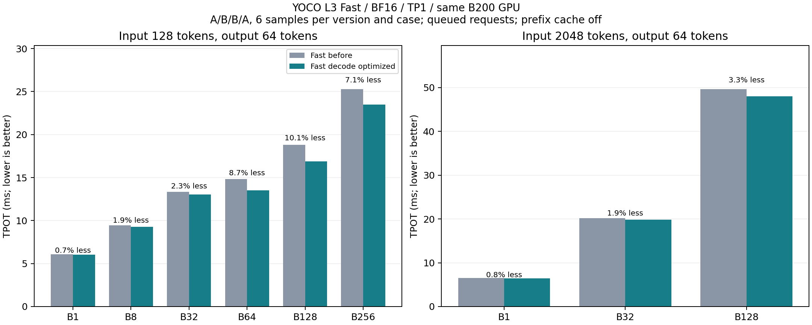
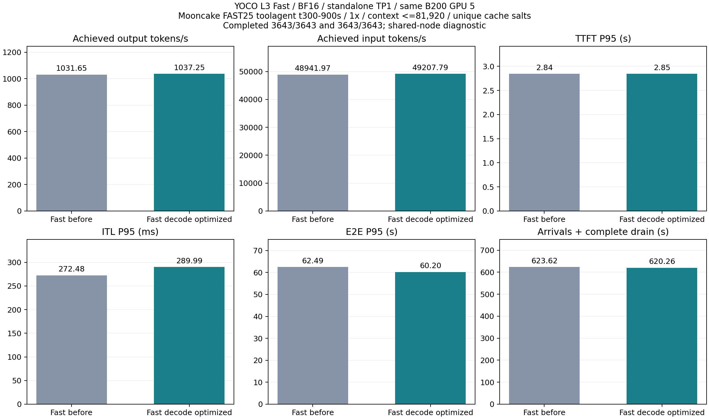
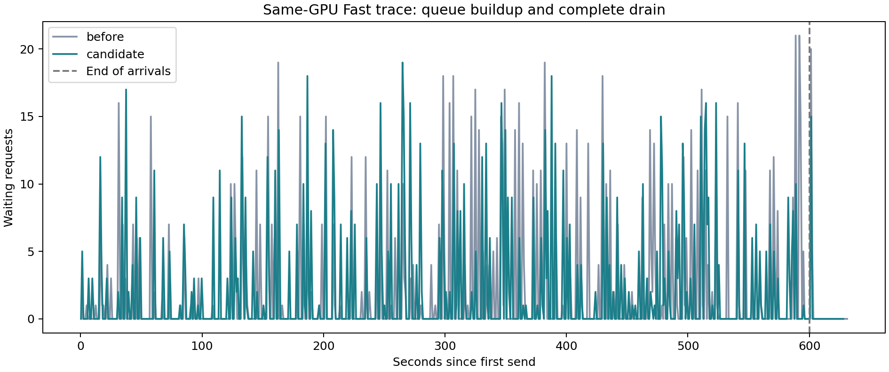

# YOCO Fast decode 优化报告

日期：2026-09-06。开发分支 `dev/yoco-fast-decode-20260906`，基于已发布的
`d7dcdd9e837531530c7aa4b03af534ca6d4704fa`，即已经包含上一轮 Prefill 优化的 Fast。

## 结果

同一物理 B200，A/B/B/A、每版每个负载 6 次：128-token 输入、64-token 输出时，
B64/B128/B256 的 TPOT 降低 **7.1%–10.1%**，
端到端吞吐提高 **6.0%–8.5%**。
小 batch、长输入及 Prefill 的独立结果见下表，不把局部加速推广到全部负载。

同卡公开 trace 输出吞吐 **1031.65 → 1037.25 tok/s**，
变化 **+0.54%**；TTFT / ITL / E2E P95 分别变化
**+0.08% / +6.43% / -3.66%**。
负的延迟变化表示改善。固定到达率限制了总吞吐，这不是最大容量测试。

Fast 仍不保证 bitwise。固定前缀抽样覆盖 128 个预测位置，每位置完整词表 154,880；
本次 Top-1 均一致，数值差异见后表。它不替代模型任务质量或长期稳定性评估。

## 实现与选择过程

- 稳定 C128 的 12 步 profile 中，960 次专家 GEMM 累计 140.455 ms，约每步 11.7 ms，是主要优化方向。
- 最终候选同样 12 步、960 次 GEMM 的累计时间为 114.411 ms，
  降低 18.54%。这是实际生成中的累计 kernel 时间；路由可能变化，不将它单独当作纯 kernel 因果证据。
- 分别筛选 W13/W2 配置，保留相同 M tile 以复用专家分派；验证包含均匀和集中路由。
- Triton 私有小 M 表只命中精确尺寸。最初按邻近 bucket 外推在 M48/65 集中路由上回退，因此没有采用。
- M64/128/256 使用预先测量的 CUTLASS tactic，要求完整 CUDA Graph、uniform batch 且每请求一个 token。
  多 token prefill、混合图、未测尺寸和 eager 调用继续使用原 backend 策略。
- 仅加载六条 GEMM1/GEMM2 tactic；FlashInfer 官方加载器检查 GPU/CUDA/library 元数据。
  已验证环境为 FlashInfer 0.6.8.post1、CUDA 13.1、cuBLAS 13.2.1、cuDNN 91900、B200。
- 保留已有 BF16 权重、128 experts、Top-8、SwiGLU clamp、`[up, gate]` 布局与共享 workspace；没有增加权重副本。
- FlashInfer 的 bucket 上限覆盖完整 scheduler budget，避免大 prefill 被映射到最后一个 decode bucket。
  16 项强 clamp 检查通过，1024-token prefill 的两个 GEMM 确认使用未缓存的 heuristic tactic。
- 不在线 autotune。依赖不匹配或已有其他显式 autotune cache 时回退；Align 不使用本轮配置。

启用需满足原 standalone Fast 的 B200/L3/BF16/TP1/KV-sharing 条件，图捕获上限不超过 256。
关闭新增 CUTLASS decode 选择：

```bash
--additional-config '{"yoco_fast_decode_cutlass": false}'
```

这保留 Triton 调参与已有 Prefill 策略。

## 固定负载测量

相同模型、GPU 5、BF16、maxlen16384、budget8192、maxseq256、memory .72；prefix cache 关闭，
chunked prefill 与 KV-sharing fast-prefill 开启，FULL_AND_PIECEWISE 图捕获到 256。
请求先全部入队再统一恢复调度。每个负载先预热，记录全部样本；没有挑选最快样本。
吞吐比例由相同 token 工作量的端到端时间计算，包含 Prefill 与调度。长输入的 TPOT 也可能包含混合调度干扰。

| 负载 | 基线 ms | 候选 ms | 吞吐变化 | 两对吞吐变化 |
| --- | --- | --- | --- | --- |
| decode-b1-s128 | 414.75 | 411.20 | +0.86% | +0.65% / +0.97% |
| decode-b8-s128 | 690.03 | 679.12 | +1.61% | +1.37% / +1.92% |
| decode-b32-s128 | 992.15 | 974.20 | +1.84% | +1.85% / +1.82% |
| decode-b64-s128 | 1127.93 | 1049.36 | +7.49% | +7.36% / +8.07% |
| decode-b128-s128 | 1529.78 | 1410.16 | +8.48% | +8.43% / +8.48% |
| decode-b256-s128 | 2130.34 | 2009.98 | +5.99% | +6.23% / +5.58% |
| decode-b1-s2048 | 485.45 | 481.97 | +0.72% | +0.90% / +0.38% |
| decode-b32-s2048 | 2055.03 | 2037.04 | +0.88% | +0.90% / +0.86% |
| decode-b128-s2048 | 5819.82 | 5691.36 | +2.26% | +2.35% / +2.17% |
| prefill-b1-s1024 | 84.79 | 84.80 | -0.01% | -0.19% / -0.37% |
| prefill-b8-s1024 | 151.84 | 153.25 | -0.92% | -1.56% / +0.44% |
| prefill-b1-s4096 | 82.78 | 82.42 | +0.44% | -1.86% / -0.09% |
| prefill-b8-s4096 | 535.10 | 532.25 | +0.53% | +0.97% / +0.28% |

| 输入长度 | Batch | 基线 TPOT ms | 候选 TPOT ms | TPOT 降低 |
| --- | --- | --- | --- | --- |
| 128 | 1 | 6.086 | 6.041 | 0.75% |
| 128 | 8 | 9.468 | 9.284 | 1.94% |
| 128 | 32 | 13.348 | 13.041 | 2.31% |
| 128 | 64 | 14.822 | 13.538 | 8.66% |
| 128 | 128 | 18.791 | 16.897 | 10.08% |
| 128 | 256 | 25.302 | 23.509 | 7.09% |
| 2048 | 1 | 6.482 | 6.429 | 0.83% |
| 2048 | 32 | 20.203 | 19.829 | 1.85% |
| 2048 | 128 | 49.662 | 48.035 | 3.27% |



## 数值检查

75 项相关回归通过，包含 Align；40 项独立 FP32 reference 检查通过，Triton 调参前后在这些输入上逐字节相同。
缓存 CUTLASS 的 16 项强 clamp 检查覆盖 limit=.5/10、均匀/集中路由以及 M64/128/256/1024。

完整模型比较通过替换采样输出 token ID 固定后续前缀，原始 logits 在替换之前抓取；不改变模型算术。
每个 batch 重复两次，目标位于首、中、尾；两端实际 batch 记录一致。该探针不用于计时。
KL 用本地 CPU FP64 log-softmax 计算，定义为 KL(基线 || 候选)。

| Batch | 抽样位置 | Logits bitwise | 平均 KL | 最大 KL | Top-1 一致率 |
| --- | --- | --- | --- | --- | --- |
| 1 | 8 | True | 0 | 0 | 100.0% |
| 8 | 24 | True | 0 | 0 | 100.0% |
| 32 | 24 | True | 0 | 0 | 100.0% |
| 64 | 24 | False | 6.95366e-05 | 0.000816989 | 100.0% |
| 128 | 24 | False | 7.69044e-05 | 0.000649444 | 100.0% |
| 256 | 24 | False | 9.44549e-05 | 0.00106687 | 100.0% |

CUTLASS 在部分大 batch 的重复结果也不是逐位确定的，原始重复差异保存在
`fixed-prefix-comparison.json`。本次内部筛选阈值为平均 KL <.01、最大 KL <.1，最终通过；
这只是数值筛选，不是任务准确率门槛。首轮实现曾误命中小 prefill，B1 出现较大 KL 波动，
因此被拒绝并收窄为单 token 图；该版本的速度不作为本报告最终结果。

## AIPerf 公开 trace

Mooncake FAST’25 `toolagent_trace` 源时间 300–900 秒，600 秒固定到达、1×、3643 请求，context <=81920。
源文件 23608 行，context 过滤保留 23492 行；冻结窗口 SHA256：
`680e526d49545258c0ca5b635d0004a44cce2ce990d533ac32024cefee1f0170`。
公开 trace 只有时间、长度及 prefix hash；是合成负载回放，不是在线 agent 任务或模型质量数据。

两端各自先 smoke50，再长测至完全排空。相同物理 GPU、服务参数、客户端参数、默认 BOS 行为，
每轮独立 cache salt；AIPerf 0.12.0，record-processors=1，并发上限 512。
服务 maxlen81920、budget32768、maxseq256、memory .85，开启 prefix cache。
共享节点、一次完整前后对照、没有声明延迟 SLO，因此结果为 diagnostic。

| 指标 | 基线 Fast | 候选 Fast |
| --- | --- | --- |
| 成功 / 计划 | 3643/3643 | 3643/3643 |
| 输出 tok/s | 1031.646 | 1037.250 |
| 输入 tok/s | 48941.972 | 49207.794 |
| 完成请求/s | 5.842 | 5.873 |
| 回放至排空 s | 623.623 | 620.255 |
| 600 秒后排空尾部 s | 23.623 | 20.255 |
| 调度 lag P99 ms | 12.366 | 11.212 |
| 最大客户端并发 | 216.000 | 213.000 |
| 最大 running | 210.000 | 206.000 |
| 最大 waiting | 21.000 | 21.000 |
| Prompt token cache hit % | 37.453 | 37.297 |
| 最大 metrics 间隔 s | 0.998 | 0.708 |
| 错误数 | 0 | 0 |
| 输出长度不匹配 | 0.0 | 0.0 |
| 回放调度降速 | 0.0 | 0.0 |
| Preemptions | 0.0 | 0.0 |
| 客户端审计 | True | True |
| 服务端审计 | True | True |
| Token accounting | True | True |
| 最终 running | 0.0 | 0.0 |
| 最终 waiting | 0.0 | 0.0 |

| 指标 | 基线 P50 / P95 / P99 | 候选 P50 / P95 / P99 |
| --- | --- | --- |
| TTFT s | 1.589 / 2.843 / 3.297 | 1.578 / 2.845 / 3.345 |
| ITL ms | 86.044 / 272.476 / 475.738 | 81.887 / 289.995 / 478.111 |
| E2E s | 4.692 / 62.492 / 91.350 | 4.524 / 60.203 / 86.938 |





两端实际输入/输出 token 数逐请求一致：True。
客户端配置只允许 cache salt、输出目录不同；服务命令一致。完整配置比较见 `trace-config-equivalence.json`。

## 保留的中间问题与证据

- 初次 profile 断言错误包含排空尾部；独立审计确认采样的 12 步均为 C128，原日志和退出码保留。
- 隔离 runtime 缺少 `workspace_init` fixture，补入仓库原 fixture 后完成检查；最终 75 项一起重跑通过。
- 远端 CPU 汇总两次 SIGSEGV，未改变 GPU 结果。原始张量复制本地后正常计算；不宣称已查明 CPU 崩溃根因。
- 小 prefill 数值筛选失败的候选保留为 V2；V3 及最终版本加入阶段和 uniform/single-token 边界。
- 失败与未采用的候选不混入最终配对时间，最终目录为 before-b、candidate-final-a、candidate-final-b、before-final。

主要结果：`short-comparison.json/csv`、`fixed-prefix-comparison.json`、`trace-comparison.json/csv`。
逐项源码哈希、原始日志、脚本、profile、张量和 AIPerf 原始导出保存在实验工作区
`yoco_results/fast-decode-optimization-b200-20260906/`；GPU runtime 位于
`/data/yoco-fast-decode-20260906/`。仓库 docs 发布报告、图表与汇总数据。

临时服务已停止，GPU 5 恢复 0 MiB 使用；原 Pod UID/restartCount 和 8600/8610/8620 服务保持。
两轮检查区间内未观察到 GPU 错误，uncorrectable ECC 计数均为 0。完整收尾证据见实验工作区的
`FINAL_VALIDATION.json`、`gpu-final.txt`、`pod-final.txt` 与 `protected-final.txt`。
