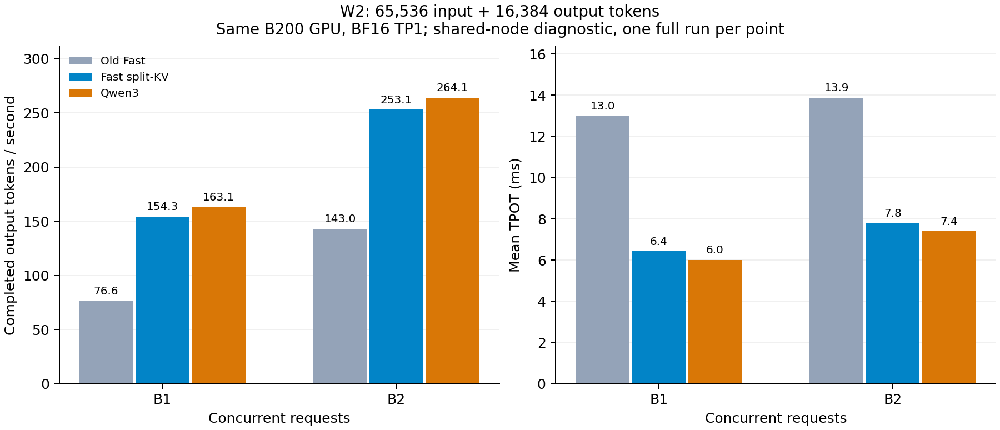

# YOCO Fast 低并发 W2 优化

日期：2026-09-08（UTC）。分支 `fhb-dev-9-8`，基线 `99bfbead2f967676c2054891de974987ed10dd82`。

## 问题与结果

Fast 沿用了旧 YOCO FA4 的 `force_single_split=True` 策略。长上下文、小 batch 的 cross-attention 因而无法使用 split-KV 并行。修复将强制单 split 限制为 Align，Fast 使用后端原有的自动调度。生产修改只涉及 FlashAttention 后端初始化条件，没有新增逐 token Python 分支、权重转换或量化。

完整 W2 为 **65,536 输入 + 16,384 输出**；请求先全部入队再恢复调度，确保完成全部输出。下表是完整请求的输出吞吐，包含 prefill 与调度：

| 并发 | 旧 Fast tok/s | 修复 Fast tok/s | Qwen tok/s | Fast 加速 | Fast/Qwen 吞吐比（旧→新） |
| ---: | ---: | ---: | ---: | ---: | ---: |
| 1 | 76.60 | 154.25 | 163.10 | 2.014× | 0.470 → 0.946 |
| 2 | 142.99 | 253.09 | 264.08 | 1.770× | 0.541 → 0.958 |

同物理 B200、不同时间串行测量。每个模式/并发各一次完整 W2；同节点其他 GPU 有工作，因此是 **diagnostic**，不作独占节点峰值容量或长期 SLO 保证。所有 W2 请求完成，输出长度精确；原始样本、时间和比较公式见 [COMPARISON.json](COMPARISON.json)。

## 定位过程

1. 2026-09-06 的 Fast 优化主要覆盖 B64/B128/B256。B1、128-token 输入的 TPOT 仅改善约0.75%，长上下文 W2 没有成为当轮验收负载。
2. 重新用当前 YOCO L3 与 Qwen3-30B-A3B-Instruct-2507 在同卡测量。B1/64K/128-output 的旧 Fast TPOT 为12.4266 ms，Qwen为6.0126 ms。
3. 旧 Fast 的12-step profile 中，每步40次 attention 执行；30层 self-attention forward 累计0.554 ms，10层 cross-attention forward 累计6.215 ms。专家GEMM累计约1.649 ms。主要差距来自 attention。
4. 源码确认 Fast 也被强制 `num_splits=1`。移除此限制后，首轮 B1/64K TPOT 为6.5010 ms。全 attention 的累计kernel时间（含修复后的combine）从6.769降到0.903 ms/step；cross forward从6.215降到0.490 ms/step。
5. 新增调用参数回归，随后完成短负载 A/B/B/A 顺序复测、完整 W2 与固定前缀数值检查。

Profile 是实际生成中的累计 kernel duration，可能包含 stream 重叠，不将累计值直接相加当 wall time。12步的每步请求数与query length已单独核查。原始汇总见 [PROBE_SUMMARY.json](PROBE_SUMMARY.json)；补丁见 [ATTENTION_PATCH.diff](ATTENTION_PATCH.diff)。

早期准备了小 M GEMV 实验脚本；profile 发现 attention 是更大的瓶颈，因此该候选没有运行、没有接入生产。

## 激活量的比较口径

当前 L3 的20组block参数中，10组self参数循环3次，decode实际执行30次self加10次cross。按已加载矩阵形状、Top-8/128路由比例以及真实执行次数累计，并排除输入embedding整表和一维norm参数：

| 口径 | YOCO L3 | Qwen3 |
| --- | ---: | ---: |
| 每token执行的矩阵权重元素 | 6.702883B | 3.041657B |
| YOCO中routed expert部分 | 3.774874B | — |
| YOCO中attention与shared-KV投影 | 1.712849B | — |
| YOCO shared expert / latent投影 / lm-head | 0.471859 / 0.251658 / 0.475791B | — |

这用于核对矩阵计算量，**不包含attention QK/AV，也不是实测HBM读取字节**。如果耗时只由这些矩阵元素决定且效率相同，吞吐比应近似是激活量比的倒数（Qwen/YOCO约0.454）；实际还取决于KV读取、循环执行、kernel启动和并行效率。应以当前checkpoint和完整负载实测为准。

## 短负载复测

每版两次独立模型进程、每进程每负载3个样本；Fast时间顺序为旧A、修复A、修复B、旧B。每一组前后使用同一脚本与配置；A组warmup生成128 token，B组warmup生成64 token，两组均已完成图预热。B脚本增加完整W2和数值检查，计时阶段未挂载logits抓取钩子。结果保留全部样本后取中位数。

| 负载 | 旧 Fast TPOT ms | 修复 Fast TPOT ms | 变化 |
| --- | ---: | ---: | ---: |
| b1-s128-o128 | 5.909 | 5.939 | +0.51% |
| b2-s128-o128 | 6.946 | 6.999 | +0.76% |
| b1-s65536-o128 | 12.399 | 6.497 | -47.60% |
| b2-s65536-o128 | 14.805 | 9.314 | -37.08% |

B2/64K仅生成128 token时，平均TPOT会混入另一请求的chunked prefill；该行不能解释成纯稳态B2 decode。完整W2用于低并发吞吐比较。模型比较使用相同有效token ID及长度，是固定形状合成负载；没有把它称为开源trace或在线agent任务。

## 正确性

- 配置/分派回归：**36 passed**。新增测试实际检查传给paged attention的`num_splits`：Fast保留0/4，Align固定1。
- 旧实现负对照：2个Fast用例按预期失败，其他3个通过；失败是`num_splits`断言，不是测试环境错误。
- 固定旧Fast生成的token前缀，再比较两端原始完整词表logits；采样token替换发生在logits抓取之后，不用于计时。
- 共 **48** 个预测位置，每位置完整词表154,880；全部有限，实际physical batch相同。CPU FP64计算 `KL(旧Fast || 修复Fast)`，平均 **0.000841031**，最大 **0.00671803**，Top-1相同 **47/48**。
- 本次唯一Top-1差异在B1/64K的第2个预测位置：旧结果两个候选logit相差0.03125，修复后并列，argmax选择改变；详情见 [TOP1_CHANGES.json](TOP1_CHANGES.json)。完整W2中B1的greedy序列哈希不同，B2两条序列哈希均相同；整模型吞吐是系统对照，不将其全部变化归因于单个kernel。
- 沿用此前Fast数值筛选阈值：平均KL<.01、最大KL<.1；不把它等同任务准确率或Fast bitwise保证。

| 固定前缀 | 位置数 | 平均 KL | 最大 KL | Top-1 相同 | Logits bitwise |
| --- | ---: | ---: | ---: | ---: | --- |
| fixed-b1-s128 | 8 | 0.00174323 | 0.00671803 | 8/8 | False |
| fixed-b1-s65536 | 8 | 0.000854835 | 0.00388139 | 7/8 | False |
| fixed-b2-s128 | 16 | 0.000656191 | 0.00449843 | 16/16 | False |
| fixed-b2-s65536 | 16 | 0.000567871 | 0.0027037 | 16/16 | False |

Align继续保留原single-split规则；严格batch-invariant路径仍按原逻辑选择FA2。本轮没有改变llm-train和共享Align kernel，不扩大原三端bitwise结论的条件。

## 环境与复现

- 保留Job：`yoco-align-fast-vllm-vllm-train`，Pod `yoco-align-fast-vllm-vllm-train-master-0`，节点 `slc01-cl02-hgx-0228`。
- 同物理GPU2，NVIDIA B200，UUID `GPU-3c98295b-46bd-92b3-ef14-82b5e35524f7`。没有更换Job、Pod或节点，没有启动并行模型压测。
- BF16，TP1/DP1，maxlen81920、prefill预算32768、maxseq256、memory .72、prefix cache关闭；chunked prefill与异步调度开启，FULL_AND_PIECEWISE图捕获1/2/4/8/16/32/64/128/256。YOCO启用其KV-sharing fast-prefill；Qwen使用标准路径。
- Torch `2.11.0a0+eb65b36914.nv26.02`，CUDA `13.1`，Triton `3.8.0`；FA4、BF16 Triton MoE、FlashInfer在线autotune关闭。完整命令和依赖路径保存在各case manifest。
- 实测backend源码SHA与本地基线/修复源码分别匹配，最终测试文件也与远端一致，见 [ATTENTION_SOURCE_VERIFICATION.json](ATTENTION_SOURCE_VERIFICATION.json) 和 [FINAL_VERIFICATION.json](FINAL_VERIFICATION.json)。全部6个服务进程成功退出，日志无CUDA/OOM/Traceback错误；收尾GPU2为0 MiB，Pod UID、节点、restart count未变。

完整原始结果位于本地 `yoco_results/fast-low-concurrency-20260908/`；PVC归档及SHA256见 [BACKUP.json](BACKUP.json)。包含原始profile、命令、测试负对照、全部测量样本、GPU telemetry和固定前缀张量。

## 后续优化范围

本轮解决了长KV、小batch下的attention并行漏项。小M专家GEMM/GEMV候选尚未执行或验收；修复后的短上下文吞吐也没有明显改善。后续应按实际profile再选择小M专家计算或kernel启动开销，并用开源trace检验收益。此次W2合成诊断不替代任务质量评测，也不把47/48的Top-1一致当作生成序列一致。

## 表格维护

本轮建立独立的 [低并发W2表](../performance/LOW_CONCURRENCY.md)，保留各行时间和来源。原 [Mooncake固定到达率表](../performance/THROUGHPUT.md) 的工作负载与统计口径不同，其历史数值保持原样。
