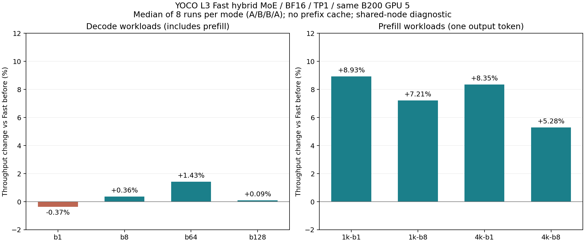
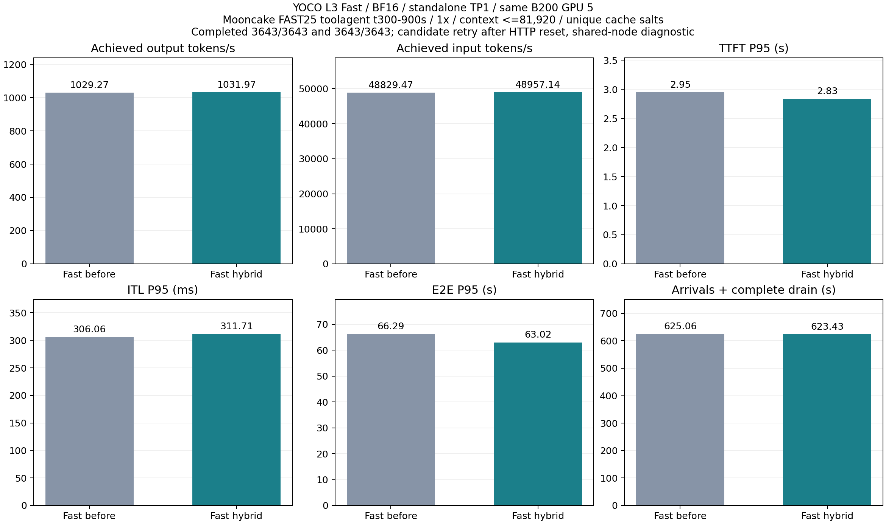
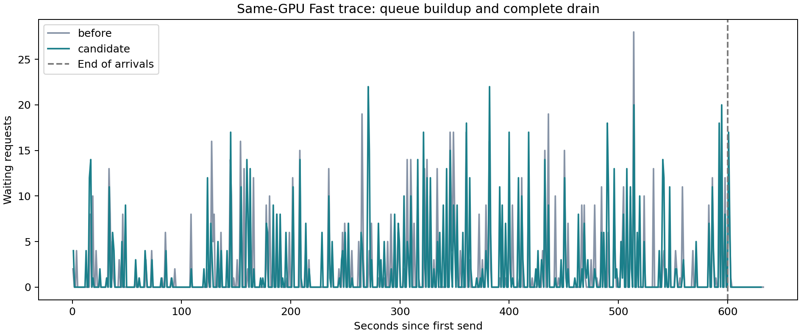

# YOCO Fast standalone 优化报告

日期：2026-09-05。分支：`dev/yoco-fast-optimization-20260905`。

## 1. 结果

本轮将大批量 Prefill 的 routed MoE 切换到 FlashInfer CUTLASS，并保留小批量 Triton。
同物理 B200 的 A/B/B/A 短测中，Prefill 吞吐提升
**5.3%–8.9%**。
Decode 工作负载端到端吞吐变化约 **−0.4% 到 +1.4%**；逐 token 时间基本持平，没有测到明确的 Decode 加速。

600 秒 Mooncake trace 同卡前后对照：输出吞吐从 **1029.27** 到
**1031.97 tok/s**，变化 **+0.26%**，整体吞吐基本持平。
TTFT P95、ITL P95、E2E P95 分别变化
**-3.92% / +1.85% / -4.92%**。
这里延迟的负值表示改善。主比较使用一次基线和候选的完整补跑，保留候选首轮失败；
节点其他卡有负载、未声明 SLO，因此结论属于 diagnostic。

Fast 不要求 bitwise，新旧 Fast 在部分高 batch 生成序列上有差异。
模型仍为 BF16、128 experts、Top-8，clamp 与模型数学定义保留；本轮没有改动 Align 前向 kernel。

## 2. 定位与实现

旧 standalone Fast 在各 token-row 形状使用 Triton；历史纯 Prefill / Decode 的 P/D 策略已有独立调优。
不能把大 M 的 CUTLASS 直接用于所有 Decode：之前的小 M 测量已发现回退风险。

本轮基线 profiler 中 `fused_moe_kernel` 共 800 次、聚合 CUDA 时间 121.404 ms，
是最大的 kernel 组。采样来自 C128 的 128→32 请求过程，延迟 4 步后记录 10 步；
其中有异步流与变化的调度形状，不能把聚合时间视为串行 wall-time 占比或纯稳定 C128 Decode。

最终策略限定于 SM100、YOCO L3 形状、BF16、无量化、TP/DP/PP/CP=1、standalone、
KV-sharing fast-prefill，并要求 FlashInfer CUTLASS 可用。明确启用 autotune 或不匹配的配置沿用原选择。

```text
threshold = max(1024, max_num_seqs + 1, max_cudagraph_capture_size + 1)
M >= threshold : FlashInfer CUTLASS heuristic
M <  threshold : 原 Fast Triton 调参、W2 配置和 MoE sum
```

测试配置中 threshold=1024，保留所有已配置的纯 Decode 图在 Triton 路径。
CUTLASS 将 W13 从 `[gate, up]` 转为 `[up, gate]`；Triton fallback 明确读取换序布局并保留 clamp。
fallback 使用 WorkspaceManager 的跨层共享空间，避免为每层长期保留大激活缓冲区。

配置自动生效，关闭方式为：

```bash
--additional-config '{"yoco_fast_standalone_flashinfer_moe": false}'
```

新增源码位于 `vllm_yoco_fast_optimization`，原 Align 工作树和训练工作树保持原状态。
起点含历史未提交开发内容，因此增量补丁以本轮开始时的源码快照为基准，不能只用旧 HEAD 代表起点。

## 3. 固定形状短测

同 GPU 5，BF16，FA4，maxlen16384、budget8192、maxseq256、mem .72、关闭 prefix cache，
开启 chunked prefill / KV-sharing fast-prefill / CUDA Graph，capture=[1,2,4,8,16,32,64,128,256]。
固定 token-ID 输入，greedy、ignore_eos、固定输出长度。每档先完整预热一次；3 次第一对加5次反向顺序复测，
每个版本每档8次，使用 wall-time 中位数。原始两对结果和所有样本保留，没有省略慢样本。
第一轮基线配置了 profiler，但显式采集发生在计时之后；第二轮两端均没有 profiler 配置。

吞吐变化 = 旧时间 / 新时间 − 1。B1/B8 Decode 为128→128，B64/B128为128→64；
此处 Decode 工作负载计时仍包含请求 Prefill 与调度，单独的 TPOT 见后表。
Prefill 1K/4K 各测 B1/B8，输出1 token。

| 工作负载 | 旧 Fast ms | 新 Fast ms | 吞吐变化 | 第一对 / 第二对 |
| --- | --- | --- | --- | --- |
| decode-b1 | 800.704 | 803.703 | -0.37% | -0.59% / -0.33% |
| decode-b8 | 1332.282 | 1327.550 | +0.36% | +2.67% / -2.29% |
| decode-b64 | 1172.482 | 1155.949 | +1.43% | +0.78% / +3.83% |
| decode-b128 | 1546.446 | 1544.980 | +0.09% | -0.13% / +0.37% |
| prefill-1k-b1 | 85.851 | 78.816 | +8.93% | +2.90% / +8.58% |
| prefill-1k-b8 | 212.850 | 198.532 | +7.21% | +5.31% / +6.83% |
| prefill-4k-b1 | 89.787 | 82.864 | +8.35% | +10.55% / +10.74% |
| prefill-4k-b8 | 564.737 | 536.403 | +5.28% | +6.06% / +4.97% |



| Batch | 旧 Fast TPOT ms | 新 Fast TPOT ms | 时间变化 |
| --- | --- | --- | --- |
| 1 | 6.0589 | 6.0797 | +0.34% |
| 8 | 9.5309 | 9.5225 | -0.09% |
| 64 | 15.0049 | 15.0389 | +0.23% |
| 128 | 18.7853 | 18.9671 | +0.97% |

Prefill 在两对测量中均改善；Decode 波动随 batch 和调度变化。
尤其 B8 两对分别为 +2.67% / −2.29%，不能将其中单次收益当作稳定 Decode 加速。

## 4. AIPerf 同卡长 trace

复用 Mooncake FAST’25 `toolagent_trace`：原始23608行，context过滤保留23492行（99.51%），
取源时间300–900秒得到3643请求。冻结SHA-256：
`680e526d49545258c0ca5b635d0004a44cce2ce990d533ac32024cefee1f0170`。
两端均为当前 Fast，无历史跨 GPU Fast 数据混入本轮收益计算。

AIPerf0.12.0，1×固定到达、并发512仅为安全上限、超时600秒、seed42、streaming completions、
server token counts、默认BOS、temperature0、ignore_eos。每端先50请求smoke，再600秒到达并完整排空，
每次使用独立cache_salt，保留trace内部prefix复用。公开trace只有时间、长度和hash关系，内容由客户端合成。
两端均为32个发送workers、1个record processor。首次smoke使用默认8个record processors时，
服务端50条均已完成而客户端导出停在44条；保留失败后统一改为1个处理进程重测，未修改AIPerf源码或度量公式。

服务均为 L3 BF16 / TP1 / FA4 / mem .85 / maxlen81920 / budget32768 / maxseq256，
开启prefix cache、chunked prefill与KV-sharing fast-prefill、图捕获到256；FlashInfer autotune均明确关闭。
两端相同GPU、tokenizer、依赖和API参数。固定显存利用率，KV容量可随实现的临时内存用量而变化。
基线额外经历了首次失败smoke的服务端计算；cache_salt隔离了跨case的KV复用，
候选补跑还经历了首轮长测的预热，JIT历史并非完全相同。运行期首次形状编译也计入端到端耗时，
长测不作为纯kernel或稳定容量结论。

候选首轮`candidate-long`成功3642/3643，输出1031.27 tok/s，
TTFT P95 2.807s、E2E P95 62.131s。
session_002519在复用HTTP连接后、任何响应前约0.7ms收到`Connection reset by peer`；
该请求未计入服务端成功数，服务端无CUDA/模型报错。首轮未通过完整性门禁，不作为全成功结果。
原服务保持、参数不变、使用新cache_salt完整补跑`candidate-long-r2`；主比较取首次通过的补跑，
没有按速度挑选。选择依据另存`trace-selection.json`，失败原始数据全部保留。

计划负载：6.072 req/s、
50864.12 input tok/s、1072.29 output tok/s。
这是固定到达测试，吞吐被计划到达率及排空尾部共同限制，不等于最大吞吐容量测试。

| 指标 | 旧 Fast | 新 Fast |
| --- | --- | --- |
| 完成 / 计划请求 | 3643 / 3643 | 3643 / 3643 |
| KV容量 tokens | 1599343 | 1608309 |
| 输出 tok/s | 1029.27 | 1031.97 |
| 输入 tok/s | 48829.47 | 48957.14 |
| 完成请求/s | 5.83 | 5.84 |
| 回放至排空 s | 625.06 | 623.43 |
| 600 秒之后排空尾部 s | 25.06 | 23.43 |
| 最大客户端并发 | 225.00 | 217.00 |
| 最大 running | 216.00 | 210.00 |
| 最大 waiting | 28.00 | 22.00 |
| Prompt token cache hit % | 37.45 | 37.30 |
| 最大 KV 使用 % | 31.61 | 30.78 |
| 调度延迟 P99 ms | 7.51 | 6.56 |
| 最大 metrics 间隔 s | 0.73 | 0.69 |
| 错误数 | 0 | 0 |
| OSL mismatch | 0.0 | 0.0 |
| 调度降速 | 0.0 | 0.0 |
| Preemptions | 0.0 | 0.0 |
| 客户端门禁 | True | True |
| 服务端 metrics 门禁 | True | True |
| Token accounting | True | True |
| 最终 running | 0.0 | 0.0 |
| 最终 waiting | 0.0 | 0.0 |

| 指标 | 旧 Fast P50 / P95 / P99 | 新 Fast P50 / P95 / P99 |
| --- | --- | --- |
| TTFT s | 1.635 / 2.949 / 3.425 | 1.579 / 2.834 / 3.250 |
| ITL ms | 93.282 / 306.057 / 497.118 | 87.692 / 311.707 / 477.650 |
| E2E s | 4.935 / 66.285 / 97.588 | 4.691 / 63.022 / 92.151 |

逐请求的实际输入/输出 token counts 在两端完全相同：**True**。
默认BOS和文本合成后重新分词会使实际输入与名义输入相差最多2 token；该差异已审计，输出长度要求精确。
普通E2E从实际发送开始计时，调度延迟另列。





## 5. 正确性与失败记录

40项配置和kernel测试通过，含旧P/D选择、Align排除、并行度/dtype/量化/开关门禁、
M=1..8192共享workspace容量单调性、Fast调参传递，以及M=17/1024的实际CUDA参考比较。
参考测试用128专家、强制0.5 clamp和与真实modular路径相同的output/workspace别名；
独立FP32计算加BF16存储边界参考的相对RMS误差小于1.5%。这些测试不代表完整模型质量评估。

第一对B64有680/4096输出token不同，B128有1343/8192不同；首个输出token都相同，
之后部分序列分叉。扩展复测还记录到旧Fast B128自身以及新Fast B64/B128自身的少量重复差异。
B1/B8 Decode和四个Prefill用例的记录输出保持一致。详细位置、输入hash、各轮唯一输出数见
`short-comparison.json`，全部token IDs保留在原始结果。

Align在选择器入口即被排除，本轮未修改invariant GEMM、概率、attention或训练forward/backward。
没有把新Fast当作跨端bitwise路径，也没有在本轮重新宣称任意配置的严格一致性。

保留两次早期失败：首次基线harness关闭统计导致RequestOutput.metrics缺失；candidate-a在某个
中间batch触发workspace锁定后扩容。后者来自按M取整形状的不单调字节容量，已改成精确flat容量，
并经回归测试、两轮完整短测与trace验证。失败日志未覆盖或删除。
另保留`cases/before-smoke`的客户端导出停滞与取消审计；基线smoke重试为`before-smoke-r2`。
候选首轮长测的HTTP连接重置见`cases/candidate-long`，完整补跑为`cases/candidate-long-r2`。

5项定向pre-commit检查通过；新增测试和kernel文件格式检查通过。
`yoco.py`原有两处格式差异保留，格式diff单独落盘。测试后只做格式修改，AST一致性已核对。

## 6. 环境、源码与复现资产

Pod：`oidc@msr02/bonete01/yoco-align-prob-b200-20260901-master-0`；节点`slc01-cl02-hgx-0228`。
GPU 5 UUID：`GPU-14379c29-e601-fc6d-b27c-4fd778ab772a`。
GPU 0/1/6/7存在其他作业；GPU 2/3/4的原服务未参与测试。新服务使用8670端口，仅操作本轮记录PID与启动时间匹配的进程。

Torch2.11.0a0、Triton3.8、CUDA13.1、FlashInfer0.6.8.post1；短测skip-tokenizer使用Transformers5.8.1，
服务两端统一使用已验证的Transformers4.57.6过滤依赖层，Torch仍来自镜像，不使用历史serve-site的其他Torch wheel。
模型：`30A3B-180M-L3/0000-28000-hf`。精确版本、源码hash和实际加载路径见`serving-environment-*.json`。

- `implementation.patch`：本轮增量；`before/`和`start-tracked.patch`：起点快照。
- `benchmark_fast.py`、`run_repeat.py`、`analyze_short.py`、`plot_short.py`：短测与图表复现。
- `server_control.py`、`run_aiperf.py`、`run_case.py`：隔离服务生命周期、冻结trace与审计。
- `short-comparison.json/csv`、`trace-comparison.json/csv`：机器可读结果。
- `cases/`、`servers/`、`before-profile/`、`candidate-b/`、`candidate-final/`、`before-repeat/`：原始证据。
- `final-tests.log`、`lint-checks.json`、`format-only-review.json`：测试与静态验证。

这轮收益来自Prefill MoE，Decode仍是后续优化重点。扩大结论需要更多相同物理GPU的trace重复、
明确SLO以及模型质量评估；本次不声称已经完成这些工作。
