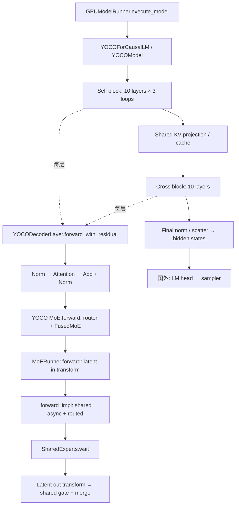
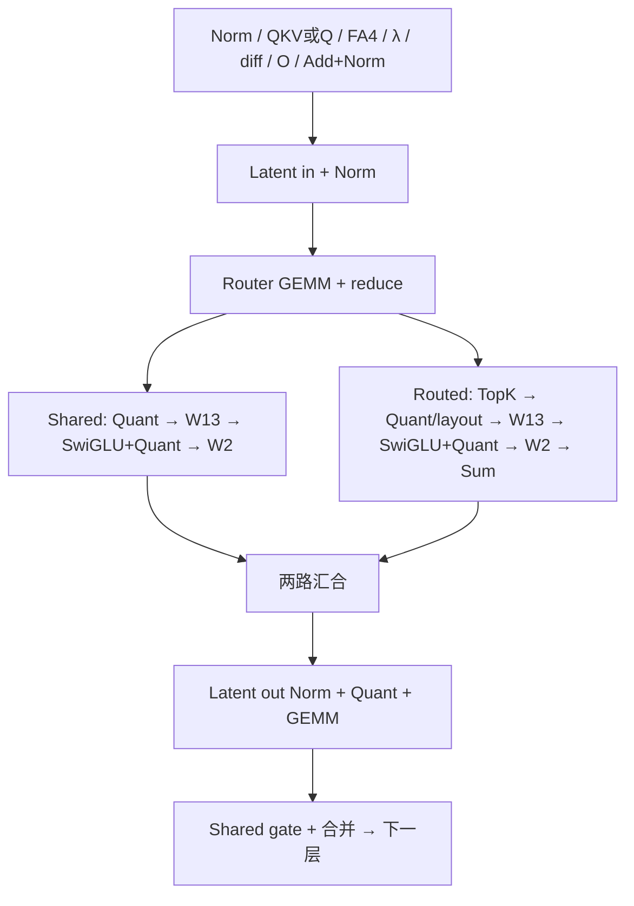

# YOCO decode 调用链与耗时边界

2026-09-17：已回退 shared/latent M1 自动分派，提交
`91f3c261ce808abf438102a37ce33c164221f349`。当前推理代码、相关 kernel 测试和
benchmark 与接入前 `fddb7e35e5` 相同；历史原型、数据和报告保留。
原 BF16 调试服务恢复到接入前源码，18888 健康、实际 8-token 生成及空队列验收通过，
Pod UID、holder 和 GPU 原位保留。下面分析的是独立 FP8 benchmark。

**主要发现：本次 shared 从未拖晚每层的汇合。B1 的 latent 串行段减少约
0.153 ms，但专家并行段增加约 0.115 ms，整图最终只减少约 0.044 ms。**
不能把四个小矩阵的 kernel 加速相加，作为模型收益。

- [可按层展开的调用关系与时间线](DECODE_CRITICAL_PATH.html)。
- [完整数值、trace 哈希及首个 Graph 的 kernel 时间戳](DECODE_CRITICAL_PATH.json)。
- [历史整模型 ABBA、固定 token 数值结果](SHARED_LATENT_M1_INTEGRATION.md)。

## 测量范围

使用 `work/yoco-m1-integration-20260917/m1-final-a1` 和 `m1-final-b1` 的真实
PyTorch/CUPTI trace，分别对应原生和 M1 候选。每侧 B1/B8 各 12 个纯 generation
Graph，共 48 个 Graph、1,920 次逻辑层调用；相同 B200 UUID、输入 token 文件和
镜像原生 DeepGEMM 哈希已核对。FP8 权重/KV、FA4、TP1/DP1，无 EP。
输入长度 512、生成 128，属于短上下文 warm-prefix 场景，不外推长上下文。

每个 Graph 有 1,490 个 kernel、40 次 Attention、80 次 routed GEMM。图外每步
另有 18 个 kernel，包括 LM head 和采样。表中 elapsed 指模型 Graph 首个 kernel
开始至最后 kernel 结束；不包含 CPU 调度，也不等于整请求耗时。

本次用均值做可加的阶段拆分。原生/候选 B1 Graph 中位数分别为
5.582845/5.538463 ms；B8 为 8.751758/8.751856 ms。
无 profiler 的完整 ABBA 结果仍是 B1 吞吐约 +0.25%，B8 约 −0.19%，按基本持平解读。
每份 trace 的 12 步连续且相关，不是 12 个独立 engine 实验。

## 调用图与依赖

源码入口关系如下；编译及 CUDA Graph replay 会折叠 Python 调用，图中不是采样出的
Python 调用栈，也不是 CUDA Graph 的完整节点依赖导出。



实际每层 GPU 调度的主要边界：



数学依赖与上述调度有区别：Router、Shared 和 Latent in 都读取同一原始 MoE
输入，彼此可独立计算。源码在 MoE wrapper 中先算 Router，实际编译 trace 却是
Latent in → Router → 分叉。Shared 的输出仅在最终合并时需要，当前 runner 的
`wait()` 放在 latent out 之前。本批 shared 已提前完成，所以单纯把 wait 后移
没有直接收益证据。λ 也读取 Attention 的原始输入，当前 trace 在 FA4 后才计算。

源码定位：

- [模型及 self/cross 循环](../../../vllm/model_executor/models/yoco.py)。
- [Attention 与 λ 输入](../../../vllm/model_executor/layers/yoco_attention.py)。
- [MoE Router、latent transforms、shared gate](../../../vllm/model_executor/layers/yoco_moe.py)。
- [MoERunner 的输入变换、分叉、wait、输出变换](../../../vllm/model_executor/layers/fused_moe/runner/moe_runner.py)。
- [SharedExperts 的 input/output CUDA events](../../../vllm/model_executor/layers/fused_moe/runner/shared_experts.py)。

## 哪些时间影响下一层

单位 ms/模型 Graph，12 步均值。阶段按连续时间戳边界划分，逐项相加等于整图。

| 阶段 | B1 原生 | B1 M1 | 差值 | B8 原生 | B8 M1 |
| --- | ---: | ---: | ---: | ---: | ---: |
| Attention 前后整条链 / Norm | 2.401734 | 2.396372 | −0.005362 | 2.724379 | 2.712663 |
| Latent in / Router | 0.632900 | 0.519307 | −0.113593 | 0.645358 | 0.650516 |
| Shared / routed 并行段 | 2.019905 | 2.135021 | +0.115116 | 4.823177 | 4.824733 |
| 汇合到 latent out 的间隔 | 0.015385 | 0.015421 | +0.000036 | 0.015470 | 0.015448 |
| Latent out / 合并 | 0.499842 | 0.460099 | −0.039744 | 0.522015 | 0.528160 |
| 最后 norm 等尾部 | 0.012946 | 0.012909 | −0.000037 | 0.013514 | 0.013496 |
| 合计 | 5.582712 | 5.539128 | −0.043584 | 8.743913 | 8.745016 |

Attention 链占原生 B1 整图 **43.0%**；包含 QKV/Q/O 投影、λ、KV/位置处理、
Norm 及其间隔，首层含 embedding，首个 cross 层含共享 KV/边界处理。
**FA4 本体 + combine 的 kernel 时长只有约 0.555 ms/步，约为整图 9.95%。**
因此不能看到 43% 就直接把 FA4 当作主要问题。

专家并行段占 B1 **36.2%**、B8 **55.2%**，这两档都由 routed 的结束时间决定。

| 每侧 480 次层调用 | B1 原生 | B1 M1 | B8 原生 | B8 M1 |
| --- | ---: | ---: | ---: | ---: |
| Shared 先完成次数 | 480 | 480 | 480 | 480 |
| Shared 平均提前量，μs | 22.935 | 24.063 | 38.429 | 38.468 |
| Shared 最小提前量，μs | 20.417 | 18.593 | 28.769 | 3.104 |
| Routed 分支平均 span，μs | 49.226 | 52.110 | 119.431 | 119.451 |
| Shared 分支平均 span，μs | 27.563 | 29.312 | 82.151 | 82.151 |

提前量定义为 `routed sum end − shared W2 end`。分叉取两路最早 kernel 开始，
汇合取两路最后 kernel 结束。阶段之间出现的间隔单独计入；源码核实了两路 event
同步边界。这里只能描述本批实际执行，不声称换掉 shared 后 routed 耗时保持不变。

## 为什么 M1 的收益抵消

B1 各类 kernel 的实际时长总和如下，**此表有并行重叠，不能作为 elapsed 分解**。

| Kernel 类别 | 原生 μs/步 | M1 μs/步 | 差值 |
| --- | ---: | ---: | ---: |
| Latent in GEMM | 253.601 | 126.958 | −126.643 |
| Latent out GEMM | 198.207 | 143.362 | −54.845 |
| Shared W13 | 263.412 | 198.210 | −65.202 |
| Shared W2 | 289.624 | 288.839 | −0.785 |
| Shared SwiGLU + quant | 234.500 | 420.930 | +186.430 |
| Routed input quant | 92.074 | 121.553 | +29.480 |
| Routed W13 | 626.618 | 671.879 | +45.260 |

四个 GEMM 合计减少约 247.5 μs，但 shared activation 的时长增加，Shared W2
在整图中也没有复现隔离测试收益。未修改的 routed quant/W13 同时变慢，专家段
elapsed 增加。可能涉及执行重叠、资源竞争和输入/路由差异；本次 B1 greedy 历史
已不同，只有时间线不能断言因果。低 CTA 的 shared activation（grid=3）值得
检查，但 grid 少本身不足以证明 occupancy 或 stall 原因。

原生 B1 Graph 内没有任何 kernel 运行的区间并集约 0.279 ms；候选约 0.308 ms。
Graph 已被 replay，不能把这些小间隔全部算成 Python launch 开销。
同 stream 的部分 kernel 时间戳会重叠，不能假定每个 kernel 全部结束后下一个
才启动；需结合程序化依赖和 CUDA Graph 节点信息。

## 性能分析工具与下一步

| 工具 | 能回答什么 | 当前已验证的状态 |
| --- | --- | --- |
| PyTorch profiler + Perfetto | GPU 时间线、stream overlap、图内/图外、阶段耗时 | 已有本次 4 份 trace；无需再占 GPU |
| Nsight Systems | CPU/GPU 调度、CUDA API/event 等待、Graph 节点及 NVTX | 宿主机 nsys 2026.1.3；GPU Pod 暂无采集器；尚无本模型的 nsys 报告 |
| Nsight Compute | 选定 kernel 的 DRAM/L2 流量、SM 利用率、occupancy、stall | GPU Pod 无 ncu；RmProfilingAdminOnly=1 且缺 CAP_SYS_ADMIN，尚未取得硬件计数器 |
| Triton Proton | 带作用域的 GPU 调用树及 Graph 归因 | 本仓库有配置入口；此 Pod 版本及实际归因能力尚未验收 |

先用 Perfetto 打开 `work/yoco-critical-path-20260917/perfetto/` 中的
`native-b1.json.gz`、`candidate-b1.json.gz`、B8 对应文件。保留原始事件，并增加
`YOCO inferred elapsed phases (not NVTX)` 轨道。新增轨道是离线推断标注，
不冒充采集时记录的 NVTX。这些文件不是 `.nsys-rep`。

已有浏览器查看器位于服务器 `127.0.0.1:18080`（Nsight Systems，需同时转发
18080/13478）和 `127.0.0.1:18081`（Nsight Compute，需要原有登录）。本次确认
HTTP 入口可达；没有导入本模型的新 Nsight 报告，也没有修改查看器服务。

接下来建议按以下顺序做受控实验：

1. 固定 token 历史及捕获的 hidden states / expert IDs / 权重，排除 B1 生成分叉；
   对相同 routed/shared 层比较 overlap 开/关，测层末端 elapsed，并同时观察两路。
   数值检查已能强制 token，但还没有完整的固定 hidden/route 性能回放。
2. B1 优先调查 Attention 链中的小操作串行边界：λ 的延后计算、Router 与 Latent in
   的调度、量化/Norm/复制是否可融合。任何改动都需重新验证层末端和整模型收益。
3. B8 优先分析 routed W13/W2 及 dispatch/layout/activation；专家段占比已超过一半。
4. 在持有 GPU 的环境暂存兼容 nsys CLI，采集少量预热后的 Graph replay。
   使用 `--trace=cuda,nvtx,osrt --cuda-graph-trace=node --sample=none --cpuctxsw=none`
   和 `--capture-range=cudaProfilerApi --capture-range-end=stop`。
   引擎需配置 `profiler="cuda"`，以 `start_profile()/stop_profile()` 定界；当前
   benchmark 的 `--profile-dir` 明确使用 torch profiler，不能直接套上上述命令。
5. 获得计数器访问条件后，ncu 只采固定层的 routed W13/W2、SwiGLU 和关键投影，
   看 Memory Workload、Scheduler、Warp State；不要把多次 kernel replay 的时间
   当作原始并行吞吐。采集 DRAM/L2 数据前，不下“已跑满 HBM”的结论。

## 复现离线分析

在分析仓库根目录运行，无需加载模型或访问 GPU：

```bash
.venv/bin/python tools/yoco_alignment/analyze_decode_critical_path.py \
  --runs-root ../work/yoco-m1-integration-20260917 \
  --output docs/yoco/performance/DECODE_CRITICAL_PATH.json \
  --annotated-dir ../work/yoco-critical-path-20260917/perfetto

.venv/bin/python tools/yoco_alignment/render_decode_critical_path.py \
  --data docs/yoco/performance/DECODE_CRITICAL_PATH.json \
  --output docs/yoco/performance/DECODE_CRITICAL_PATH.html
```

审计检查真实 Graph launch correlation、kernel 数、四个矩阵的分派/grid/同 stream
邻接、self/cross 次数、分叉/汇合边界以及无遗漏的层划分。阶段之和重建每个 Graph
span。网页包含首个 Graph 的原生与候选时间线，12 步的全部统计在 JSON 中。

验证：48 个 Graph 的 span 和源文件哈希与历史独立审计逐项一致；每份标注 trace
保留 18,096 个 kernel 事件并新增 2,400 个阶段。网页在 1120/360 像素、浅色/深色
下通过渲染、切换 B1/B8 和逻辑层、kernel 详情及数值重建检查，无脚本错误或页面
横向溢出。相关 pre-commit 检查通过。
