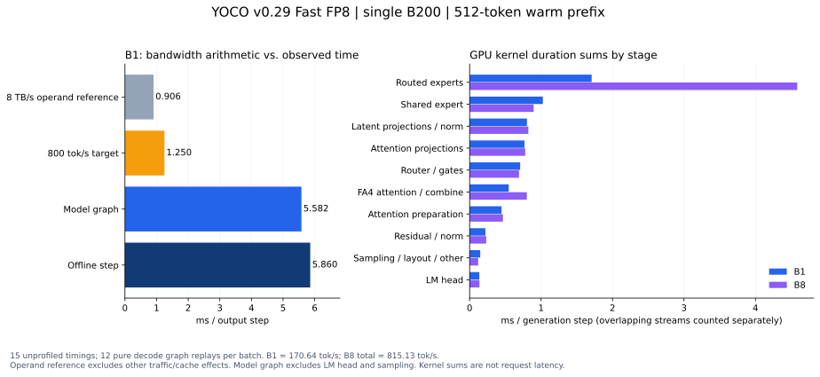

# YOCO 0.29：为什么单请求 Fast FP8 decode 只有约 170 tok/s

基线 `28d82e2e464f0464332d742140ad62453f9eddd8`，分析分支
`investigate/yoco-v029-fp8-decode-20260916`。2026-09-16 在同一张 B200
重新测得 B1 **170.64 tok/s，5.860 ms/输出步**。

**“不到 10B 的激活量”这个数量级成立。差距主要来自小 batch 下许多串行算子的
低效率：每步 1,508 个 kernel，并非所有阶段都能以 8 TB/s 处理有效数据。**
当前主模型 CUDA Graph 已需 5.582 ms，routed expert 的 W13/W2 合计仅占
kernel 累计时间的 18.9%。只优化专家矩阵乘，无法把整步提高到 800 tok/s。
本分支保存基线分析、复现工具和数据；性能数字来自未改动的推理实现。

## 1. 先确认 170 是什么

一张 B200，TP1/DP1/EP1，L3 step28000，block-128 FP8 权重，FA4 FP8 Q/K/V
及 KV cache，BF16 主干/router，FP32 归约和采样。小 M 使用 Triton routed
experts，dense/shared/latent FP8 投影使用镜像原生 DeepGEMM；W2 调参已开启。
实际 Runner 为 V2。不是每步将整模型权重从 CPU 搬入 GPU。

既有发布 ABBA 中，旧版 B1 为 170.37、新版为 170.83 tok/s；此次复测为
170.64，说明这一单请求速度在迁移前后基本持平。
发布对照的 B8 有 1.50% 回退，不能据此声称所有 batch 均无回退。

| 本轮 batch | 总输出 tok/s | 每条请求约 tok/s | 每输出步平均时间 |
| ---: | ---: | ---: | ---: |
| 1 | 170.64 | 170.64 | 5.860 ms |
| 8 | 815.13 | 101.89 | 9.814 ms |

每条输入 512 token、输出 128 token，5 次预热后 15 次计时，取耗时中位数。
计时从整批入队后恢复 scheduler 到全部输出取回，包含剩余 prefill、采样等。
所有计时请求命中 496/512 个输入 token，并生成足额输出。B8 的 815 是总吞吐；
增加并发没有让单条请求达到 800。

另外分别采集 12 步纯 generation。实际 annotation、batch、CUDA Graph
launch、每步 40 次 attention 和 80 次 routed GEMM 均经过检查。
模型加载、编译、图捕获及 profiler 导出不计入上述吞吐。

## 2. 8 TB/s ÷ 10 GB 是理想带宽参考，不是单请求预测

当前模型有 10 个 self 层执行三轮，再执行 10 个 cross 层；总共 40 次逻辑层。
循环复用的是权重存储，计算仍执行三轮。按每次调用所需矩阵权重读一次核算：

| B1 权重内容 | 每输出 token 的参考读取量（十进制 GB） |
| --- | ---: |
| Top-8 routed experts：40 × 8 × 3 × 1024 × 3840，FP8 | 3.775 |
| Shared expert：40 × 3 × 3072 × 1280，FP8 | 0.472 |
| QKV/Q/O 与模型级共享 KV 投影，FP8 | 1.705 |
| Latent in/out，FP8 | 0.252 |
| Router、λ、shared gate，BF16 | 0.047 |
| LM head：3072 × 154880，BF16 | 0.952 |
| **主要矩阵权重合计** | **7.202** |

这里对应约 **6.703B 次权重元素参与计算**，包含 self loop 的重复执行，
不是唯一参数个数。Embedding 只取当前 token 的一行，不能再把整个词表读一次；
LM head 要计算整个词表，仍是 BF16，已按两字节计入。

当前 KV 已为 FP8。按 GQA 的 8 个 KV heads 计算一次 K/V 读取，
512–640 上下文每步约 0.042–0.045 GB；80K 则约 1.670 GB。
共享 cross KV 存储仍被十次 attention 消费。长上下文数字不能套到本次短上下文。

因此本次权重 + KV 参考为 **约 7.25 GB/步**。如果这些数据都只读一次、
一直达到 8 TB/s、其他工作免费，约需 **0.906 ms/步（约 1,104 tok/s）**。
你的 800 算法作为理想数量级估计没有问题；不足之处是把整条执行链都视为满带宽扫描。

按 7.25 GB / 5.860 ms 计算的有效负载处理率约 1.24 TB/s，相当于标称 8 TB/s
的 15.5%。**这是参考 payload / 时间，不能叫实测 HBM 利用率。**
本表不含 scale、激活、scratch、索引和 norm 小参数；L2 命中会减少 DRAM 流量，
CTA 重读、padding、spill 会增加它。本轮没有获取 DRAM/L2 硬件字节计数。
8 TB/s 也没有在本卡上做独立带宽校准。

## 3. 当前版本实际把时间花在哪里

每步 **1,508 个 kernel**：主模型 Graph 内 1,490 个，Graph 外另有 18 个，
包括 LM head 和采样。B1 Graph span 中位数 **5.582 ms**；图外 kernel 累计
约 **0.207 ms**。这已经能解释 5.860 ms 中的大部分时间。
两种测量的上下文长度和 profiler 开销不同，不能相减当作精确 CPU 时间。

| GPU kernel 累计时间/输出步 | B1 | B1 占比 | B8 |
| --- | ---: | ---: | ---: |
| Routed experts，含量化、激活、归约、布局 | 1.708 ms | 26.2% | 4.585 ms |
| Shared expert，含输入量化和 scale 初始化 | 1.025 ms | 15.7% | 0.896 ms |
| Latent in/out 投影、Norm、量化 | 0.803 ms | 12.3% | 0.822 ms |
| Attention 的 QKV/Q/O/KV 投影及输入量化 | 0.768 ms | 11.8% | 0.778 ms |
| Router、Top-K、λ 和 shared 分支门控 | 0.707 ms | 10.9% | 0.691 ms |
| FA4 主 kernel + Split-KV 合并 | 0.547 ms | 8.4% | 0.800 ms |
| Attention 前后处理、descale 复制、scheduler | 0.447 ms | 6.9% | 0.466 ms |
| 主残差 / Norm | 0.221 ms | 3.4% | 0.232 ms |
| LM head | 0.136 ms | 2.1% | 0.137 ms |
| 采样、布局等其余 kernel | 0.148 ms | 2.3% | 0.120 ms |
| **kernel 累计时间** | **6.509 ms** | **100%** | **9.528 ms** |

这些百分比是 kernel 时间之和的占比，多 stream 有重叠，**不是端到端延迟占比**。
主模型 Graph 内的 kernel busy union 约 5.312 ms，图内没有 kernel 执行的空隙
约 0.270 ms；kernel 累计时间则更长。每步只有一次主模型 `cudaGraphLaunch`，
不能将 1,490 个图内节点解释为 1,490 次 Python/CUDA API 启动。



### 小矩阵和量化的固定成本很明显

- 241 次 dense/shared/latent FP8 GEMM 累计约 1.669 ms，另有 161 次输入量化，
  累计约 0.426 ms。Latent 的 `3072→1024` 每次仅约 3.15 MB 权重，
  GEMM 却需约 6.33 µs，再加输入量化和 Norm。大 batch 的 GEMM 吞吐优势
  不能直接变成 B1 的低延迟。
- 每步 40 次 routed SwiGLU/量化合计 **0.288 ms**，40 次 shared 同类操作
  **0.239 ms**，shared scale 清零另需 **0.120 ms**。
  当前 kernel 固定 `BLOCK_M=8`，每个 CTA 顺序处理 4 个量化 group。
  B1 的实际 grid：routed **[8,1,1]**、shared **[3,1,1]**。
  Shared 只有一行有效输入，仍使用八行模板；routed 的非 packed scale 路径也
  沿用四组一包的模板。这些是可直接定位的低并行度点。
- Router 和 λ 各每步 40 次小 GEMM，B1 均用 GEMM + Split-K reduce 两个 kernel，
  合计 **0.504 ms**；Top-K 和 shared 门控/输出合并再约 0.203 ms。
  Router `3072→128`、λ `3072→64`，权重字节数很小，无法靠权重变 FP8
  就消除这类调用成本。

### Routed FP8 也没有满带宽，但不是唯一主因

B1 的 W13 平均 **15.60 µs**，W2 **15.18 µs**。按每次 Top-8 权重仅读一次，
对应有效权重处理率分别约 **4.03 / 2.07 TB/s**；这是逻辑 payload 速率，
不是硬件 DRAM 带宽。

小 M 走 `TritonOrDeepGemmExperts` 的 Triton fallback，`M<=16`；每个激活专家
在 B1 只有一行有效输入，但 GEMM 的 M tile 为 16。其余行被 mask，仍参与 tile
级矩阵运算。这个 1/16 指有用的 M 行比例，**不表示读取了 16 倍权重或延迟必为 16 倍**。
block-128 路径每个 K block 执行 `tl.dot` 后乘 scale、FP32 累加，W13/W2 分别
有 8/30 个 K block，不能只用 FP8 Tensor Core 峰值估时间。

当前 W13 已是上游 `N=64, stages=4`，实测 grid 960；W2 已采用私有
`N=32, stages=4`，grid 256。不要重复建议将旧 N128 改成已生效的配置。
原 W2 调参使 B1 从约 163 提到 171，收益已经包含在当前基线内。

相反，LM head 一次读取参考约 0.952 GB，耗时 0.136 ms，有效权重处理率约
**7.02 TB/s**。它本身接近带宽参考，且只占 kernel 累计时间的 2.1%；
巨大的词表不是当前最值得优先优化的阶段。

## 4. 建议的改进顺序

下面的时间是待优化阶段的实测预算，不能直接当作可节省的端到端时间。

| 优先级 | 改进方向 | 证据与实施要点 |
| --- | --- | --- |
| 1 | 小 M 激活量化与邻接算子融合 | routed/shared SwiGLU + scale 初始化约 0.647 ms，其他输入量化约 0.426 ms。先为 routed 非 packed scale 路径按 row/group 增加并行度，去掉四组模板的串行限制；shared 单行研究 W13 epilogue / quant 融合及 scale 初始化融合。保留 clamp、加权顺序、BF16 舍入和 UE8M0 scale 规则。 |
| 2 | 小 M dense/shared/latent 专用 GEMV/GEMM | 241 次 GEMM 合计约 1.669 ms，shared/latent 尤其受固定成本影响。按真实形状调度与测量，研究输入量化/Norm/输出处理融合；显式比较热缓存单算子和轮转真实层权重的计时，最终由整模型 ABBA 决定。 |
| 3 | Router / λ 的小矩阵路径与 Top-K 融合 | 两类 GEMM + reduce 约 0.504 ms。BF16 router 现在仍是 `F.linear`；尝试专用小 M kernel，减少 split-K 中间结果和启动。Top-K 对舍入敏感，必须检查真实路由与整模型概率，不能只测 GEMM 误差。 |
| 4 | W13/W2 的小 M 专用实现及 MoE 整段融合 | 两次 GEMM共 1.231 ms，W2 的有效权重速率低于 W13。现有 N/warp 表已调过；进一步需要减少无效 M 行、block-scale 标量工作、激活物化与 Top-8 输出归约，不能靠重复切开关获得既有收益。 |
| 5 | FA4 固定元数据和短上下文 split 调度 | 每步 120 次 descale 连续化复制约 0.161 ms，40 次 scheduler 准备约 0.069 ms，40 次 combine 约 0.129 ms。固定 scale 的连续化可探索在初始化时完成；必须兼容 scale 更新、KV sharing 和 Graph 地址。短上下文 split 数要按端到端 A/B 选择，减少 split 也可能降低并行度。 |

Scale 复制的具体链路为 `flash_attn.py` 的标量 `.expand()`，进入运行环境
FA4 `cute/interface.py` 后因末维 stride 为 0 而 `.contiguous()`。
当前 trace 严格验证每组三次复制 → `FlashPrepareScheduler` → FA4 主 kernel。
它是小 scale 布局转换，没有将整份 FP8 权重或 KV 还原为 BF16。

对应代码入口：[量化模板](../../../vllm/model_executor/layers/yoco_ops/fp8.py)、
[YOCO Triton MoE 链路](../../../vllm/model_executor/layers/yoco_ops/triton_moe.py)、
[小 M 后端选择](../../../vllm/model_executor/layers/fused_moe/experts/triton_deep_gemm_moe.py)、
[通用 GEMM tile / block-scale 实现](../../../vllm/model_executor/layers/fused_moe/fused_moe.py)、
[BF16 router](../../../vllm/model_executor/layers/yoco_ops/routing.py)、
[FA4 入口](../../../vllm/v1/attention/backends/flash_attn.py)。

这些优化应保持当前推理方程和精度边界，分别验证 FP8 bytes/scales、完整 MoE
输出、固定前缀 teacher-forced logprob/NLL、greedy 输出、B1/B8 及长上下文。
保持相同 GPU、输入、版本、缓存和调度，采用独立 engine ABBA；真正不同的
generated routing 需要另做固定路由/固定 token 对照。

已有实验提供两项限制：latent Norm/FP8 fusion 的历史 B1 NLL 曾变差，因此仍
默认关闭；进一步将 Norm/采样降低为 BF16 的历史 ABBA 几乎没有吞吐收益。
当前 KV 和 latent 权重已是 FP8，也没有未开启的这两项“免费翻倍”开关。

## 5. 能不能到 800

800 tok/s 要求 **1.25 ms/步**，当前约 5.86 ms，需要消除约 **79%** 的时间，
是 **4.69 倍**提升。按 8 TB/s 的权重/KV 理想参考，其他全部计算、量化、同步和
调度只剩约 **0.34 ms** 的预算。物理上不能仅凭本轮计时排除，但当前实现离这个
执行方式很远。

作为量级检验：即使让本轮 1.231 ms 的 routed GEMM 时间全部免费，
5.582 ms 的主模型 Graph 也只可能减少其中一部分；忽略 overlap 的乐观估算
仍约 4.35 ms。它不能单独解释 170→800 的差距。

建议先做前两项的可验证改进，再按新的 profile 排序。若要追求数倍的单请求速度，
需要更大范围的融合/持久化 kernel，或引入经过验收的投机解码/MTP，让一次
验证前向产出多个 token。接受率、验证开销和输出质量决定后者收益，目前没有
证据可承诺 800。增大并发可提高总吞吐，但不会实现这个单请求延迟目标。

## 证据与复现

- [本轮逐次计时、模型配置、runtime dtype、每个 kernel 的名称/grid/耗时及图审计](../validation/fp8-decode-analysis-20260916.json)。
- [发布 ABBA 对照](../release-validation-20260916.md)。
- [既有 W2 调参](FP8_W2_TUNING.md)、[latent fusion 限制](LATENT_NORM_FP8.md)、[BF16 归约实验](BF16_INTERNALS.md)。
- 原始 trace、benchmark 和控制器记录位于工作区 `work/yoco-fp8-decode-analysis-20260916/`；
  JSON 保存原始文件 SHA256。运行前核对了 2,533 个已跟踪 Python 文件与本分支
  基线一致。Torch `2.13.0+cu130`，原生 DeepGEMM `_C` SHA256
  `73824dc1312e98cf277ae6bc017becf7e963d5b0bfab81e0c6d475d9b769c9e7`，
  与发布测量相同。本轮没有覆盖原生库。
- 当前环境没有 PATH 可用的 ncu/nsys，驱动设置 `RmProfilingAdminOnly=1`。
  未运行 DRAM/L2 计数测量，也未根据 profiler 的 occupancy 估计字段声称得到硬件计数。

从本分支根目录，以项目 venv 运行离线分析：

```bash
TASK=../work/yoco-fp8-decode-analysis-20260916
.venv/bin/python tools/yoco_alignment/analyze_fp8_decode.py \
  --benchmark "$TASK/decode-v029-profile-r1/benchmark.json" \
  --model-config "$TASK/config.json" \
  --trace-dir "$TASK/decode-v029-profile-r1/traces" \
  --output docs/yoco/validation/fp8-decode-analysis-20260916.json
.venv/bin/python tools/yoco_alignment/plot_fp8_decode_analysis.py \
  --analysis docs/yoco/validation/fp8-decode-analysis-20260916.json \
  --output docs/yoco/figures/fp8-decode-analysis-20260916
```

分析器要求完整的 12 步纯 generation、真实 Graph replay、确定的 kernel 调用次数，
按矩阵形状和同 stream 邻接关系归属算子，不把配置中的 Graph 开关当作回放证据。
已在两份真实 trace 上通过检查，并确认它拒绝将 B1 trace 标成 B8、拒绝将当前字节
模型应用到不同 universal-loop 配置；计时样本、缓存命中、输出长度和原生库哈希
也已核对。分析脚本通过 Ruff 检查，图表已渲染检查。
本轮保留原单卡 Job/Pod UID、节点、holder 和 restart count，已恢复测试前的调试
服务；本地 18888 健康、8-token 真实生成及空队列验收通过。
