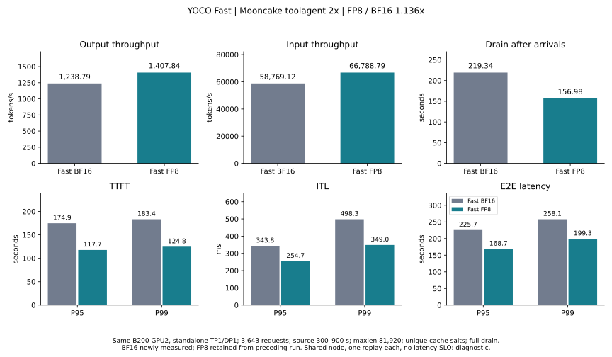
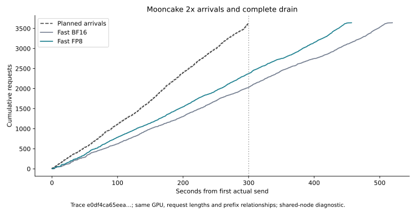

# Fast BF16 / FP8：Mooncake 2× 同卡对照

当前 Fast BF16 实测 **1,238.79 输出 tok/s**，此前同条件的当前 Fast FP8 为 **1,407.84 tok/s**。FP8/BF16 为 **1.136×**，吞吐变化 **+13.65%**。

本轮只补测 BF16；FP8 复用上一轮 `candidate-full-b` 的正式测量，未重测 FP8、Align 或 Qwen。两者采用相同冻结源码、同一物理 B200 GPU2、相同 trace 字节与 2× 到达率。共享节点、每精度一次正式测量、约300秒到达窗口且无延迟 SLO，属于过载诊断，不能作为稳定容量认证。

## 吞吐与延迟

| 指标 | Fast BF16（本轮） | Fast FP8（上轮保留） | FP8 相对 BF16 |
| --- | ---: | ---: | ---: |
| 输出 tok/s | 1,238.792 | 1,407.839 | +13.65% |
| 输入 tok/s | 58,769.124 | 66,788.787 | +13.65% |
| 请求/s | 7.014 | 7.972 | +13.65% |
| TTFT P95 / s | 174.912 | 117.720 | -32.70% |
| ITL P95 / ms | 343.759 | 254.662 | -25.92% |
| E2E P95 / s | 225.668 | 168.721 | -25.23% |
| 排空尾部 / s | 219.341 | 156.979 | -28.43% |

延迟行的负数表示降低；吞吐包括完成全部请求所需的排空时间。

| 延迟 | BF16 P50 / P95 / P99 | FP8 P50 / P95 / P99 |
| --- | ---: | ---: |
| TTFT / s | 75.337 / 174.912 / 183.425 | 43.609 / 117.720 / 124.821 |
| ITL / ms | 195.231 / 343.759 / 498.290 | 170.061 / 254.662 / 348.961 |
| E2E / s | 112.929 / 225.668 / 258.113 | 76.392 / 168.721 / 199.329 |

## 比较条件

模型：YOCO 30A3B-180M-L3 step28000。两端均为 Fast、TP1/DP1 standalone、BF16 hidden/KV、FA4、KV sharing、prefix caching、chunked prefill、FULL_AND_PIECEWISE；capture sizes 1/2/4/8/16/32/64/128/256。maxlen81920、maxseq256、max batched tokens32768、memory utilization0.85。

服务启动参数仅差 `--quantization fp8_per_block`。精度决定各自的默认 GEMM/MoE 后端与实际可用 KV cache；本对照衡量完整默认精度路径的服务表现，不隔离单个 GEMM 的收益。

| 实际运行配置 | BF16 | FP8 |
| --- | --- | --- |
| MoE wrapper | FlashInferExperts | TritonOrDeepGemmExperts |
| 模型加载阶段 GiB | 61.04 | 32.07 |
| KV cache tokens | 1,608,309 | 2,168,880 |
| Fast LM head | 启用 | 启用 |
| Fast weighted RMSClip 层数 | 10 | 10 |

模型加载占用减少约47.5%，但这不能按比例换算成吞吐收益。Attention/KV保持BF16，量化与路由存在开销；没有新增GPU profile，不能仅凭端到端结果确定当前瓶颈或认定已充分优化。实际后端与内存配置另存于runtime-details.json。

AIPerf0.12.0，completions/streaming、server token counts、seed42、客户端并发上限2048、workers32、record processors1、timeout600。每 case 独立非空 cache salt，保持 trace 内的前缀共享关系。并发上限是保护阈值，到达率由冻结时间戳控制。

数据源：Mooncake FAST’25 [toolagent trace](https://raw.githubusercontent.com/kvcache-ai/Mooncake/main/FAST25-release/traces/toolagent_trace.jsonl)。源23608行，上下文过滤保留23492行（99.51%）；源300–900秒窗口取3643行，占完整源15.43%。只离线将时间戳加速2×，到达约300秒；AIPerf synthesis-speedup-ratio固定1.0。公开trace没有真实提示词或任务答案，不能用于模型质量评估。

Trace SHA256：`e0df4ca65eeac5daf8eb1529f2eb832b2e16ef8c76c53ce426a8ba1f1eb41310`。源 SHA256：`48a2db1a13d3bc05e6330140c64f604ba366df20d3c9e128b5c35a01c1fa5f71`。

Offered load：12.143 请求/s、101,728.41 输入 tok/s、2,144.59 输出 tok/s。

物理 GPU：B200 GPU2，UUID `GPU-3c98295b-46bd-92b3-ef14-82b5e35524f7`；node `slc01-cl02-hgx-0228`。使用原4卡Job `yoco-align-fast-vllm-vllm-train`。GPU0/1存在其他任务；GPU3未参与测试。

## 审计与结果边界

| 审计项 | BF16 | FP8 |
| --- | --- | --- |
| 正式 case | bf16-full-b | candidate-full-b |
| 开始 UTC | 2026-09-10T06:42:07.604454+00:00 | 2026-09-10T05:54:34.553808+00:00 |
| 完成 / 计划 | 3643 / 3643 | 3643 / 3643 |
| 错误 | 0 | 0 |
| 客户端门槛 | True | True |
| 服务端门槛 | True | True |
| 调度 lag P99 / ms | 7.054 | 5.736 |
| 调度退化 | 0.0 | 0.0 |
| 最大客户端并发 | 1613.0 | 1266.0 |
| running / waiting 峰值 | 256 / 1348 | 256 / 1002 |
| prefix hit fraction | 0.372714 | 0.376967 |
| 完全排空 | True | True |
| 其他忙碌 GPU | [0, 1] | [0, 1] |
| 指标连续性 | {'standalone': {'scrape_errors': 0, 'max_gap_seconds': 1.3161261081695557, 'counter_resets': []}} | {'standalone': {'scrape_errors': 0, 'max_gap_seconds': 1.2283234596252441, 'counter_resets': []}} |

正式轮要求通过客户端、token计数与服务端审计，且无新增可观测JIT、无DeepGEMM/Triton缓存新增文件或元信息变化。按上述条件选择首个合格回放，含首次编译的完整回放保留为预热记录，不按最快成绩挑选。选择细节见comparison.json中的replay_selection。

BF16首轮`bf16-full-a`除了attention/RMSClip首次JIT，还发生一次连接复用时的`ClientOSError(104, Connection reset by peer)`：请求index587未收到响应字节，3642/3643成功，客户端与token计数门槛FAIL。服务端门槛通过且完全排空，GPU不可纠正ECC没有增加。该轮保留为失败预热，未用于吞吐比例；确认服务健康后以相同参数、新cache salt独立重放，没有修改服务或添加请求重试。连接重置的底层原因尚未确认，正式轮通过不构成长期传输稳定性保证。详见原始RECOVERY_PLAN.json和失败case。

两端逐请求实际输入/输出token计数差异 **0项**。两端计时前后ISL128、8192、79150及batch8的生成log-prob均有限；这只验证基本数值健康，不是跨精度bitwise或任务质量评估。B200 volatile/aggregate不可纠正ECC计数无增加，正式区间未见CUDA/Xid错误；详细GPU时钟、功耗、温度和采样统计保存在comparison.json。

源码22个冻结文件hash一致；模型JSON/Python有内容hash，权重只核对文件大小和修改时间，没有重新全量计算内容hash。AIPerf版本、tokenizer/Mooncake实现hash及模型文件元信息在两次测量中一致。

此前公共路径复用带来的+0.46%使用修改前FP8作分母；此前分派优化的+28.60%同样是FP8内部比较。它们与本报告的FP8/BF16比例分开记录。历史BF16的1.2×结果不参与本次计算。

## 源码与证据

代码为 `fhb-dev-9-8` 的 `511fbed3f75f0fd18a4f93194ca832db2c723f98` 加已有本地改动，本轮没有修改推理实现。

本地原始目录：`/home/lidong1/vllm_test/yoco_results/fast-bf16-mooncake-f2-20260910T062300Z`；Pod内：`/data/fast-bf16-mooncake-f2-20260910T062300Z`。BF16服务和原Job/Pod/GPU分配保留，服务owner为该目录的active.json/control.py，endpoint127.0.0.1:8794。

[比较 JSON](comparison.json) · [结果 CSV](trace.csv) · [备份索引](BACKUP.json) · [上轮 FP8 报告](../fast-fp8-reuse-mooncake-f2-20260909/REPORT.md)
