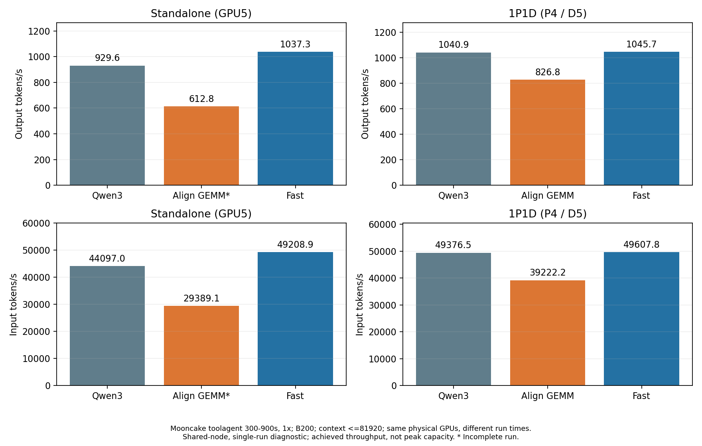
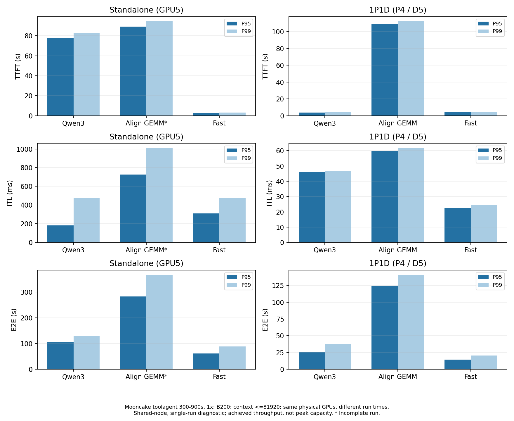
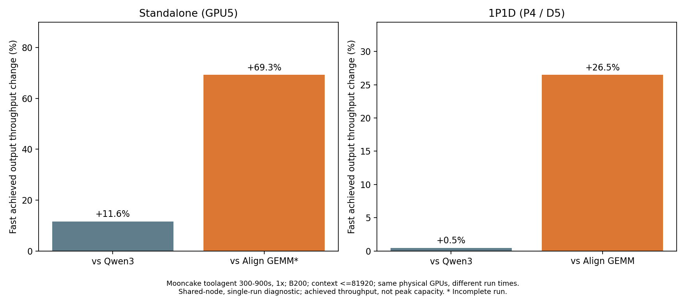
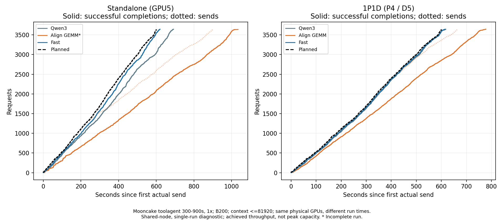

# Fast 单独重测与三模式持续对照表

日期：2026-09-07。本轮只新测 YOCO L3 `--fast` 的单卡和1P1D；Qwen3与Align GEMM沿用2026-09-07已有结果。没有重测另外两个模式。固定入口：[持续吞吐表](../THROUGHPUT.md)。

Fast 单卡 **1037.27 tok/s**；1P1D **1045.68 tok/s**。

## 吞吐与完成情况

| 配置 | 测量时间 UTC | 完成/计划 | 错误 | 输入 tok/s | 输出 tok/s | 每推理GPU输出 tok/s |
| --- | --- | --- | --- | --- | --- | --- |
| Qwen3-30B-A3B-Instruct-2507 / 单卡 | 2026-09-07T10:42:06+00:00 | 3643/3643 | 0 | 44096.98 | 929.63 | 929.63 |
| YOCO Align GEMM / 单卡 | 2026-09-07T09:13:55+00:00 | 3638/3643 | 5 | 29389.12 | 612.83 | 612.83 |
| YOCO Fast / 单卡 | 2026-09-07T12:56:36+00:00 | 3643/3643 | 0 | 49208.94 | 1037.27 | 1037.27 |
| Qwen3-30B-A3B-Instruct-2507 / 1P1D | 2026-09-07T11:00:42+00:00 | 3643/3643 | 0 | 49376.48 | 1040.93 | 520.46 |
| YOCO Align GEMM / 1P1D | 2026-09-07T08:49:40+00:00 | 3643/3643 | 0 | 39222.23 | 826.76 | 413.38 |
| YOCO Fast / 1P1D | 2026-09-07T13:16:45+00:00 | 3643/3643 | 0 | 49607.84 | 1045.68 | 522.84 |

| Fast拓扑 | 相对参考 | 已报告输出吞吐变化 | 限制 |
| --- | --- | --- | --- |
| standalone | qwen3 | +11.58% | 完整 |
| standalone | align | +69.26% | 参考轮未完成，非等工作量比较 |
| pd | qwen3 | +0.46% | 完整 |
| pd | align | +26.48% | 完整 |

单卡Align保留5条600秒流式timeout，其吞吐/延迟仅来自成功请求，存在幸存者偏差；比值不代表完成相同工作的等成本效率。Qwen与YOCO为不同模型，差距不能全部归因于Align GEMM或Fast kernel。

固定1×计划负载为约1072.29 output tok/s、50864.12 input tok/s、6.072 req/s。这里是该负载加收尾的已实现吞吐，接近该值时不能继续按结果推断峰值能力。1P1D按2张实际推理卡归一化；Job始终预留4卡，吞吐÷4另保存在JSON。

## 延迟与客户端调度

每格为P50/P95/P99；TTFT、E2E单位秒，ITL单位毫秒。ITL采用AIPerf每请求平均token间隔的分布。

| 配置 | TTFT s | ITL ms | E2E s |
| --- | --- | --- | --- |
| Qwen3-30B-A3B-Instruct-2507 / 单卡 | 41.75 / 77.64 / 82.96 | 80.26 / 183.57 / 475.21 | 50.51 / 104.70 / 129.92 |
| YOCO Align GEMM / 单卡 | 68.05 / 89.30 / 94.55 | 386.09 / 725.70 / 1010.19 | 84.89 / 282.75 / 367.18 |
| YOCO Fast / 单卡 | 1.55 / 2.66 / 3.20 | 81.83 / 311.56 / 475.95 | 4.52 / 61.47 / 88.31 |
| Qwen3-30B-A3B-Instruct-2507 / 1P1D | 1.52 / 3.57 / 4.91 | 36.83 / 46.05 / 46.90 | 3.08 / 25.22 / 37.47 |
| YOCO Align GEMM / 1P1D | 63.17 / 108.83 / 112.31 | 54.08 / 59.82 / 61.75 | 73.43 / 124.51 / 140.83 |
| YOCO Fast / 1P1D | 2.09 / 3.90 / 4.69 | 18.45 / 22.58 / 24.32 | 3.25 / 14.17 / 20.37 |

| 配置 | 调度lag P99 ms | 最大并发 | 客户端门槛 | 服务门槛 | 末次计划到达后的完成耗时 s |
| --- | --- | --- | --- | --- | --- |
| Qwen3-30B-A3B-Instruct-2507 / 单卡 | 9533.22 | 512.0 | False | True | 92.06 |
| YOCO Align GEMM / 单卡 | 295920.39 | 512.0 | False | True | 434.49 |
| YOCO Fast / 单卡 | 3.09 | 212.0 | True | True | 20.24 |
| Qwen3-30B-A3B-Instruct-2507 / 1P1D | 5.89 | 102.0 | True | True | 18.07 |
| YOCO Align GEMM / 1P1D | 60833.25 | 512.0 | False | True | 178.17 |
| YOCO Fast / 1P1D | 6.51 | 85.0 | True | True | 15.26 |

全部为共享节点、单次配对、无预设延迟SLO的诊断。节点上其他GPU负载随运行时间变化；同物理GPU与相同设置仍不等于独占节点同时A/B。触并发512或迟发的轮次未通过原始到达负载验收，HTTP零错误不足以认定容量通过。E2E不包含客户端尚未发送的等待。

## 缓存、传输与服务审计

| 本轮Fast / 角色 | 前缀命中率 | 抢占 | 运行峰值 | 等待峰值 |
| --- | --- | --- | --- | --- |
| YOCO Fast / 单卡 / standalone | 37.45% | 0.00 | 206.00 | 20.00 |
| YOCO Fast / 1P1D / p | 0.00% | 0.00 | 10.00 | 28.00 |
| YOCO Fast / 1P1D / d | 0.49% | 0.00 | 42.00 | 37.00 |

| 本轮Fast / 角色 | 最大采集间隔 s | 采集错误 | 计数器重置 |
| --- | --- | --- | --- |
| YOCO Fast / 单卡 / standalone | 1.32 | 0 | 0 |
| YOCO Fast / 1P1D / p | 1.31 | 0 | 0 |
| YOCO Fast / 1P1D / d | 1.31 | 0 | 0 |
| YOCO Fast / 1P1D / proxy | 1.31 | 0 | 0 |

传输次数、字节、P95耗时、失败和尾队列保存在trace-comparison.json的transfer；P/D如需完成通知收尾，只在计时结束、传输任务完成之后发本地1-token控制请求，单列post_timing_cleanup，不计入trace吞吐或延迟。所有失败原始case都保留。

## 冻结条件

同一Pod UID505f46a3-597a-40c3-8260-d213fae60136，节点slc01-cl02-hgx-0228。单卡GPU5，P/D GPU4/5；GPU2/3本轮空闲。BF16、TP1/DP1、maxlen81920、maxseq256、memory0.85，预算单卡/P32768、D8192，prefix cache/chunked prefill，YOCO KV sharing。

复用Align/Qwen冻结runtime，并核对Fast关键源文件与当前本地版本一致。请求FA4、FULL_AND_PIECEWISE，记录服务实际生效后端；Align自身强制FA2/FULL_DECODE_ONLY。实际日志确认：单卡M>=1024采用FlashInfer CUTLASS prefill；P采用CUTLASS BF16 MoE；D采用CUTLASS BF16 MoE并开启autotune，见EFFECTIVE_BACKENDS.json。不加载Align profile或外部旧autotune cache。此轮没有改推理kernel。

Mooncake FAST’25 toolagent原文件23608行，maxlen过滤116行，保留23492行（99.51%），再取源时间300–900秒3643请求（源文件15.43%）。它是按长度/hash_ids合成的开源trace回放，不含真实工具调用、真实文本或质量标签。冻结SHA256：680e526d49545258c0ca5b635d0004a44cce2ce990d533ac32024cefee1f0170。

AIPerf0.12.0、fixed schedule1x、streaming、server token counts、concurrency512、workers32、record-processors1、timeout600、seed42；每case独立cache_salt。各模式tokenizer不同，逐条检查输入±2-token BOS容差，输出长度必须精确。

| 本轮Fast | 成功输入实际-请求差值分布 | 成功输出长度不符 |
| --- | --- | --- |
| YOCO Fast / 单卡 | {"1": 3633, "2": 10} | 0 |
| YOCO Fast / 1P1D | {"1": 3633, "2": 10} | 0 |

## 功能检查和证据范围

两组Fast先做511/512/513/4097输入、各32输出token的探针，再跑smoke50。单卡与P/D探针中4/4组生成token相同；可比较组所选token log-prob最大差0.13219839334487915。差异来源尚未隔离，不能直接归为普通舍入；这只是功能诊断，不是全logits、全trace或bitwise保证。详见functional-comparison.json。

Qwen3历史P/D的独立探针存在log-prob差异，尚未定位；本轮未重测或修复它。Align bitwise结论仅引用原报告的已测配置和位置；性能成功请求数不能作为数值一致性证据。

FINAL_AUDIT.json检查冻结runtime、模型JSON和文件元数据、GPU清理及可读取Xid/ECC日志；POD_FINAL.json检查UID/节点/restartCount。计时与编译/预热分开。

## 持续更新方式

yoco_results/THROUGHPUT.md是固定入口。current.json/current.csv显示当前值，throughput/history保留每次测量。update_throughput.py一次导入一个case，只替换该模式/拓扑；不触发其他模式测试。修改trace/速率/硬件/主要参数须另建可比组。

## 图与原始文件

comparison.json包含六组完整指标，trace-comparison.json/csv只含本轮两组Fast；cases保存smoke和正式回放。BACKUP.json记录PVC归档及SHA读回证据。测试结束后仅停止本轮服务进程，四卡Job保留。
