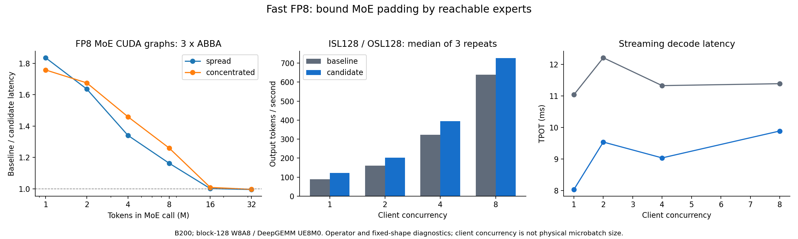
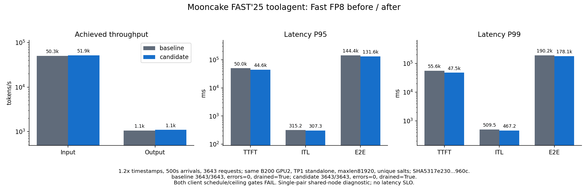
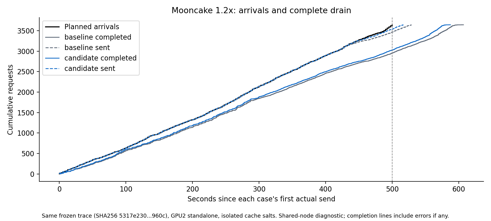

# Fast FP8 小批次 MoE padding 优化

测量日期：2026-09-08 PDT / 2026-09-09 UTC。基线为合并 `shaohanh/yoco-260906` 后的 `fhb-dev-9-8`，提交 `511fbed3f75f0fd18a4f93194ca832db2c723f98`。

<!-- MEASURED_RESULTS_BEGIN -->

## 实测结果

本轮完成 MoE padding 和在线 block-FP8 启动预热两处修改。M=1 的完整 MoE 算子在两种路由下加速 1.76–1.84×；编译缓存预热后 ISL128/OSL128、并发1的输出吞吐为 89.05 → 121.37 tok/s（+36.29%）。

同卡 Mooncake 1.2× 编译缓存预热后回放的输出吞吐为 1059.86 → 1095.02 tok/s（+3.32%）。必须结合下列完成数、调度门槛和尾延迟解读；客户端触及并发上限时，实际到达会受限，吞吐与排空变化属于过载响应，不能作为无损容量或固定实际到达时刻下的纯 kernel 加速结论。

### 完整 MoE CUDA graph

3×ABBA，每个样本100次 replay，取每版本6个样本的中位数。随机 top-k 与集中 top-8 路由使用相同输入和权重进行版本内对照。

| M | 随机路由：旧→新 μs | 加速比 | 集中路由：旧→新 μs | 加速比 |
| --- | ---: | ---: | ---: | ---: |
| 1 | 159.80 → 87.08 | 1.835× | 169.15 → 96.26 | 1.757× |
| 2 | 181.87 → 111.19 | 1.636× | 171.40 → 102.33 | 1.675× |
| 4 | 203.81 → 152.03 | 1.341× | 169.82 → 116.38 | 1.459× |
| 8 | 256.81 → 220.75 | 1.163× | 170.55 → 135.32 | 1.260× |
| 16 | 332.50 → 331.91 | 1.002× | 173.44 → 171.85 | 1.009× |
| 32 | 379.41 → 380.94 | 0.996× | 174.20 → 174.70 | 0.997× |

M≥16 的 padding 上限未改变，计时约持平。12组输出均 finite、bitwise equal；这只覆盖所列算子测试。

### 逐档预热后的完整服务

| ISL / OSL | 客户端并发 | 旧 tok/s | 新 tok/s | 吞吐变化 | 旧→新 TPOT中位数 ms |
| --- | ---: | ---: | ---: | ---: | ---: |
| 128 / 128 | 1 | 89.05 | 121.37 | +36.29% | 11.041 → 8.031 |
| 128 / 128 | 2 | 159.72 | 202.93 | +27.05% | 12.215 → 9.538 |
| 128 / 128 | 4 | 322.16 | 395.30 | +22.70% | 11.330 → 9.035 |
| 128 / 128 | 8 | 639.71 | 726.61 | +13.58% | 11.391 → 9.889 |
| 8192 / 128 | 1 | 80.06 | 105.14 | +31.33% | 11.224 → 8.235 |

每档2次预热、3次测量，预热另存。正式探针中 48/48 条输出文本 SHA256 相同；这不是 token ID/logits 的完整比较或质量评测。客户端并发不等于物理 MoE batch。



### Mooncake 1.2× 编译缓存预热后回放

| 指标 | 旧 Fast FP8 | 优化 Fast FP8 |
| --- | ---: | ---: |
| 完成 / 计划 | 3643 / 3643 | 3643 / 3643 |
| 失败请求 | 0 | 0 |
| 输出 tok/s | 1059.86 | 1095.02 |
| 输入 tok/s | 50280.58 | 51948.66 |
| req/s | 6.0013 | 6.2004 |
| 总完成时间 s | 607.020 | 587.529 |
| overhang s | 107.021 | 87.529 |
| 调度迟到 P99 ms | 24530.71 | 12525.35 |
| 调度退化 | 1 | 1 |
| 最大在途并发 | 512 | 512 |
| 运行 / 等待队列最大值 | 256 / 256 | 256 / 259 |
| prefix cache 命中 | 37.78% | 37.78% |
| 新增 DeepGEMM / Triton kernel | 0 / 0 | 0 / 0 |
| 客户端门槛 | FAIL | FAIL |
| 服务 / 计数 / 排空 | PASS | PASS |

| 延迟 ms | 旧 P50 | 旧 P95 | 旧 P99 | 新 P50 | 新 P95 | 新 P99 |
| --- | ---: | ---: | ---: | ---: | ---: | ---: |
| TTFT | 2506.99 | 49975.99 | 55632.68 | 2307.69 | 44647.67 | 47534.52 |
| ITL | 175.82 | 315.18 | 509.46 | 151.94 | 307.26 | 467.23 |
| E2E | 32189.55 | 144361.22 | 190220.73 | 23980.57 | 131621.98 | 178083.63 |

实际输入总数 30522125 → 30522125；有 0 个请求的实际 token 计数不同，逐条差异保留。ISL允许历史合成器的±2计数差，OSL逐条严格检查。AIPerf ITL是逐请求平均 token 间隔的分布；overhang以首个实际发送时刻加499.999秒为参照。





两处修改分别解决小 batch 的 workspace 过大和在线 FP8 层未进入启动预热的问题。当前仍保留专家内部的 alignment padding；其 activation/quantization 工作可作为下一轮优化对象，需单独验证有效行掩码和 scale 布局。

<!-- MEASURED_RESULTS_END -->

## 优化内容

本轮优化 `--fast --quantization fp8_per_block --moe-backend deep_gemm`：block-128 W8A8、UE8M0 scale。它与 vLLM CLI 的 block-32 `--quantization mxfp8` 是不同量化配置；不能由本轮结果推导与 llm-train 原生 FP8 严格等价。

旧实现缺少 CPU 专家计数时，为所有本地专家预留最多 127 行 padding。L3 的 128 个专家、top-8 路由在单 token decode 时最多命中 8 个专家，但仍分配 16,384 行，并按此行数执行后续 activation/quantization。现在使用 `min(local_num_experts, M * topk)` 约束能命中的专家数。

```python
num_routed_tokens = M * num_topk
max_active_experts = local_num_experts
if num_routed_tokens > 0:
    max_active_experts = min(local_num_experts, num_routed_tokens)
M_sum = round_up(
    num_routed_tokens + max_active_experts * (alignment - 1), alignment
)
```

每个非空专家至多需要 `alignment - 1` 行额外 padding，非空专家数不会超过路由条数，因此这个上界覆盖任意路由分布。显式 CPU 计数和零 token 输入沿用原逻辑。修改不需要同步 GPU 计数，也不改变 GEMM 的 K 归约、路由权重乘法、clamp 或量化舍入。

| MoE 输入行 M | 旧 workspace 行数 | 新 workspace 行数 | 减少比例 |
| --- | ---: | ---: | ---: |
| 1 | 16,384 | 1,024 | 93.75% |
| 2 | 16,384 | 2,048 | 87.50% |
| 4 | 16,384 | 4,096 | 75.00% |
| 8 | 16,384 | 8,192 | 50.00% |
| 16 | 16,384 | 16,384 | 0% |
| 32 | 16,512 | 16,512 | 0% |

以上比例是 workspace 行数减少，不能直接当作整模型速度提升。padding 改动位于 `vllm/model_executor/layers/fused_moe/deep_gemm_utils.py`；这是 DeepGEMM 的共享 padding 工具，本轮性能与完整专家验证限于 FP8 路径。没有修改 llm-train 接口、Align 实现或历史 BF16 性能表。

## 在线 block-FP8 预热遗漏

完整服务暴露出第二个问题：启动预热的 `_fp8_linear_may_use_deep_gemm` 只识别旧的 `Fp8LinearMethod`；`Fp8PerBlockOnlineLinearMethod` 使用新的继承关系，因此 dense FP8 层全部被漏掉。运行时观察到 nvcc 编译 `GemmType::Normal`、N=10240、K=3072 的 dense GEMM，而 GPU 长时间空闲；首轮冷缓存 trace 触及 512 客户端并发上限。

现在预热识别在线 block-FP8 类，并确认它实际选择 `DeepGemmFp8BlockScaledMMKernel`，再提取加载后的权重和 block scale；其他后端不进入这条预热。旧 FP8、Marlin 排除条件和不支持的权重形状检查保留。修改位于 `vllm/model_executor/warmup/deep_gemm_warmup.py`，作用是将编译提前到启动阶段，不改变推理的数学运算。

首轮完整回放保留为冷缓存诊断；各版本随后进行逐档预热后的低并发探针和第二轮相同 trace。正式吞吐比较必须基于这组稳定状态结果；新预热代码不等于保证所有模型、形状都不会再发生 JIT，实际是否继续编译另行审计。

## 正确性验证

- B200：53 项测试通过。包括 11 项上界/CPU 计数/空输入测试及 42 项 GPU permutation 检查，覆盖分散、集中、非本地路由，PSUM 和非 PSUM layout，M=1/2/7/15/16/17/64。守卫行验证没有越界写入。
- 数学检查枚举 30,000 种专家计数分布，覆盖跨 alignment 边界的情况，均满足实际所需行数不超过新上界，新上界不超过旧上界。
- 真实 L3 专家尺寸：W13 `[128,7680,1024]`、W2 `[128,1024,3840]`、top-8；M=1/2/4/8/16/32 × 两种路由，共 12 组 CUDA graph 输出均 finite、bitwise equal、最大差 0。独立正确性运行和随后计时运行都通过；另用 contiguous `uint8` view 补做原始字节比较，12/12通过，以区分浮点相等与正负零等位模式差异。
- 本地 padding 回归：11 passed、42 skipped；本地没有可用的 DeepGEMM 后端，GPU 项在 B200 执行。
- 预热识别回归：B200 环境 9 passed，覆盖在线/旧 FP8 的发现与取权重、后端排除、不支持的形状、Marlin、未量化线性层，以及模型启动预热调用。该组测试使用 CPU 小张量；服务级验证另行记录。

这些是所列输入上的算子验证，不是 Fast 整模型跨 batch、decode/prefill 或与 llm-train 的 bitwise 保证，也没有替代模型质量评测。

## 测量条件

公开 trace 记录时间、长度和`hash_ids`；AIPerf据此合成prompt，复现到达与前缀共享负载，不是工具调用或模型质量评测。源文件与窗口信息见[trace manifest](trace-manifest.json)。

- 同一保留的四卡 Job：`yoco-align-fast-vllm-vllm-train`。节点 `slc01-cl02-hgx-0228`；Pod UID `505f46a3-597a-40c3-8260-d213fae60136`。
- 服务 A/B 均为物理 GPU2，UUID `GPU-3c98295b-46bd-92b3-ef14-82b5e35524f7`。算子 A/B 在 GPU3，UUID `GPU-7d5a27ae-f576-89e7-835b-64d8602e70b0`；算子计时期间服务无请求。所有测量串行执行。
- 模型 `/mnt/pvc/lidong1/exp/agens/30A3B-180M-L3/0000-28000-hf`；Fast、BF16 hidden dtype、FP8 block 权重/激活、DeepGEMM、FA4；TP1/DP1 standalone。
- memory 0.85、maxlen 81,920、maxseq 256、max batched tokens 32,768；prefix caching、chunked prefill、YOCO KV-sharing fast prefill；FULL_AND_PIECEWISE CUDA graphs，capture sizes `[1,2,4,8,16,32,64,128,256]`。FlashInfer autotune 关闭。
- 两版本从同一提交构建运行快照，复用匹配的已编译扩展、包 metadata 和 FA4 generated package；源码差异只允许 padding 与在线 FP8 预热两处 production 改动。源码、模型 metadata、服务参数及 AIPerf 版本保存于证据。
- 算子每种 shape 使用 `baseline/candidate/candidate/baseline` 顺序重复 3 次，每个样本 100 次 graph replay；报告 6 个样本的中位数。低并发为 ISL128/OSL128、C1/2/4/8 和 ISL8192/OSL128、C1，各重复 3 次。客户端并发不能直接当作物理 microbatch。
- Mooncake FAST’25 toolagent：源时间 300–900 秒，3643 请求，输入 30,518,473、输出 643,375 token；离线将时间戳除以 1.2，到达跨度 499.999166667 秒。请求长度、顺序和 `hash_ids` 不变。每版本先通过独立 50 请求 smoke，再完整回放及排空。
- 冻结 trace SHA256：`5317e2301656c7d5441bbd63e58b7e8b9d3d445e0118729cd7fde0b8717b960c`；公开源 SHA256：`48a2db1a13d3bc05e6330140c64f604ba366df20d3c9e128b5c35a01c1fa5f71`。源 23,608 请求，经上下文过滤保留 23,492（99.51%），本轮再选固定时间窗口。
- AIPerf 0.12.0、fixed schedule/auto-offset、streaming completions、server token counts、32 workers、1 record processor、512 并发上限、600 秒 timeout、seed42、synthesis ratio1.0；每 case 使用独立非空 cache salt。

这是共享节点的一对端到端测量，没有声明延迟 SLO，压缩后的到达时间不到 600 秒，归类为 **diagnostic**。固定 offered rate 约 7.286 req/s、61,037.05 input tok/s、1,286.75 output tok/s，吞吐可能受请求到达速度限制，必须结合尾延迟、积压和 overhang 解读。

## 运行记录和限制

首次启动 `fp8-baseline-a` 缺少安装 metadata，CUDA 平台探测失败；第二次 `fp8-baseline-b` 缺少 generated FA4 package，出现不可接受的 attention fallback。两次均未运行负载，日志保留；补齐两版本相同依赖后使用 `fp8-baseline-c` 作为有效基线。第二次启动停止时仅对经过 PID/启动时间/进程组身份核验的自有进程组升级终止，记录于 `STOP_ESCALATION.json`。Job、Pod、PID7 和 GPU allocation 保留。

最初本地 GPU 测试因缺少 DeepGEMM 失败，已修正 backend skip guard 并在 B200 完成全部测试；最初独立 graph harness 未初始化 scale-format oracle，修正 harness 后重新运行成功。所有失败记录保留，不计入有效测量。

新增预热测试的本地执行先遇到无关 tokenizer 文件系统条目的 I/O 错误；限制测试收集目录后暴露本地缺少 CUDA attention 扩展，因此改在依赖完整的 B200 环境执行。两次本地收集失败与 B200 的 9 项通过结果均保留。

## 预热、失败与恢复记录

本报告“编译缓存预热后”指 JIT 缓存已预热。每个 trace case 使用新的 KV cache salt，不复用上一 case 的前缀；同一 case 内仍保留公开 trace 的前缀共享关系。正式比较是预先记录的 `baseline-b-f1p2` 与 `candidate-b-f1p2`，没有从重复结果中选择最快值。

| case | 完成 / 计划 | 输出 tok/s | 客户端与恢复状态 |
| --- | ---: | ---: | --- |
| baseline-a-smoke | 50 / 50 | — | PASS |
| baseline-a-f1p2 | 3642 / 3643 | 803.22 | 首轮预热不足；1条600秒超时，触顶/调度退化，服务排空 |
| baseline-timeout-recheck | 1 / 1 | 89.91 | 同一超时请求单独复测通过，2000输出token，约22.24秒，排空 |
| baseline-b-f1p2 | 3643 / 3643 | 1059.86 | 正式基线；0失败，触顶/调度退化，排空 |
| candidate-a-smoke | 50 / 50 | — | PASS |
| candidate-a-f1p2 | 3643 / 3643 | 1110.19 | 首轮候选；0失败，触顶/调度退化，排空 |
| candidate-b-f1p2 | 3643 / 3643 | 1095.02 | 正式候选；0失败，触顶/调度退化，排空 |

原超时请求为 session725，ISL6775/OSL2000；HTTP已返回200且收到1892个stream chunks，但仍在600秒时超时。单独复测返回2000输出token，不能将其改写为原case成功。首轮JIT与过载同时存在，冷/热差值不能全部归因于本轮padding改动。审计脚本对正式两轮均返回FAIL，原因是512上限和调度门槛；服务、token计数、排空检查则通过。

启动日志显示 DeepGEMM warmup 的迭代数从4350增至8446，阶段耗时约10秒→59秒。这里的迭代数不是编译二进制数量；使用了共享编译缓存，不能据此给出干净冷启动的时延差。候选首轮仍出现其他Triton形状首次JIT警告，当前修复没有覆盖所有首次运行形状。正式两轮的 DeepGEMM/Triton 磁盘缓存新增条目均为0。

## 可比性、资源与审计

1767个Python源码文件逐一校验，仅padding和warmup两处生产文件不同。服务CLI除未启用profiler的输出目录外一致；软件快照、命令、模型路径、GPU UUID和独立cache salt保留在证据中。模型目录的文件名、大小和mtime一致。初始snapshot脚本误把后缀与`json`而非`.json`比较，导致初始JSON SHA256为null；收尾补录了JSON哈希，但不能倒推已做过前后哈希校验。权重文件未全量重哈希。原审计失败和差异记录均保留。

正式两轮服务指标均无抓取错误和计数器重置，最大抓取间隔为1.259/1.262秒；队列均排空。GPU2/3的volatile和aggregate不可纠正ECC均为0。可读驱动日志中有2026-07-17及2026-09-08 03:55 UTC的历史Xid，均早于本轮实验；本轮时间范围内未发现新Xid或GPU掉线记录。5秒采样未观察到其他GPU忙碌，但没有独占整个节点，仍按共享节点诊断处理。

| 正式trace的GPU2采样 | 旧 | 新 |
| --- | ---: | ---: |
| 显存 MiB | 157776 | 159956 |
| GPU利用率均值 % | 69.76 | 65.04 |
| 功耗均值 W | 672.36 | 651.04 |
| 温度均值 °C | 47.96 | 46.85 |

候选的进程显存占用增加2180MiB（约2.13GiB），尚未拆分归因，不能将MoE workspace减少比例当作整服务显存节省。两版本启动可用KV均约109.15GiB，报告的token容量为2,168,811/2,168,772；未修改调度配置。GPU采样均值包含实际请求发送至最后完成的区间，包括负载波动，不是单独的满载峰值效率测量。

实验API/Engine已正常停止；最后字节检查进程正常退出。四卡Job保留，Pod UID、节点和restart count0不变，PID7仍为`sleep infinity`。清理记录见[AUDIT_SUMMARY.json](AUDIT_SUMMARY.json)。

## 复现与证据

适用的pre-commit检查与mypy均通过，`git diff --check`通过。整理后的分析/表格脚本再次生成的数值和实测表格与记录一致。

- [FP8维护表](../FP8.md)、[机器可读对照](comparison.json)、[case全记录摘要](CASE_SUMMARY.json)、[验证摘要](VALIDATION.json)。
- [算子CSV](kernel.csv)、[低并发CSV](probes.csv)、[trace CSV](trace.csv)、[实际发送/完成CSV](timeline.csv)、[计划到达CSV](arrivals.csv)。
- [分析脚本](analyze_fp8.py)从原始归档生成结果；[表格脚本](render_results.py)更新报告内的实测块；[绘图脚本](plot_fp8.py)从本目录JSON/CSV重画PNG/SVG，无需重新占用GPU。
- [源码补丁](candidate.diff)、[源版本与实验计划](PLAN.json)、[运行环境审计](FINAL_AUDIT.json)、[原始字节检查](kernel-correctness-bytes.json)、[算子计时原始样本](kernel-timing-a.json)。

本地完整证据位于`/home/lidong1/vllm_test/yoco_results/fast-fp8-optimization-20260908`；B200工作目录为`/data/fast-fp8-optimization-20260908`。归档包含初始失败、所有case/探针、原始trace、命令、日志、测试及源代码基线和补丁，压缩包位置与SHA256见[BACKUP.json](BACKUP.json)。重建运行环境还需要记录的GPU、模型权重、扩展及虚拟环境；编译缓存和大型runtime副本未重复装入归档。

在含numpy/matplotlib的虚拟环境内重画：

```bash
.venv/bin/python docs/yoco/performance/fast-fp8-20260908/plot_fp8.py \
  --root docs/yoco/performance/fast-fp8-20260908
```

当前收益集中在M<16的MoE调用。下一轮可检查专家内部padding的activation/quantization有效行掩码，以及启动预热后保留的额外显存；两项都需要独立对照，当前没有实施或给出收益承诺。
