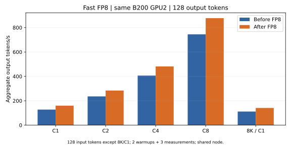
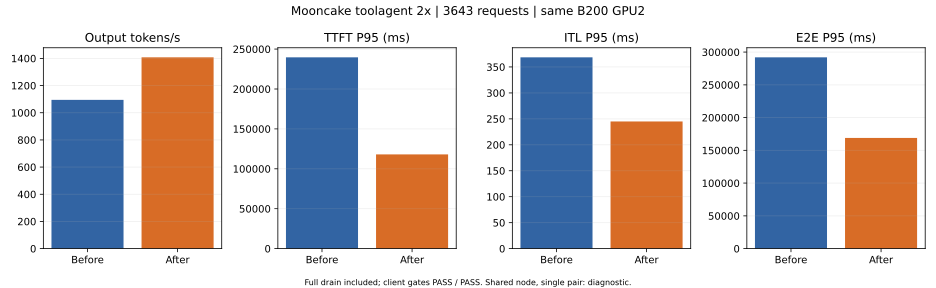
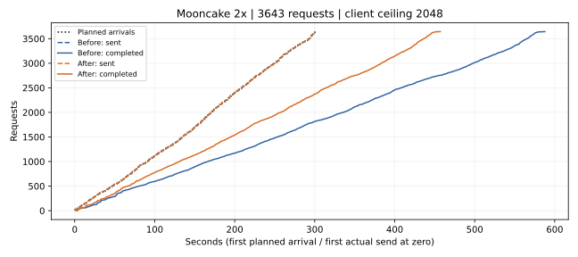

# Fast FP8 分派与布局优化：Mooncake 2×（2026-09-09）

同卡端到端对照：低并发输出吞吐变化 **+17.81%–+26.32%**；Mooncake 2× 输出吞吐 **1094.75 → 1407.82 tok/s（+28.60%）**。共享节点、单次配对、无延迟 SLO，本轮是过载诊断。

小batch更换GEMM后端后，模型检查出现浮点差异，batch8部分生成token改变。本轮是Fast性能优化，不提供bitwise保证，也未评估任务准确率变化。

## 实现

1. DeepGEMM 的 PSUM 专家布局改为一次 Triton 前缀和，同时输出起点和终点；不再生成该布局不使用的逐行 expert-id 缓冲区。
2. scatter 直接写入 TMA 布局的 packed UE8M0 scale，消除中间 FP32 scale 缓冲区和单独转换。固定缓冲区由 GPU 前缀和描述有效范围，消除该路径的 CPU 标量读取。
3. YOCO L3、SM100、BF16 hidden、TP1/DP1/EP1、关闭 EPLB、在线 block-128 FP8 时，M≤16 使用 Triton，较大 M 继续使用 DeepGEMM。最终权重的 packed scale 在加载时解码为小型 FP32 block-scale 缓存；每层368640 bytes，共20层约7.03 MiB，FP8权重不复制。
4. M=3/4 的 Triton 路径按专家分组，修复集中路由下逐条路由建块导致的重复权重读取。M=1/2 保留更轻的分派。
5. 权重更新时原地刷新 scale 缓存；重建 kernel 时传递原缓存，保持已有 CUDA graph 引用的地址。未通过上述配置检查时保留原分派。

修改前基线已经包含上一轮有效路由行 SiLU/量化优化；本报告的增幅只对应本轮新增改动。

## 验证与数值边界

- **209项测试通过**，包括布局/scale与DeepGEMM官方转换逐位比较、非连续scale输入、无效专家、越界保护、graph重放、后端分派边界、并行/精度限制和缓存刷新后已有graph读取新scale。
- 布局/scale融合的完整MoE在M=1/2/4/8/16/32/128/256/512/2048/8192的eager与graph测试中，与修改前逐位一致。
- 小M切换GEMM后端允许正常的浮点归约差异，**不保证跨后端bitwise**。随机和集中路由的实测相对L2误差均低于0.001；两种分布中，所启用M≤16的混合路径均快于融合后的DeepGEMM。
- 完整服务在计时前后检查128、8192、79150输入和batch8的实际log-prob有限性与token计数；计时请求不额外请求log-probs。
- 首版scale打包测试发现额外舍入；第二版又发现DeepGEMM的原始位移/或运算对非2的幂次scale的处理不同。最终直接复刻官方打包操作，所有失败日志保留。原有183项回归在这两次尝试中均通过。

固定输入的模型检查结果（生成token不同的情况不直接比较对应log-prob）：

| 输入 | Batch | 生成token相同 | 同token最大log-prob差 |
| ---: | ---: | --- | ---: |
| 128 | 1 | True | 0.0966261625289917 |
| 8192 | 1 | True | 0.00013216192019172013 |
| 79150 | 1 | True | 0.0018840022385120392 |
| 128 | 8 | False | 未比较（token不同） |

## 完整服务低并发

同一物理B200 GPU2；输入/输出长度固定，每档2次预热、3次计时，取总输出tok/s中位数。所有档位输出128 tokens，各次独立cache salt。

| 输入 | 并发 | 修改前FP8 tok/s | 修改后FP8 tok/s | 变化 |
| ---: | ---: | ---: | ---: | ---: |
| 128 | 1 | 127.82 | 159.87 | +25.07% |
| 128 | 2 | 235.80 | 284.15 | +20.50% |
| 128 | 4 | 406.51 | 481.70 | +18.49% |
| 128 | 8 | 744.74 | 877.39 | +17.81% |
| 8192 | 1 | 111.84 | 141.28 | +26.32% |

## Mooncake 2×

FAST’25 toolagent源窗口300–900秒，仅将时间戳加速2×，到达窗口约300秒。3643请求与此前1.2×版本逐行核对，除时间戳外完全相同。源23608行，上下文兼容23492行（99.51%），窗口占源15.43%。公开trace提供合成长度及前缀关系，不含真实任务答案。

冻结文件SHA256：`e0df4ca65eeac5daf8eb1529f2eb832b2e16ef8c76c53ce426a8ba1f1eb41310`。

Offered load：12.143请求/s、101728.41输入tok/s、2144.59输出tok/s。客户端上限两端统一为2048，服务端仍为256；不与此前上限512的1.2×结果混算。

| 指标 | 修改前FP8 | 修改后FP8 |
| --- | ---: | ---: |
| 输出tok/s | 1094.7523 | 1407.8169 |
| 输入tok/s | 51935.7670 | 66787.7573 |
| 请求/s | 6.1988 | 7.9715 |
| TTFT P50 ms | 105594.9143 | 44364.2755 |
| TTFT P95 ms | 239690.8298 | 118010.8709 |
| TTFT P99 ms | 251459.1670 | 124803.1440 |
| ITL P50 ms | 226.0646 | 170.1736 |
| ITL P95 ms | 368.5522 | 244.9482 |
| ITL P99 ms | 523.4117 | 341.3106 |
| E2E P50 ms | 149821.0895 | 77301.1809 |
| E2E P95 ms | 292022.1846 | 168917.5119 |
| E2E P99 ms | 323188.8464 | 198911.0954 |
| 调度lag P99 ms | 3.1060 | 5.6047 |
| 最大客户端并发 | 1829.0000 | 1274.0000 |
| 排空尾部s | 287.6752 | 156.9866 |
| prefix cache hit fraction | 0.3770 | 0.3770 |
| 计划 | 3643 | 3643 |
| 完成 | 3643 | 3643 |
| 错误 | 0 | 0 |
| 客户端通过 | True | True |
| 调度退化 | 0.0 | 0.0 |
| 服务端通过 | True | True |
| 完全排空 | True | True |
| case | baseline-measured-full-a | candidate-v1-full-b |
| 开始UTC | 2026-09-09T12:55:46.637452+00:00 | 2026-09-09T14:06:59.802637+00:00 |
| running/waiting峰值 | {'vllm:num_requests_running': 256.0, 'vllm:num_requests_waiting': 1567.0} | {'vllm:num_requests_running': 256.0, 'vllm:num_requests_waiting': 1013.0} |
| 指标连续性 | {'standalone': {'scrape_errors': 0, 'max_gap_seconds': 1.3792214393615723, 'counter_resets': []}} | {'standalone': {'scrape_errors': 0, 'max_gap_seconds': 1.307835340499878, 'counter_resets': []}} |
| 其他忙碌GPU | [0, 1] | [0, 1] |

逐请求实际token计数差异：0项。吞吐包含全部请求排空时间；此处300秒到达窗口、无预设延迟SLO、共享节点单次配对，不能将结果称作稳定容量或最大无损请求速率。正式回放依照无新增JIT选择，预热/失败回放全部保留，详见comparison.json的replay_selection。

## 算子证据

布局融合的完整MoE graph A/B（同一B200 GPU3，3次交替测量中位数；不含共享专家及attention）：

| M | 原DeepGEMM µs | 融合后DeepGEMM µs | 加速比 |
| ---: | ---: | ---: | ---: |
| 1 | 87.48 | 71.48 | 1.224× |
| 2 | 99.76 | 83.62 | 1.193× |
| 4 | 129.02 | 113.28 | 1.139× |
| 8 | 179.72 | 165.20 | 1.088× |
| 16 | 246.22 | 232.90 | 1.057× |
| 32 | 322.96 | 306.38 | 1.054× |
| 128 | 361.45 | 349.56 | 1.034× |
| 256 | 369.76 | 359.14 | 1.030× |
| 512 | 388.01 | 375.76 | 1.033× |
| 2048 | 571.73 | 563.37 | 1.015× |
| 8192 | 1579.43 | 1588.04 | 0.995× |

M=8192 的微小变化落在本轮样本波动范围内，未确认该点有收益。

混合分派与融合后的DeepGEMM比较：

| 路由分布 | M | DeepGEMM µs | 混合路径 µs | 相对L2误差 |
| --- | ---: | ---: | ---: | ---: |
| spread | 1 | 68.97 | 49.97 | 0 |
| spread | 2 | 85.81 | 67.68 | 0 |
| spread | 3 | 101.58 | 85.20 | 0 |
| spread | 4 | 110.22 | 92.56 | 0.00015174 |
| spread | 8 | 162.72 | 134.46 | 0.000105534 |
| spread | 15 | 229.00 | 196.20 | 0.00016135 |
| spread | 16 | 257.05 | 222.90 | 0.000110921 |
| concentrated | 1 | 71.39 | 49.09 | 0 |
| concentrated | 2 | 72.66 | 60.44 | 1.04684e-05 |
| concentrated | 3 | 73.34 | 52.51 | 0.000150425 |
| concentrated | 4 | 72.19 | 52.73 | 7.67669e-05 |
| concentrated | 8 | 72.72 | 52.41 | 4.90861e-05 |
| concentrated | 15 | 74.94 | 54.89 | 0.000108146 |
| concentrated | 16 | 73.68 | 55.11 | 0.000529776 |

## 复现与证据

分支fhb-dev-9-8，HEAD `511fbed3f75f0fd18a4f93194ca832db2c723f98`加此前本地改动。源码见BASELINE_SOURCE_MANIFEST.json和SOURCE_CANDIDATE.json；保存完整patch及各阶段overlay。

YOCO 30A3B-180M-L3 step28000，在线block-128 W8A8/UE8M0；hidden/KV BF16，TP1/DP1 standalone，FA4、maxlen81920、maxseq256、max batched tokens32768、memory0.85、KV sharing、prefix/chunked、FULL_AND_PIECEWISE、capture1/2/4/8/16/32/64/128/256。模型加载显存两端均记录为32.07 GiB；KV cache从2,170,169变为2,170,109 tokens，详细分配见启动日志。

AIPerf0.12.0，completions/streaming/server token counts，seed42、workers32、客户端上限2048、timeout600；时间戳离线缩放，synthesis-speedup-ratio保持1.0。模型JSON/Python及客户端代码记录内容hash，权重核对大小与修改时间。

Pod `yoco-align-fast-vllm-vllm-train-master-0`，UID `505f46a3-597a-40c3-8260-d213fae60136`，node `slc01-cl02-hgx-0228`。服务GPU2 UUID `GPU-3c98295b-46bd-92b3-ef14-82b5e35524f7`；测试GPU3 UUID `GPU-7d5a27ae-f576-89e7-835b-64d8602e70b0`。GPU测试与服务计时顺序执行，保留Job/Pod和PID7。

本地证据 `/home/lidong1/vllm_test/yoco_results/fast-fp8-dispatch-f2-20260909`；Pod内 `/data/fast-fp8-dispatch-f2-20260909`。最终保留新版FP8服务，Pod内endpoint `127.0.0.1:8794`，所有权由该目录active.json/control.py记录。

[原始备份](BACKUP.json) · [比较JSON](comparison.json) · [低并发CSV](low-concurrency.csv) · [回放CSV](trace.csv) · [测试结果](validation-final-tests.xml)

最终pre-commit与差异空白检查通过。GPU审计无新增不可纠正ECC或Xid，源码、模型文件元信息、客户端与trace校验保持一致，Pod UID/restart及PID7保留。
