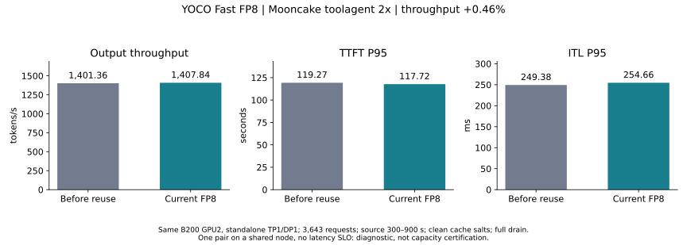
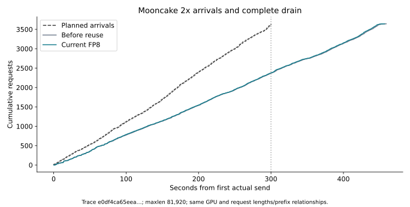

# Fast FP8 公共路径复用后的 Mooncake 2× 评测

当前 Fast FP8 的观测输出吞吐为 **1,407.84 tok/s**；同卡重测的修改前 FP8 为 **1,401.36 tok/s**，变化 **+0.46%，基本持平**。两者均完成全部 3,643 请求，零错误，客户端门槛通过并完整排空。

两端均为 YOCO L3 step28000、Fast online block-128 FP8，hidden/KV 为 BF16。本轮比较 K/V、shared-expert 与缓存公共路径复用前后的实现，没有重测 BF16、Align 或 Qwen。共享节点、单次配对、无延迟 SLO，结果属于过载诊断；较小差异不足以单独确认稳定收益。

## 结果

| 指标 | 修改前 FP8 | 当前 FP8 |
| --- | ---: | ---: |
| 输出 tok/s | 1,401.359 | 1,407.839 |
| 输入 tok/s | 66,481.378 | 66,788.787 |
| 请求/s | 7.935 | 7.972 |
| TTFT P50 / s | 44.527 | 43.609 |
| TTFT P95 / s | 119.269 | 117.720 |
| TTFT P99 / s | 126.482 | 124.821 |
| ITL P50 / ms | 170.571 | 170.061 |
| ITL P95 / ms | 249.379 | 254.662 |
| ITL P99 / ms | 344.843 | 348.961 |
| E2E P50 / s | 77.292 | 76.392 |
| E2E P95 / s | 170.658 | 168.721 |
| E2E P99 / s | 200.769 | 199.329 |
| 调度 lag P99 / ms | 5.268 | 5.736 |
| 最大客户端并发 | 1,274.000 | 1,266.000 |
| 排空尾部 / s | 159.090 | 156.979 |
| prefix cache hit fraction | 0.377 | 0.377 |

## 固定条件与审计

Mooncake FAST’25 [toolagent trace](https://raw.githubusercontent.com/kvcache-ai/Mooncake/main/FAST25-release/traces/toolagent_trace.jsonl)，源窗口 300–900 秒，仅离线缩放时间戳为 2×，到达约 300 秒。源 23608 行，按输入加输出不超过81920保留 23492 行（99.51%），本窗口3643行占原始源 15.43%。两端使用相同文件字节、请求顺序、输入/输出长度和 hash_ids。

Trace SHA256：`e0df4ca65eeac5daf8eb1529f2eb832b2e16ef8c76c53ce426a8ba1f1eb41310`。源 SHA256：`48a2db1a13d3bc05e6330140c64f604ba366df20d3c9e128b5c35a01c1fa5f71`。

Offered load：12.143 请求/s、101,728.41 输入 tok/s、2,144.59 输出 tok/s。吞吐包含全部请求完成所需时间。公开 trace 不含真实提示词或任务答案，不能用于模型质量评估。

同一物理 B200 GPU2，UUID `GPU-3c98295b-46bd-92b3-ef14-82b5e35524f7`，node `slc01-cl02-hgx-0228`，TP1/DP1 standalone。maxlen81920、maxseq256、max batched tokens32768、memory0.85、FA4、KV sharing、prefix caching、chunked prefill、FULL_AND_PIECEWISE、capture1/2/4/8/16/32/64/128/256。

AIPerf 0.12.0，completions/streaming、server token counts、seed42、workers32、record processors1、timeout600、客户端上限2048。每 case 独立 cache salt，`synthesis-speedup-ratio=1.0`。并发上限只是保护阈值，到达率由时间戳决定。

复用已有编译缓存后启动当前服务，保留默认 DeepGEMM relax 预热。计时前后检查实际 log-prob 有限性、源码、模型文件元信息和客户端版本/hash；权重未重新全量计算内容 hash。新增融合的实际启用状态保存在数值检查的服务快照中。

| 审计项 | 修改前 FP8 | 当前 FP8 |
| --- | --- | --- |
| 正式 case | baseline-full-a | candidate-full-b |
| 开始 UTC | 2026-09-10T05:30:14.889473+00:00 | 2026-09-10T05:54:34.553808+00:00 |
| 成功 / 计划 | 3643 / 3643 | 3643 / 3643 |
| 客户端门槛 | True | True |
| 调度退化 | 0.0 | 0.0 |
| 服务端门槛 | True | True |
| 完全排空 | True | True |
| running/waiting 峰值 | {'vllm:num_requests_running': 256.0, 'vllm:num_requests_waiting': 1009.0} | {'vllm:num_requests_running': 256.0, 'vllm:num_requests_waiting': 1002.0} |
| 指标连续性 | {'standalone': {'scrape_errors': 0, 'max_gap_seconds': 1.279832124710083, 'counter_resets': []}} | {'standalone': {'scrape_errors': 0, 'max_gap_seconds': 1.2283234596252441, 'counter_resets': []}} |
| 其他忙碌 GPU | [0, 1] | [0, 1] |

逐请求实际 token 计数不一致：0 项。两端 GPU volatile/aggregate 不可纠正 ECC 计数无增加，正式时段服务日志未见 CUDA/Xid 错误。

正式 case 依据无新增 JIT、kernel cache 文件清单及元信息无变化选择；首轮如触发编译则保留为预热，不按最快成绩挑选。全部回放选择依据见 comparison.json 的 replay_selection。

本次未观察到明显的整模型提速。此前 shared-expert 局部链路的加速比不能直接当作 Mooncake 端到端收益。

## 代码与证据

代码为 `fhb-dev-9-8` 的 `511fbed3f75f0fd18a4f93194ca832db2c723f98` 加本地改动；本轮没有修改推理实现。前后源码分别记录在 SOURCE_BASELINE.json / SOURCE_CANDIDATE.json，复用实现的383项回归与局部性能见[开发报告](../fast-precision-reuse-20260909/REPORT.md)。

本地原始目录：`/home/lidong1/vllm_test/yoco_results/fast-fp8-reuse-mooncake-f2-20260910T052204Z`；Pod 内：`/data/fast-fp8-reuse-mooncake-f2-20260910T052204Z`。最终保留当前 Fast FP8 服务与原4卡Job，GPU3未参与服务计时。

[比较 JSON](comparison.json) · [CSV](trace.csv) · [备份索引](BACKUP.json)
