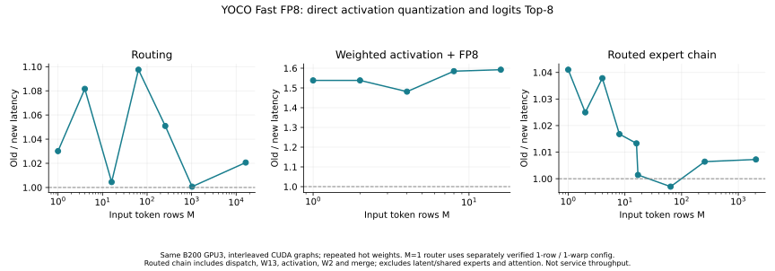

# Fast：直接 FP8 激活量化与 Top-8 logits 路由

两项优化已接入 `fhb-dev-9-8` 的本地实现：Fast路由先选Top-8 logits再做8路softmax；YOCO routed FP8直接从FP32加权SwiGLU结果量化，减少BF16中间转换。shared expert保留原舍入边界，Align保留完整softmax路径。

B200上403项完整回归通过；单行路由调整和最终代码分别通过28项定向复查，最终Fast/Align诊断另有2项测试通过。全部上述正式通过轮均零失败、零跳过。完整模型15个固定前缀的Top-1均未改变，生成log-prob均有限；1,024个公开文本采样位置的新旧FP8平均NLL没有观察到退化。

低M的激活加量化链路加速1.48–1.59×，routed-expert完整调用链加速约1.3%–4.1%；大M调用链基本持平。本轮未重测Mooncake或整模型吞吐，不用局部加速比改写历史性能表。

## 实现

1. `_yoco_fused_topk_routing_kernel` 增加编译期策略：Fast在原始logits上选Top-8，再进行FP32 softmax；Align继续原来的128路softmax、Top-8、重新归一化。保留INT32 IDs和左侧优先的并列规则。极近logits经softmax可能形成并列，因此跨旧/新Fast不承诺bitwise。
2. B200单token的新路由使用一行、一warp；其余形状保留原四行、四warp。首次测量发现新算法沿用旧配置时单token回退，追加六轮交替测量后采用专门配置。
3. `silu_mul_quant_fp8_triton` 共用激活计算，支持保留/移除BF16舍入，以及打包INT32或普通FP32 scale布局。直接模式采用与训练相同的UE8M0指数位取整。旧packed入口保留默认语义，shared expert继续先舍入BF16。
4. DeepGEMM仅对带YOCO开关的routed加权激活启用直接模式；已验证的小M Triton fallback直接生成FP8和兼容scale，跳过BF16中间写回与单独量化调用。开关经过online MoE入口、modular入口和fallback传递。
5. 路由诊断按Fast/Align选择对应路径，避免两种算法分开后记录错误的诊断结果。

本轮验证配置为L3、SM100/B200、TP1/DP1、在线block128 FP8，hidden/KV为BF16；小M Triton分派上限仍为16。shared、BF16激活、其他模型和不满足新路径条件的后端保留原计算。Fast BF16也复用新的路由算法。llm-train本身已有直接量化公式，本轮以它作参考，没有修改训练实现。

## 同卡局部性能

GPU3 UUID：`GPU-7d5a27ae-f576-89e7-835b-64d8602e70b0`，node `slc01-cl02-hgx-0228`。交替CUDA Graph计时，表内取三次计时的中位数；M1路由专门复核取六次中位数。启动编译在计时前完成。GPU0/1/6/7存在其他任务，按共享节点诊断解读。

### 激活与量化

输入为W13的BF16输出，包含clamp、SiLU、up乘法、路由权重和FP8量化；表内只列实际小M Triton分派覆盖的token行数。

| token M | 旧分离链路 µs | 新融合链路 µs | 加速比 |
| --- | ---: | ---: | ---: |
| 1 | 5.118 | 3.327 | 1.538× |
| 2 | 5.118 | 3.327 | 1.538× |
| 4 | 5.118 | 3.455 | 1.481× |
| 8 | 5.279 | 3.331 | 1.585× |
| 16 | 5.502 | 3.455 | 1.592× |

### Routed-expert完整链路

包括输入量化、分组/布局、W13、加权激活量化、W2和合并；不包含router投影、latent投影、shared expert、attention和服务调度。E128、Top-8、latent1024、FFN3840，使用相同权重和路由，反复命中热权重缓存。

| M | 旧FP8 µs | 新FP8 µs | 加速比 | 相对旧FP8输出L2差异 |
| --- | ---: | ---: | ---: | ---: |
| 1 | 48.416 | 46.508 | 1.041× | 1.5057% |
| 2 | 67.313 | 65.673 | 1.025× | 1.3818% |
| 4 | 96.065 | 92.563 | 1.038× | 1.5538% |
| 8 | 126.024 | 123.944 | 1.017× | 1.5433% |
| 16 | 210.179 | 207.420 | 1.013× | 1.7140% |
| 17 | 242.481 | 242.138 | 1.001× | 1.5649% |
| 64 | 347.538 | 348.579 | 0.997× | 1.6714% |
| 256 | 367.534 | 365.189 | 1.006× | 1.6554% |
| 2048 | 566.241 | 562.166 | 1.007× | 1.6597% |

单token路由专门复核：旧完整softmax **2.207 µs**，新Top-8 logits的一行/一warp配置 **2.143 µs**。未采用的新算法四行/四warp配置为2.284 µs。全部候选与原始样本见router-single.json。

输出相对旧FP8的L2差异约1.38%–1.71%，不能把它称为与训练参考的误差：旧路径多一次BF16舍入，新路径在覆盖的激活测试中与训练公式的FP8字节和scale完全一致。真实模型中还有不同GEMM、融合、路由与缓存的影响。

## 完整模型与文本数值检查

候选运行在GPU3、port8804，使用相同L3 step28000模型、FA4、KV sharing与FULL_AND_PIECEWISE。实际快照确认20组experts的wrapper、DeepGEMM和Triton fallback直接量化开关均已启用，20个shared expert保持原融合策略。

固定前缀沿用此前同GPU3的当前FP8参考记录，覆盖英文、中文、代码和数学文本。

| 指标 | 结果 |
| --- | ---: |
| 前缀数 / 成功比较数 | 15 / 15 |
| Top-1改变 | 0 |
| 基线目标未出现在候选Top-20 | 0 |
| 同一目标最大log-prob绝对差 | 0.293840 |
| 平均log-prob绝对差 | 0.049418 |

另检查ISL128、8192、79150和batch8的11个请求，全部完成指定输出，log-prob有限。概率差异可见；Top-1不变不代表概率分布相同。

### 公开文本的固定位置NLL

冻结 [WikiText-2 validation文本](https://raw.githubusercontent.com/pytorch/examples/main/word_language_model/data/wikitext-2/valid.txt)，取前40,000字符分词，在位置128至4192、步长4处评价1,024个真实下一token。完整源文件hash、token序列、位置见quality-dataset-dense.json。

每次只强制生成该位置的真实下一token，读取mask之前的raw log-prob；通过同一前缀的强制/非强制greedy概率一致性检查，排除把归一化后概率1误当模型概率。比较使用相同文本、tokenizer、位置和128个稀疏位置的缓存预热顺序。旧/新FP8在同一GPU3串行运行，服务参数和库版本核对一致；BF16参考来自保留的GPU2服务，因此BF16横向比较另保留物理GPU差异。

| 实现 | 1,024位置平均NLL（nat/token） |
| --- | ---: |
| BF16参考 | 1.448001 |
| 修改前FP8 | 1.449902 |
| 当前FP8 | 1.443473 |

新旧FP8的平均NLL差为 **-0.006428 nat/token**，exp(平均NLL)比例为 **0.993592**。在这组样本上未观察到平均NLL退化；这不是完整数据集PPL、统计显著性或任务准确率保证。

先前128位置探索中，新FP8相对BF16的NLL差为+0.01377 nat/token；扩大到1,024位置后差为−0.00453。两份原始结果均保留，这也说明不能把小规模采样的方向解释为整体模型质量提高。

## 验证版本与证据

403项整体回归对应v3；单token配置加入后的路由检查对应v4，最终v5又通过28项路由检查和2项CPU诊断检查。完整模型与文本检查使用v4，最终v5新增按模式记录的诊断和格式整理；该诊断在模型验证中关闭。已核对去掉诊断函数/调用后的operator AST相同，其他推理文件逐字节相同，见FINAL_SOURCE_EQUIVALENCE.json。

模型/数值验证源码单独保存SOURCE_MODEL_V4.json，最终源码保存SOURCE_MANIFEST.json。代码HEAD为`511fbed3f75f0fd18a4f93194ca832db2c723f98`加已有本地改动；TASK.patch只记录本轮差异。原始失败测试、未采用的路由配置和GPU空闲门槛拒绝记录都随归档保留。

最终pre-commit和git diff --check通过。验证后GPU3两个临时服务均通过各自owner停止；GPU2原BF16服务和原4卡Job/Pod保留。本轮没有提交或推送。

[比较JSON](comparison.json) · [局部CSV](microbench.csv) · [质量样本](quality-dense.json) · [旧FP8质量样本](quality-baseline.json) · [备份索引](BACKUP.json) · [精度审计](../fast-precision-audit-20260910/REPORT.md)
