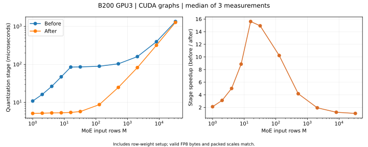
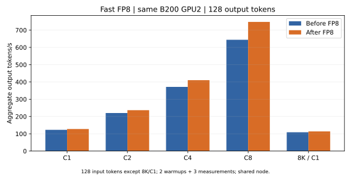
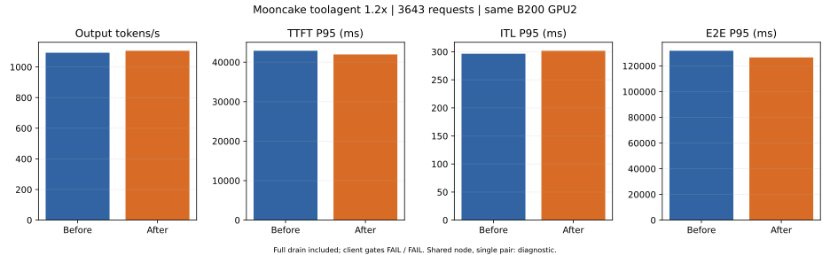

# Fast FP8 有效路由行量化优化（2026-09-09）

本轮低并发输出吞吐提升 **3.93%–16.07%**；Mooncake toolagent 1.2× 的观测输出吞吐从 **1092.94** 增至 **1105.88 tok/s**（**+1.18%**）。结果来自共享节点上的一次同卡配对，按诊断结果解读。

Mooncake 的增幅仅约 1.2%，正式比较的两端均未通过客户端调度门槛；不足以确认稳定的 trace 吞吐或容量提升。首轮新版回放通过调度门槛，重跑则未通过，原始结果全部保留。

## 实现

利用 MoE 已有的 `inv_perm`，让融合 SiLU、路由加权、FP8 量化和 scale 打包的 kernel 只遍历有效路由行，并把结果写回 DeepGEMM 所需的专家布局。直接读取 routing-order 权重，消除原来的全缓冲区权重清零与独立权重 scatter。

每个有效索引必须唯一；无效专家索引跳过。CUDA graph 的静态缓冲区形状保持原规格，SiLU、clamp、路由加权、BF16 舍入和 FP8 scale 算法保持原顺序。没有改变 GEMM 的 K 维归约。padding 的量化输出不再写入，消费者只能使用有效路由行。

源码：[量化 kernel](../../../../vllm/model_executor/layers/quantization/utils/fp8_utils.py)、[DeepGEMM 调用](../../../../vllm/model_executor/layers/fused_moe/experts/deep_gemm_moe.py)、[回归测试](../../../../tests/kernels/moe/test_yoco_fp8_sparse.py)。

本轮解决的是激活量化的 padding 工作和路由权重 scatter。小 M FP8 GEMM 分派、MoE 输入 scale 的 FP32→UE8M0 转换、混合精度投影融合仍是后续优化项；GEMM 自身的专家 padding 仍存在。

## 数值与回归

- **183 passed**，其中新增 23 项覆盖有效行 FP8 字节和 packed scale 逐位比较、不同正负行权重、无效专家索引、越界保护、NaN padding、路由变化后的 graph 重放，以及实际 W13→量化→W2→top-k 求和。
- 完整 MoE 在 eager 和 CUDA graph 下，与原来的全缓冲区量化路径逐位一致。
- 修改前后的完整服务均在计时前后通过 ISL128、8192、79150、ISL128/batch8 的 log-prob 有限性和 token 计数检查。
- 计时前 11 个样本的生成 token 全部相同：True；最大 log-prob 差：0。对比对象是修改前后的 FP8。
- 最终代码的 pre-commit 和 `git diff --check` 通过。

首次运行有两项工具准备问题：基线数值脚本缺少新目录的 source manifest，在发请求前退出；首次 pytest 因测试包导入冲突在收集阶段退出。补齐 manifest，并复用已有 B200 bootstrap/importlib 测试入口后通过。两次失败记录均保留。

## 量化环节 A/B

B200 GPU3，CUDA graph，交替测量修改前后实现，各 3 次，表中为中位数。计时包括路由权重准备和融合量化，倍数仅对应该环节。M=1/2/4/8/16/32/128/512/2048/8192/32768 共 11 档均加速，所有有效行 FP8 数据和 scale 逐位相同。

| MoE 输入 M | 有效路由行 | padding 缓冲区行 | 修改前 µs | 修改后 µs | 环节加速 |
| ---: | ---: | ---: | ---: | ---: | ---: |
| 1 | 8 | 1024 | 10.92 | 5.15 | 2.120× |
| 2 | 16 | 2048 | 16.26 | 5.22 | 3.116× |
| 4 | 32 | 4096 | 26.57 | 5.30 | 5.009× |
| 8 | 64 | 8192 | 47.37 | 5.35 | 8.859× |
| 16 | 128 | 16384 | 85.31 | 5.46 | 15.611× |
| 32 | 256 | 16512 | 86.12 | 5.77 | 14.927× |
| 128 | 1024 | 17280 | 89.84 | 8.78 | 10.226× |
| 512 | 4096 | 20352 | 104.05 | 24.94 | 4.172× |
| 2048 | 16384 | 32640 | 160.95 | 82.79 | 1.944× |
| 8192 | 65536 | 81792 | 396.83 | 320.04 | 1.240× |
| 32768 | 262144 | 278400 | 1350.00 | 1279.20 | 1.055× |

## 完整服务低并发

同一物理 B200 GPU2、相同 FP8 模型与参数；每档 2 次预热、3 次计时，取总输出 token / 请求完成墙钟时间的中位数。每次独立 cache salt；均生成 128 tokens。

| 输入 | 并发 | 修改前 FP8 tok/s | 修改后 FP8 tok/s | 提升 |
| ---: | ---: | ---: | ---: | ---: |
| 128 | 1 | 122.85 | 127.67 | +3.93% |
| 128 | 2 | 220.23 | 236.64 | +7.45% |
| 128 | 4 | 371.50 | 410.35 | +10.46% |
| 128 | 8 | 644.09 | 747.60 | +16.07% |
| 8192 | 1 | 108.76 | 113.69 | +4.53% |

## Mooncake 1.2×

FAST’25 `toolagent_trace.jsonl` 源窗口 300–900 秒，时间戳离线加速 1.2×，到达约 500 秒；长度、顺序和 hash_ids 保持不变。冻结文件 SHA256：`5317e2301656c7d5441bbd63e58b7e8b9d3d445e0118729cd7fde0b8717b960c`。源 23608 行，上下文兼容 23492 行（99.51%），窗口 3643 行（源总量 15.43%）。公开 trace 只提供合成回放参数。

Offered load：7.286 请求/s、61037.05 输入 tok/s、1286.75 输出 tok/s。

| 指标 | 修改前 FP8 | 修改后 FP8 |
| --- | ---: | ---: |
| 输出 tok/s | 1092.9398 | 1105.8824 |
| 输入 tok/s | 51849.7675 | 52463.7736 |
| 请求/s | 6.1886 | 6.2619 |
| TTFT P50 ms | 2499.4966 | 2284.1789 |
| TTFT P95 ms | 42893.6949 | 41958.2908 |
| TTFT P99 ms | 47660.0609 | 43877.0802 |
| ITL P50 ms | 160.2638 | 152.7691 |
| ITL P95 ms | 296.5513 | 301.8034 |
| ITL P99 ms | 517.5673 | 477.1747 |
| E2E P50 ms | 27575.8514 | 22592.2533 |
| E2E P95 ms | 131815.3135 | 126603.8272 |
| E2E P99 ms | 176770.4419 | 173340.2664 |
| 调度 lag P99 ms | 11164.9932 | 7922.3846 |
| 最大客户端并发 | 512.0000 | 512.0000 |
| 排空尾部 s | 88.6497 | 81.7606 |
| prefix cache hit fraction | 0.3778 | 0.3778 |
| 计划请求 | 3643 | 3643 |
| 完成请求 | 3643 | 3643 |
| 错误记录 | 0 | 0 |
| 客户端调度通过 | False | False |
| 调度退化 | 1.0 | 1.0 |
| 服务端检查通过 | True | True |
| 完整排空 | True | True |
| 采用 case | baseline-measured-full-a | candidate-v1-full-b |
| 开始 UTC | 2026-09-09T11:49:55.290004+00:00 | 2026-09-09T12:26:28.998188+00:00 |
| 新编译 kernel | {'deep_gemm': [], 'triton': []} | {'deep_gemm': [], 'triton': []} |
| running/waiting 峰值 | {'vllm:num_requests_running': 256.0, 'vllm:num_requests_waiting': 256.0} | {'vllm:num_requests_running': 256.0, 'vllm:num_requests_waiting': 256.0} |
| metrics 连续性 | {'standalone': {'scrape_errors': 0, 'max_gap_seconds': 1.2921831607818604, 'counter_resets': []}} | {'standalone': {'scrape_errors': 0, 'max_gap_seconds': 1.3361241817474365, 'counter_resets': []}} |
| 其他忙碌 GPU | [0, 1] | [0, 1] |

逐请求实际 token 计数差异：0 项。吞吐包括排空；原版达到客户端并发上限、发送时间表发生退化，因此该比值只描述本次有限并发回放，不作为最大容量或固定内核加速倍数。没有设定延迟 SLO，且为共享节点上的单次配对。

## 复现与证据

分支 `fhb-dev-9-8`，HEAD `511fbed3f75f0fd18a4f93194ca832db2c723f98`，包含此前尚未提交的 Fast FP8 适配。修改前后源码以 `BASELINE_SOURCE_MANIFEST.json` 和 `SOURCE_CANDIDATE.json` 区分，归档含两份 overlay 和本轮 patch。

模型 YOCO 30A3B-180M-L3 step 28000；在线 block-128 W8A8/UE8M0，hidden/KV BF16。TP1/DP1 standalone，FA4，maxlen81920，maxseq256，max batched tokens32768，memory0.85，prefix caching、chunked prefill、KV sharing、FULL_AND_PIECEWISE，capture1/2/4/8/16/32/64/128/256。两端 CLI 参数除入口文件路径外逐项相同；KV cache 均 2,170,169 tokens。

新版首次完整回放 `candidate-v1-full-a` 通过客户端检查，但日志观察到 `kernel_unified_attention` 和 `_yoco_weighted_rms_clip_kernel` 的首次 JIT，因此保留为预热。正式结果采用序列记录中的无新增 JIT 回放；详见 comparison.json 的 replay_selection。

AIPerf 0.12.0；completions/streaming/server token counts；seed42、workers32、客户端上限512、固定时间表、相同 tokenizer。正式计时选择没有观察到新增 JIT 的完整回放；有新编译的 case 会保留并作为预热后重测。

Pod `yoco-align-fast-vllm-vllm-train-master-0`，UID `505f46a3-597a-40c3-8260-d213fae60136`，node `slc01-cl02-hgx-0228`。服务 GPU2：`GPU-3c98295b-46bd-92b3-ef14-82b5e35524f7`；测试 GPU3：`GPU-7d5a27ae-f576-89e7-835b-64d8602e70b0`。测试与端到端计时顺序执行。

本地证据：`/home/lidong1/vllm_test/yoco_results/fast-fp8-sparse-20260909`。Pod 内：`/data/fast-fp8-sparse-20260909`。最终保留新版 FP8 服务，所有权由该目录 `active.json` / `control.py` 记录；endpoint 为 Pod 内 `127.0.0.1:8794`。

模型 JSON/Python 与客户端源码记录内容 hash，权重核对大小和修改时间。环境与 GPU 审计结果随报告保存。原始日志、请求记录、失败记录、source overlays 和备份 SHA256 见 [BACKUP.json](BACKUP.json)。

[机器可读比较](comparison.json) · [低并发 CSV](low-concurrency.csv) · [回放 CSV](trace.csv) · [算子数据](quant-microbench.json)
