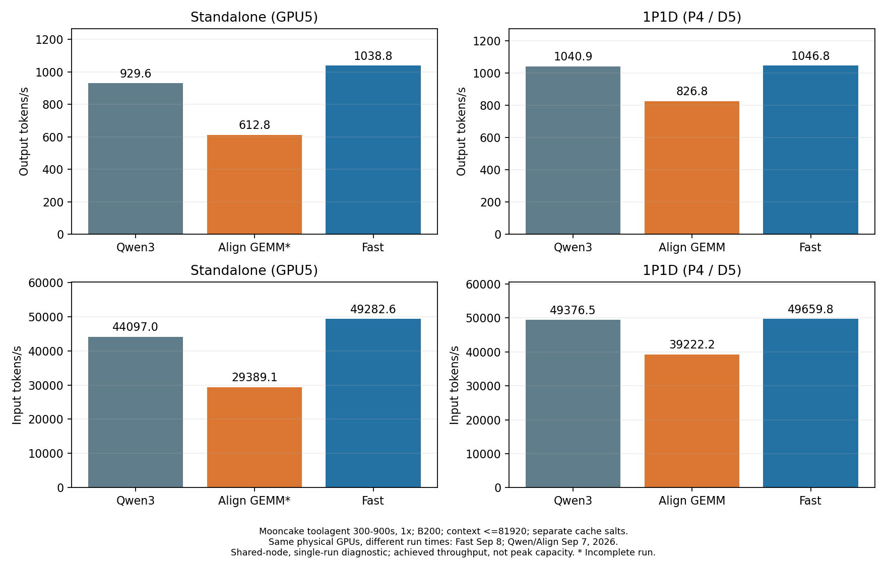
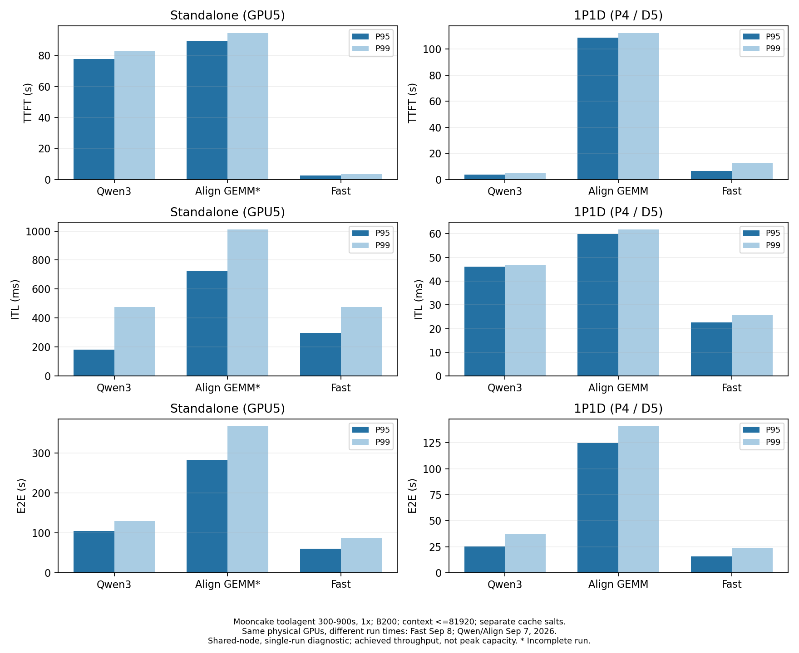
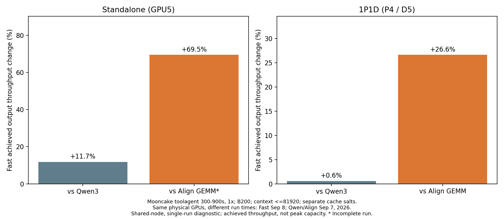
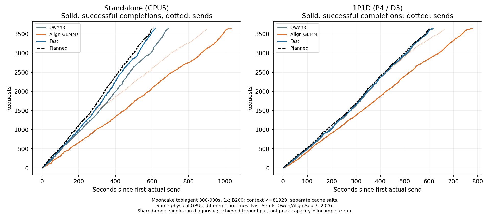
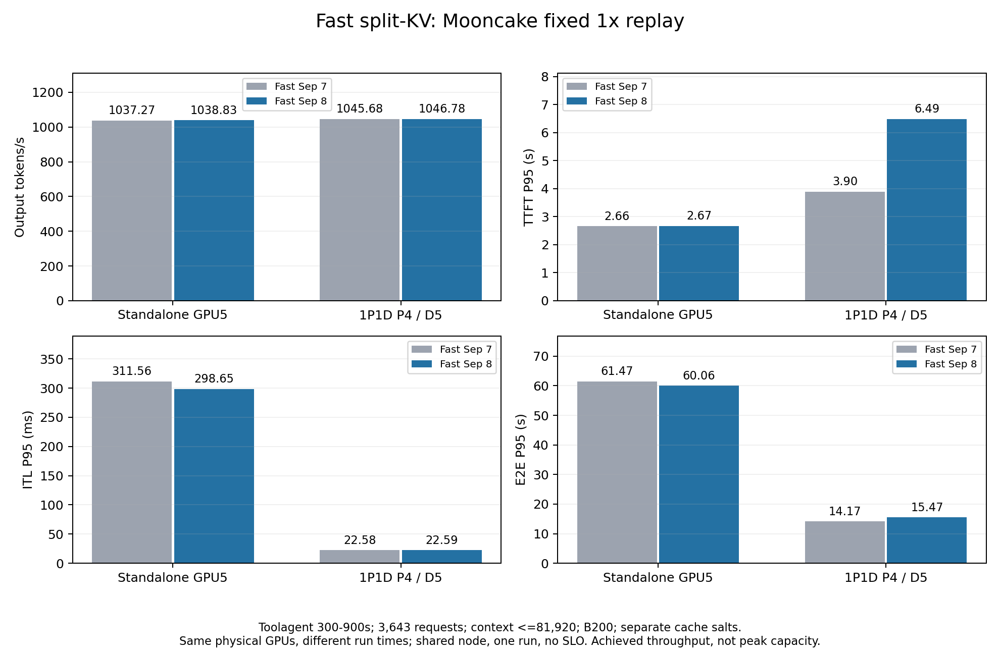

# fhb-dev-9-8 Fast：Mooncake 开源 trace 复测

测量日期：2026-09-08 UTC。当前推理源码提交 `416b83d83504af902b8da248452a19cc5d56b5db`。只新测 Fast 单卡与 1P1D，历史 Fast、Qwen3、Align 的实际测量时间见表。

| 拓扑 | 旧 Fast 输出 tok/s | 当前 Fast 输出 tok/s | 变化 | 当前 Fast 相对历史 Qwen3 |
| --- | --- | --- | --- | --- |
| standalone | 1037.27 | 1038.83 | +0.15% | +11.75% |
| pd | 1045.68 | 1046.78 | +0.10% | +0.56% |

本轮两种拓扑的输出吞吐都只变化约0.1%，应视为基本持平。单卡ITL/E2E略降；1P1D的TTFT P95从3.895秒升到6.490秒（+66.61%），E2E P95增加9.12%，属于需要保留并调查的尾延迟退化，不能据此宣称Mooncake全面加速。

## 条件与结论边界

本轮沿用2026-09-07的 Fast 模型、同物理 B200 GPU5（单卡）与 GPU4/5（1P1D）、依赖版本、启动和客户端参数。COMPARABILITY.json核对完整命令、环境、trace和GPU；允许实验目录与每case独立cache_salt变化。唯一生产推理Python差异是flash_attn.py对Fast恢复FA4 split-KV调度；另有Align实验profile和说明文件变化，但本轮三端align_profile均为null，没有加载该profile。完整差异见SOURCE_DELTA.json和COMPARABILITY.json，Align规则保持。

共享节点、单次测量、没有预设延迟SLO，因此全部为 diagnostic。固定1×回放计划约6.07168 req/s、50864.21 input tok/s、1072.293 output tok/s。吞吐包含最后排空，接近输入负载后无法用此数值推断峰值能力。W2固定形状长上下文与该trace的长度、并发和缓存分布不同，不能把W2加速比直接套到这里。

Mooncake FAST’25 toolagent 是按长度与hash_ids合成的开源trace，不含真实prompt文本、工具调用或质量标签。原文件23608条；上下文过滤116条，保留23492条（99.51%）；取源时间300–900秒共3643条（原文件15.43%）。冻结SHA256 `680e526d49545258c0ca5b635d0004a44cce2ce990d533ac32024cefee1f0170`；原始SHA见traces manifest。

AIPerf0.12.0、fixed schedule、1×、streaming、server token counts；concurrency512、workers32、record-processors1、timeout600、seed42。BF16、TP1/DP1、maxlen81920、maxseq256、memory0.85；单卡/P budget32768，D8192。请求FA4/FULL_AND_PIECEWISE；实际Fast按角色MoE策略见EFFECTIVE_BACKENDS.json。启动阶段的编译、图捕获与预热不计入回放；回放期间首次遇到形状触发的工作仍完整计入。

## 吞吐、完成与延迟

| 模式 | 拓扑 | 开始时间 UTC | 完成/计划 | 错误 | 输入 tok/s | 输出 tok/s | 每推理GPU输出 tok/s |
| --- | --- | --- | --- | --- | --- | --- | --- |
| Old Fast | standalone | 2026-09-07T12:44:36+00:00 | 3643/3643 | 0 | 49208.94 | 1037.27 | 1037.27 |
| Current Fast | standalone | 2026-09-08T07:15:16+00:00 | 3643/3643 | 0 | 49282.60 | 1038.83 | 1038.83 |
| qwen3 | standalone | 2026-09-07T10:28:53+00:00 | 3643/3643 | 0 | 44096.98 | 929.63 | 929.63 |
| align | standalone | 2026-09-07T08:56:01+00:00 | 3638/3643 | 5 | 29389.12 | 612.83 | 612.83 |
| Old Fast | pd | 2026-09-07T13:05:53+00:00 | 3643/3643 | 0 | 49607.84 | 1045.68 | 522.84 |
| Current Fast | pd | 2026-09-08T07:35:28+00:00 | 3643/3643 | 0 | 49659.82 | 1046.78 | 523.39 |
| qwen3 | pd | 2026-09-07T10:49:49+00:00 | 3643/3643 | 0 | 49376.48 | 1040.93 | 520.46 |
| align | pd | 2026-09-07T08:36:02+00:00 | 3643/3643 | 0 | 39222.23 | 826.76 | 413.38 |

Align单卡历史5超时，保留未完成状态；成功请求吞吐和延迟有幸存者偏差，不代表等工作量比较。Qwen3与YOCO为不同模型，端到端差距不能全部归因于kernel。

下表各延迟为P50 / P95 / P99；TTFT和E2E单位秒，ITL单位毫秒。AIPerf ITL为每请求平均token间隔的分布。

| 模式 | 拓扑 | TTFT s | ITL ms | E2E s |
| --- | --- | --- | --- | --- |
| Old Fast | standalone | 1.55 / 2.66 / 3.20 | 81.83 / 311.56 / 475.95 | 4.52 / 61.47 / 88.31 |
| Current Fast | standalone | 1.54 / 2.67 / 3.32 | 80.50 / 298.65 / 477.42 | 4.47 / 60.06 / 86.88 |
| qwen3 | standalone | 41.75 / 77.64 / 82.96 | 80.26 / 183.57 / 475.21 | 50.51 / 104.70 / 129.92 |
| align | standalone | 68.05 / 89.30 / 94.55 | 386.09 / 725.70 / 1010.19 | 84.89 / 282.75 / 367.18 |
| Old Fast | pd | 2.09 / 3.90 / 4.69 | 18.45 / 22.58 / 24.32 | 3.25 / 14.17 / 20.37 |
| Current Fast | pd | 2.15 / 6.49 / 12.82 | 18.17 / 22.59 / 25.72 | 3.58 / 15.47 / 24.00 |
| qwen3 | pd | 1.52 / 3.57 / 4.91 | 36.83 / 46.05 / 46.90 | 3.08 / 25.22 / 37.47 |
| align | pd | 63.17 / 108.83 / 112.31 | 54.08 / 59.82 / 61.75 | 73.43 / 124.51 / 140.83 |

| 拓扑 | TTFT P95变化 | ITL P95变化 | E2E P95变化 |
| --- | --- | --- | --- |
| standalone | +0.59% | -4.14% | -2.29% |
| pd | +66.61% | +0.02% | +9.12% |

## 客户端、服务与GPU审计

| 模式 | 拓扑 | lag P99 ms | 最大有效并发 | 客户端门槛 | 服务门槛 | 完全排空 | 末次计划到达后耗时 s |
| --- | --- | --- | --- | --- | --- | --- | --- |
| Old Fast | standalone | 3.09 | 212.0 | True | True | True | 20.24 |
| Current Fast | standalone | 9.59 | 211.0 | True | True | True | 19.32 |
| qwen3 | standalone | 9533.22 | 512.0 | False | True | True | 92.06 |
| align | standalone | 295920.39 | 512.0 | False | True | True | 434.49 |
| Old Fast | pd | 6.51 | 85.0 | True | True | True | 15.26 |
| Current Fast | pd | 13.35 | 115.0 | True | True | True | 14.61 |
| qwen3 | pd | 5.89 | 102.0 | True | True | True | 18.07 |
| align | pd | 60833.25 | 512.0 | False | True | True | 178.17 |

客户端门槛包含零错误、长度核验、replay_sched_degraded=0、lag P99≤500ms、不触及并发512；服务门槛包含metrics连续性和计数器、传输/代理失败与排空。延迟SLO未声明，不代表容量验收。E2E从实际请求发送计时，不包含发送前客户端迟发。

| 当前Fast / 拓扑 / 角色 | 前缀命中率 | 抢占 | 运行峰值 | 等待峰值 | 最大采集间隔 s | 采集错误 | 计数器重置 |
| --- | --- | --- | --- | --- | --- | --- | --- |
| standalone/standalone | 37.45% | 0.0 | 204.0 | 23.0 | 1.28 | 0 | 0 |
| pd/p | 0.00% | 0.0 | 10.0 | 81.0 | 1.27 | 0 | 0 |
| pd/d | 0.49% | 0.0 | 46.0 | 91.0 | 1.27 | 0 | 0 |
| pd/proxy | — | 0 | None | None | 1.27 | 0 | 0 |

逐条实际输入/输出计数保存在token-accounting.json。输入允许历史协议的±2 token BOS差，输出必须精确；不隐藏错误请求。transfer字段保留传输次数、字节、耗时、失败和尾队列；P/D完成通知的收尾控制请求仅在计时结束之后执行，单列post_timing_cleanup。FINAL_AUDIT.json保存源码/模型完整性、Xid/ECC、GPU释放和PID7检查；POD_FINAL.json保存UID/节点/restartCount。

## 1P1D首token延迟退化的分段检查

PD_LATENCY_ANALYSIS.json按同一trace的计划到达位置分桶：100–200秒区间TTFT P95由4.086秒增至13.367秒，200–300秒由3.706秒增至5.556秒；0–100秒以及300–600秒区间接近旧值。回放约178/184秒的样本中Prefill仍有运行请求，但GPU4利用率为0；随后Prefill等待峰值达到81（旧28），Decode等待峰值91（旧37）。这些证据把调查重点指向这次局部停顿及随后的排队；本轮未隔离其根因，不能将其解释为所有请求持续变慢。

Prefill平均排队0.477→0.799秒，Decode侧平均等待1.842→2.339秒；P平均prefill执行时间0.877→0.898秒。P/D这些计时定义不同且可以重叠，不能相加；P指标含1个计时后的收尾请求。传输总量352,621,297,664字节和缓存命中率均相同，传输P95为18.751→18.884ms。客户端lag P99仅13.35ms、无迟发降级，无法解释秒级TTFT尾延迟。

仅凭当前证据不能区分所有引擎/JIT/主机干扰因素，也不能给split-KV单独做因果归因。07:38:43 UTC出现一份Decode slot-mapping Triton缓存特化，缓存时间戳不足以解释稍后的Prefill停顿；共享节点的其他GPU工作在两次测量期间也不同。本轮没有再做kernel profiler或受控ABBA重测。

## 功能探针与数值限制

单卡和1P1D各先测511/512/513/4097输入、32输出token，再做smoke50；本轮两拓扑探针4/4组生成token相同，可比较组的所选token log-prob最大差为0.15985816717147827。详见functional-comparison.json。该检查不是全词表、全trace或bitwise验证。Fast不保证bitwise，历史0.1322差异的因果归属未在本轮隔离。历史Qwen3探针差异仍保留。

另将本轮单卡与历史Fast同样四组探针对比：4/4组输出token相同，可比较组所选token log-prob最大差0.08732566237449646。这不是KL，也不代表全词表质量结论，见OLD_VS_NEW_STANDALONE_PROBES.json。

## 表与证据

持续表每次只导入一个已测case；本轮只替换Fast两个行，Qwen/Align四行及W2表字节核验保留不变。仓库保留关键审计、报告、CSV与图；完整trace和逐请求记录保存本地和PVC归档，BACKUP.json记录SHA读回。llm-train同步的是推理性能资料，本轮未运行训练吞吐测试。

