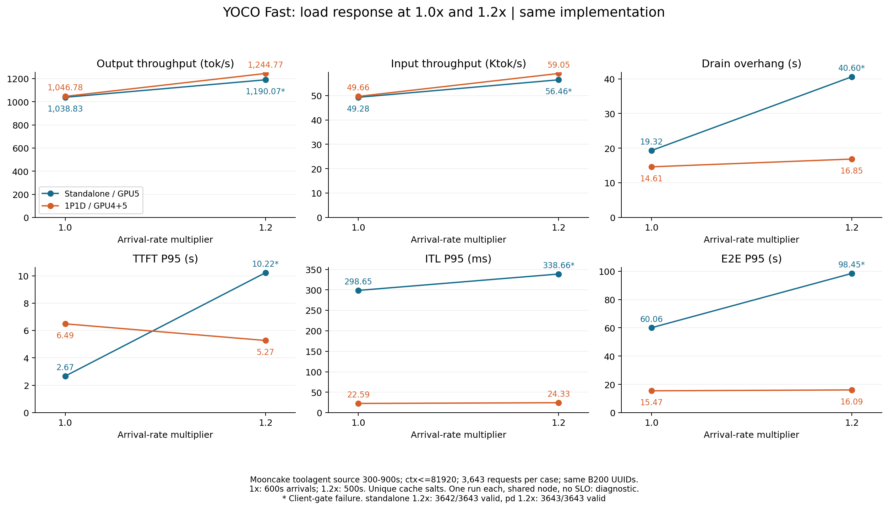
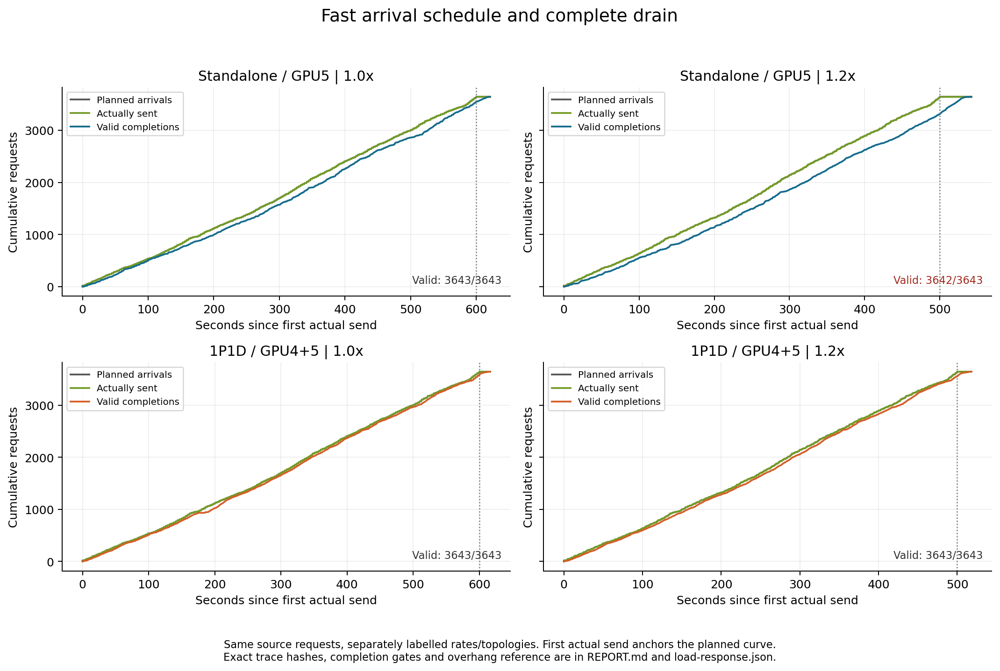

# Fast Mooncake 1.2× 负载响应报告

测量日期：2026-09-08 UTC。这里的FASTER指当前 `--fast` 实现。按用户要求，保留同一开源trace的ISL、OSL、顺序、hash_ids和服务配置，将到达速率从1×提高到1.2×，串行重测Fast单卡和1P1D。

## 结果

**单卡本轮未全通过：3642/3643完成，1次连接重置；失败记录保留。** 下面的单卡吞吐和延迟来自该不完整运行的成功请求，不能当作无错误容量。

- **单卡**：输出吞吐 1038.83 → **1190.07 tok/s**（+14.56%）。相对理想1.2倍吞吐，达到 95.47%。TTFT / ITL / E2E P95分别变化 +282.59% / +13.40% / +63.92%。
- **1P1D**：输出吞吐 1046.78 → **1244.77 tok/s**（+18.91%）。相对理想1.2倍吞吐，达到 99.10%。TTFT / ITL / E2E P95分别变化 -18.73% / +7.72% / +4.06%。

这是**同一实现的负载响应**：输入压力增加20%，实现和kernel没有修改。吞吐按完整请求完成区间计算，包含排空；不能把吞吐随负载增加称为一次kernel优化收益。1.2×单独建表，Qwen3和Align尚未测量1.2×。

共享节点、每拓扑一次、约500秒到达、未声明延迟SLO，结果均为**diagnostic**；请求完成与技术审计通过不能当作持续容量验收。

| 拓扑 | 速率 | 完成/计划 | 错误 | offered req/s | achieved req/s | 输入tok/s | 输出tok/s | 输出tok/s/活动GPU | 排空overhang s |
| --- | ---: | ---: | ---: | ---: | ---: | ---: | ---: | ---: | ---: |
| 单卡 | 1.0× | 3643/3643 | 0 | 6.072 | 5.882 | 49282.60 | 1038.83 | 1038.83 | 19.317 |
| 1P1D | 1.0× | 3643/3643 | 0 | 6.072 | 5.927 | 49659.82 | 1046.78 | 523.39 | 14.613 |
| 单卡 | 1.2× | 3642/3643 | 1 | 7.286 | 6.737 | 56456.67 | 1190.07 | 1190.07 | 40.598 |
| 1P1D | 1.2× | 3643/3643 | 0 | 7.286 | 7.048 | 59052.91 | 1244.77 | 622.39 | 16.849 |

单卡使用1张GPU，1P1D使用2张GPU；Pod共保留4张卡。overhang以“首个实际发送时间＋trace到达跨度”为参照，完整统计最后请求完成；控制用的P/D收尾请求在计时结束后。实际时间区间见[load-response.json](load-response.json)。

## 延迟与调度

下表延迟均为ms，采用AIPerf成功请求统计；ITL为每请求平均token间隔的分布。失败请求单独保留，不混入成功延迟分位数。

| 拓扑 | 速率 | TTFT P50 / P95 / P99 | ITL P50 / P95 / P99 | E2E P50 / P95 / P99 | 迟发P99 ms | 最大并发 |
| --- | ---: | --- | --- | --- | ---: | ---: |
| 单卡 | 1.0× | 1537.71 / 2671.78 / 3319.27 | 80.50 / 298.65 / 477.42 | 4474.13 / 60059.99 / 86883.30 | 9.59 | 211/512 |
| 1P1D | 1.0× | 2153.75 / 6489.54 / 12824.23 | 18.17 / 22.59 / 25.72 | 3578.15 / 15467.13 / 24001.89 | 13.35 | 115/512 |
| 单卡 | 1.2× | 2108.62 / 10222.08 / 13205.80 | 154.90 / 338.66 / 510.49 | 9327.97 / 98452.09 / 138930.19 | 10.07 | 362/512 |
| 1P1D | 1.2× | 2598.97 / 5274.00 / 6247.28 | 20.30 / 24.33 / 25.97 | 4368.54 / 16094.88 / 22738.76 | 7.86 | 108/512 |

## 队列、缓存和传输

| 拓扑 | 速率 | server最大等待队列 | 本地prefix命中率 | P传输P95 ms | P传输总GiB |
| --- | ---: | --- | --- | ---: | ---: |
| 单卡 | 1.0× | standalone=23 | standalone=37.45% | — | — |
| 1P1D | 1.0× | p=81, d=91 | p=0.00%, d=0.49% | 18.884 | 328.404 |
| 单卡 | 1.2× | standalone=99 | standalone=37.42% | — | — |
| 1P1D | 1.2× | p=37, d=59 | p=0.00%, d=0.47% | 22.062 | 328.459 |

1P1D按同一源时间段比较TTFT P95（ms）；1.2×每段真实持续约83.3秒，1×约100秒。

| 源时间段 s | 请求数 | 1× TTFT P95 | 1.2× TTFT P95 |
| --- | ---: | ---: | ---: |
| 300–400 | 536 | 2953.50 | 3187.66 |
| 400–500 | 573 | 13366.94 | 5108.01 |
| 500–600 | 575 | 5555.90 | 4515.46 |
| 600–700 | 719 | 3795.95 | 5272.76 |
| 700–800 | 591 | 3850.18 | 5163.32 |
| 800–900 | 649 | 4138.36 | 6035.28 |

不同负载和不同测量时段都会改变队列与延迟，不能据此隔离上轮局部停顿的kernel原因。P与D的计时可能重叠，不可直接相加。各角色平均计时、队列峰值和全节点GPU利用率见JSON；源时间分段明细见[source-time-latency.csv](source-time-latency.csv)。

## 审计

| 拓扑 | client | token | server | transfer | drain | schedule degraded | 最大metrics gap s |
| --- | --- | --- | --- | --- | --- | ---: | ---: |
| 单卡 | FAIL | FAIL | PASS | PASS | PASS | 0 | 1.254 |
| 1P1D | PASS | PASS | PASS | PASS | PASS | 0 | 1.263 |

单卡失败发生于2026-09-08 09:28:31.320 UTC，trace第1896号请求（0起始，ISL904、OSL10）。复用连接后3.647ms内发生ClientOSError(104, Connection reset by peer)，未收到HTTP响应；不是已观测到的HTTP4xx/5xx状态。通用审计中的bad_http=1包含这种缺少2xx响应的情况。

成功请求OSL全部匹配；失败请求缺少token计数，因此完整token-accounting为FAIL。未插入重试、未删除该记录。服务日志未见对应异常，metrics连续且已排空。连接复用时序、服务连接处理和主机干扰仍需单独实验区分，当前证据不能确定根因，也不能把它归因于GEMM或GPU计算。详见[TRANSPORT_FAILURE.json](TRANSPORT_FAILURE.json)。

1P1D整体TTFT P95的下降受上轮异常中段影响：源400–500秒TTFT P95为13.37→5.11秒；源600–900秒三个时段则由3.80/3.85/4.14秒升到5.27/5.16/6.04秒。多数正常时段随压力增加变慢，不能用总体P95下降推导出“负载越大计算越快”。

实际输入token计数存在合成/tokenization的细微变化：单卡和1P1D均有19个成功请求相较1×相差1个输入token，仍位于原有ISL+1/+2计数范围；没有宣称两倍率的合成prompt逐token相同。1P1D实际输入总数30,522,126→30,522,125，相差1个token；单卡另缺失连接失败请求的计数。输出长度对所有成功请求完全匹配。详见[TOKEN_REALIZATION.json](TOKEN_REALIZATION.json)及逐条TOKEN_DELTA；吞吐使用实际server token计数。

两拓扑均先运行4组功能探针和50请求smoke，之后完整回放并排空。单卡与1P1D探针输出token相同 4/4；相同token探针中的selected-token log-prob最大差为 0.1240386813879013。这是有限功能检查；Fast不提供bitwise保证，也不是完整模型质量评测。

本轮2个正式case全部保留了原始请求记录、HTTP trace、客户端与服务日志、逐条token计数和GPU遥测。最终源码/AIPerf、模型metadata及JSON哈希、GPU Xid/ECC、PID7和Pod身份审计见[VERIFICATION.json](VERIFICATION.json)及[FINAL_AUDIT.json](FINAL_AUDIT.json)。权重文件核对大小和mtime，未重新哈希全部权重。

## 冻结条件与可复现性

- 数据：Mooncake FAST’25 `toolagent_trace.jsonl`，源23608请求；上下文81920过滤后保留23492（99.51%）。固定源时间300–900秒内3643请求，30,518,473输入、643,375输出token。此公开trace只包含长度、到达时间和hash前缀关系，客户端合成输入。
- 1.2×：离线将同一批请求的相对时间戳除以1.2，顺序、ISL、OSL、hash_ids逐条核验不变；实际到达跨度499.999166667秒，offered约7.286req/s、61,037.05输入tok/s、1,286.75输出tok/s。AIPerf CLI `--synthesis-speedup-ratio 1.0`。
- 1× trace SHA256：`680e526d49545258c0ca5b635d0004a44cce2ce990d533ac32024cefee1f0170`。
- 1.2× trace SHA256：`5317e2301656c7d5441bbd63e58b7e8b9d3d445e0118729cd7fde0b8717b960c`。
- 源trace SHA256：`48a2db1a13d3bc05e6330140c64f604ba366df20d3c9e128b5c35a01c1fa5f71`。
- 本轮源码提交`8c74b459542ff6b03cab9f355daabc47e80990b5`；1×冻结源码提交`416b83d83504af902b8da248452a19cc5d56b5db`。2,303个服务源码与3,662个runtime文件字节相同；提交差异仅来自此前的文档与表维护。详见[COMPARABILITY.json](COMPARABILITY.json)。
- B200同物理卡：单卡GPU5，UUID `GPU-14379c29-e601-fc6d-b27c-4fd778ab772a`；1P1D的P为GPU4，UUID `GPU-4e279853-e2ff-de3e-70a8-d3623fd038b3`，D为GPU5。节点`slc01-cl02-hgx-0228`。其他GPU有独立工作负载，不能排除共享节点干扰。
- 模型：`/mnt/pvc/lidong1/exp/agens/30A3B-180M-L3/0000-28000-hf`，BF16、TP1/DP1、memory0.85、maxseq256、maxlen81920；单卡/P token budget32768，D8192。
- FA4、FULL_AND_PIECEWISE，capture `[1,2,4,8,16,32,64,128,256]`；prefix cache、chunked prefill、YOCO KV sharing。CLI MoE backend仍为triton，实际Fast按角色选择CUTLASS路径：单卡M≥1024，P/D为BF16 MoE，D autotune。无外部autotune cache和Align profile。
- P/D：Mooncake RDMA、16 workers、KV加载失败即失败；端口8694/8695、proxy8696、bootstrap8999。客户端AIPerf0.12.0、fixed schedule/auto-offset、streaming completions、server token counts、32workers、1record processor、512并发上限、600秒超时、seed42，每case独立非空cache_salt。
- 运行时：Torch2.11.0a0+eb65b36914.nv26.02、CUDA13.1、Triton3.8.0、Transformers4.57.6、FlashInfer0.6.8.post1。完整参数、salt和UTC时间见各case的manifest。

## 文件与维护

[1.2×持续表](../THROUGHPUT_F1P2.md) · [原1×表](../THROUGHPUT.md) · [CSV](load-response.csv) · [原始统计JSON](load-response.json) · [计划](PLAN.md)。

图表可由同目录的`plot_load_response.py`及CSV/JSON重建；保留PNG和SVG。完整运行证据落盘到本地同名`yoco_results`目录，并归档到PVC `/mnt/pvc/lidong1/fast-mooncake-f1p2-20260908/results.tar`；归档哈希记录在归档旁的`BACKUP.json`。

两仓库`fhb-dev-9-8`同步此报告与独立1.2×表；训练代码未修改，训练吞吐未重测。Job/Pod、PID7和4卡allocation保留，本轮拥有的服务子进程在审计排空后停止。
