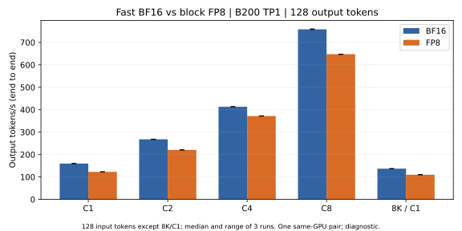
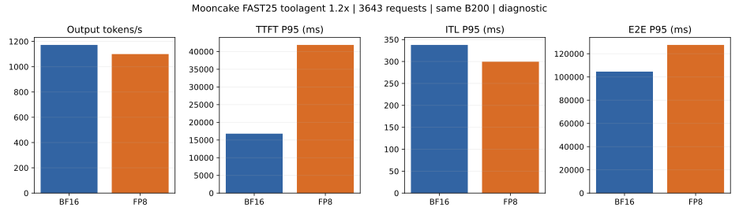

# Fast FP8 与 BF16 性能对照（2026-09-09）

**本轮结果：FP8 的低并发吞吐比 BF16 低约 10%–23%；Mooncake 1.2× 回放的观测输出吞吐低 6.18%。BF16 通过客户端调度门槛，FP8 达到 512 并发上限并出现调度退化，所以回放数值按诊断结果解读。**

同一份 `fhb-dev-9-8` 源码快照、YOCO 30A3B-180M-L3 step 28000、同一物理 B200 GPU2、TP1/DP1 standalone。两者均为 Fast；FP8 使用已完成有限性验证的在线 block-128 W8A8/UE8M0 路径。

本轮仅测量，不修改推理实现。不同精度采用各自默认 Fast 后端，结果包含 GEMM、量化、融合、调度与缓存的共同影响。

后续源码与已有 GPU profile 审计确认了小 M 分派、padding 量化和融合方面的性能缺口，见[性能原因审计](AUDIT.md)。该审计没有新增吞吐测量，也不把各项直接归因为已测差距。

## 低并发

每档 2 次预热、3 次计时，吞吐取中位数。均输出 128 tokens，每次独立 cache salt，吞吐为总输出 token / 完整请求墙钟时间。

| 输入 / 输出 | 并发 | BF16 tok/s | FP8 tok/s | FP8 / BF16 | 吞吐变化 |
| --- | ---: | ---: | ---: | ---: | ---: |
| 128 / 128 | 1 | 159.72 | 122.86 | 0.769× | -23.08% |
| 128 / 128 | 2 | 268.00 | 220.64 | 0.823× | -17.67% |
| 128 / 128 | 4 | 412.96 | 371.75 | 0.900× | -9.98% |
| 128 / 128 | 8 | 758.49 | 647.53 | 0.854× | -14.63% |
| 8192 / 128 | 1 | 137.23 | 110.20 | 0.803× | -19.70% |

| 条件 | BF16 TTFT / TPOT / E2E ms | FP8 TTFT / TPOT / E2E ms |
| --- | ---: | ---: |
| ISL128 C1 | 36.74 / 6.02 / 800.99 | 40.01 / 7.88 / 1041.32 |
| ISL128 C2 | 54.81 / 7.06 / 951.60 | 55.83 / 8.66 / 1155.87 |
| ISL128 C4 | 110.09 / 8.88 / 1237.86 | 139.36 / 9.73 / 1374.10 |
| ISL128 C8 | 122.67 / 9.64 / 1346.92 | 145.72 / 11.29 / 1579.28 |
| ISL8192 C1 | 154.44 / 6.11 / 929.57 | 153.10 / 7.91 / 1158.09 |

TTFT/TPOT 来自流式 choice 事件，TPOT 按首末事件之间的时间除以输出 token 数减一；不是单 kernel 时延。原始数据保留首次可见文本时间和各请求用量。

## Mooncake 1.2×

使用 FAST’25 toolagent 源 300–900 秒窗口，按上下文 81920 过滤，时间戳离线加速 1.2×。同一冻结文件 3643 请求、643375 输出 tokens、约 500 秒到达窗口；保留长度与 hash_ids 前缀关系。AIPerf 0.12.0，completions、streaming、server token counts、concurrency ceiling 512、workers-max 32、seed 42。公开 trace 是合成回放，不含真实提示词或任务答案。

全量源 23608 行，上下文过滤保留 23492 行（99.51%）；当前窗口 3643 行，占源总量 15.43%。

冻结 trace SHA256：`5317e2301656c7d5441bbd63e58b7e8b9d3d445e0118729cd7fde0b8717b960c`。Offered load：7.286 请求/s、61037.05 输入 tok/s、1286.75 输出 tok/s。

| 精度 | 输出 tok/s | 输入 tok/s | 请求/s | TTFT P95 ms | ITL P95 ms | E2E P95 ms | 成功 / 计划 | 客户端门槛 |
| --- | ---: | ---: | ---: | ---: | ---: | ---: | ---: | --- |
| BF16 | 1172.28 | 55613.80 | 6.638 | 16790.23 | 337.75 | 104585.34 | 3643/3643 | PASS |
| FP8 | 1099.78 | 52174.19 | 6.227 | 41866.89 | 299.52 | 127574.19 | 3643/3643 | FAIL（诊断） |

FP8/BF16 输出吞吐为 **0.938×**（-6.18%）。该吞吐包括完成全部请求所需的排空时间。FP8 的调度退化改变了实际发送时间表，0.938×仅用于描述这次带并发上限的回放。

| 指标 | BF16 P50 / P95 / P99 ms | FP8 P50 / P95 / P99 ms |
| --- | ---: | ---: |
| TTFT | 2417.12 / 16790.23 / 19662.69 | 2336.52 / 41866.89 / 43515.04 |
| ITL | 160.93 / 337.75 / 498.02 | 159.51 / 299.52 / 497.83 |
| E2E | 14415.33 / 104585.34 / 146677.51 | 24034.11 / 127574.19 / 174764.53 |

| 审计项 | BF16 | FP8 |
| --- | --- | --- |
| 采用 case | bf16-full-b | fp8-full-b |
| 实际开始 UTC | 2026-09-09T10:19:08.013415+00:00 | 2026-09-09T10:47:36.295786+00:00 |
| 调度 lag P99 ms | 5.080202239999996 | 6462.3809484799995 |
| 调度退化 | 0.0 | 1.0 |
| 最大有效并发 | 405.0 | 512.0 |
| 排空尾部 s（首个实际发送 + 到达窗口之后） | 48.80795556386312 | 84.98953181584676 |
| 服务端 prefix cache hit fraction | 0.3729690511391327 | 0.3785943475429709 |
| 服务端 running/waiting 峰值 | {'vllm:num_requests_running': 256.0, 'vllm:num_requests_waiting': 141.0} | {'vllm:num_requests_running': 256.0, 'vllm:num_requests_waiting': 260.0} |
| 节点上其他忙碌 GPU | [0, 1, 5] | [0, 1, 5] |
| 指标连续性审计 | {'standalone': {'scrape_errors': 0, 'max_gap_seconds': 1.2353980541229248, 'counter_resets': []}} | {'standalone': {'scrape_errors': 0, 'max_gap_seconds': 1.3013451099395752, 'counter_resets': []}} |

## 验证与条件

每种精度在计时前后检查 ISL128、8192、79150 和 batch8 的有限 log-prob；计时请求不额外索取 log-probs。50 请求 smoke、服务端 token 数、错误、队列排空、GPU ECC/Xid、源码 hash 和软件版本分别保留。

首次完整回放若触发 JIT 或产生新 kernel cache 项，保留为预热记录再回放。case 选择依据编译审计，不按最快成绩挑选。

共享节点、单次同卡配对，没有预设延迟 SLO，约 500 秒到达窗口：本轮是端到端诊断，不作最大容量或单 kernel 加速声明。固定 offered rate 也限制了回放吞吐的上限。

服务参数：maxlen81920、maxseq256、max batched tokens32768、memory utilization0.85、FA4、KV sharing、prefix caching、chunked prefill、FULL_AND_PIECEWISE；capture sizes1/2/4/8/16/32/64/128/256。两者 KV cache 与 hidden dtype 均 BF16。

| 实际配置 | BF16 | FP8 |
| --- | --- | --- |
| MoE kernel wrapper | ['FlashInferExperts'] | ['TritonOrDeepGemmExperts'] |
| 模型加载阶段 GiB | 61.04 | 32.07 |
| KV cache tokens | 1,608,309 | 2,170,169 |
| 有效 custom ops | ['none'] | ['+quant_fp8', 'none'] |

两端逐请求实际 token 计数差异：0 项。完整差异列表保留在 comparison.json；AIPerf 合成文本重编码的输入长度容差为 ±2，输出数要求完全匹配。

模型 JSON/Python 文件有内容 hash，权重只核对文件大小和修改时间，没有全量重哈希。客户端 tokenizer/Mooncake 源码 hash、原始命令、所有预热/失败/计时 case 与采样检查都随归档保存。

原始执行目录：`/data/fast-fp8-vs-bf16-20260909`。本地证据：`/home/lidong1/vllm_test/yoco_results/fast-fp8-vs-bf16-20260909`。本轮保留最终 FP8 服务与 B200 Job，切换只作用于本轮创建的服务进程。

[机器可读结果](comparison.json) · [低并发 CSV](low-concurrency.csv) · [回放 CSV](trace.csv)

原始归档保存在本地和 PVC，位置与 SHA256 见 [BACKUP.json](BACKUP.json)；267 个文件的 hash 已在本地逐项验证。完整日志使用计时结束后的冻结副本，最终 FP8 服务保持运行。
