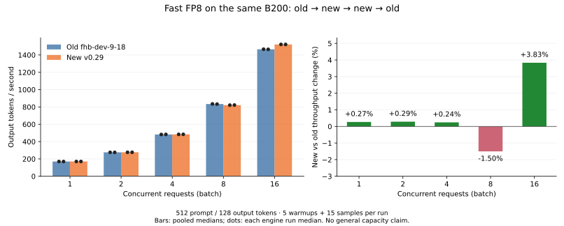

# 推送后的 Align 与 Fast FP8 验证

验证对象为 `vllm-yoco-version-0.29` 的 `f73fa58b1f4d617067bd56a1ce2c3f5ac64998bf`。
该提交已推送到 `buaahsh/vllm` 同名分支。本轮使用此前保留的一张 B200，
不改 checkpoint、训练源码或模型数值实现。

结果：Align 在本轮矩阵内保持字节对齐；Fast FP8 的 B8 吞吐下降 1.50%，
B1/B2/B4 接近持平，B16 提升 3.83%。B8 的小幅回退在两次独立候选运行中均出现。

## Align 数值结果

本轮已测范围内保持字节对齐。

| 检查 | 结果 |
| --- | --- |
| Eager：缓存、混合批次、实际 API 概率核对 | 109 项通过 |
| CUDA Graph：相同矩阵 | 109 项通过 |
| Eager 与 Graph 完整输出张量逐项比较 | 174 项全部字节一致 |
| llm-train 单条 / packed 训练前向与 CE | 72 项全部字节一致 |

输入长度为 15/16/17/31/32/33/129/512/2048，每条连续生成 8 token。
每个长度分别检查清空前缀缓存后的 cold 和重复输入的 hit。
混合批次覆盖 B2/B4/B8，目标请求放在首部、中部和尾部，其他请求使用不同长度。
运行设置为 BF16、TP1、Align、FA2、APC、fast prefill 和同步调度。

观察器复制实际 sampler 所见的 hidden、原始完整 logits 及输入位置，不替换前向计算。
完整 log-prob 由服务已启用的 Align 概率算子计算，并逐位置核对实际 API 返回的
选中 token log-prob。只匹配准确的 request ID 与生成位置，不把中间 prefill 调用
或未返回的 logits 行当作服务输出。字节比较同时检查 dtype、shape 和有限值。

Graph profile 记录到 7 次实际 `cudaGraphLaunch`，包含混合 prefill/decode
和请求完成后的批次缩减；完整输出与 eager 对照也通过，图捕获配置不是唯一证据。

训练侧使用 `llm-train-align-gemm-20260906` 的 `57e39884` 源码和同一 step28000
的 merged checkpoint，分别检查单条与两条干扰序列之间的 packed 输入。
模型处于 `train()` 模式且开启梯度，逐字节比较 8 个生成位置的 hidden、logits、
全量 log-prob，以及训练 CE 与服务负 log-prob。辅助 MTP 权重按既有加载合同忽略。
本轮运行真实训练 Model 和 NNScaler 注册代码，未运行 NNScaler 编译训练、反向或优化器更新。

训练验证环境复用当前 Torch。Align 前向调用真实 vLLM FA2；未安装的独立
FlashAttention 非 Align / backward 入口仅提供调用即报错的导入占位，实测没有调用。
单 rank ring 包装的参数兼容沿用既有验证方式。首轮验证脚本在模型权重加载前因
占位模块缺少 Python `__spec__` 被依赖检测拒绝；修复脚本后完整重跑，失败日志保留。

## Fast FP8 对照设计

基线为迁移前 `fhb-dev-9-18` 的 `e8cb46cf64`，候选为上述已推送提交。
两版使用同一 B200、当前 Docker/Torch 与原生 DeepGEMM，分别准备各自源码对应的
C++ 扩展和 FA4 Python 实现。基线保留原运行环境中的 FA4 兼容 helper。
基线基准脚本仅补充来源记录，不改变输入、配置或计时边界。

旧 FA4 使用原环境的 Cutlass DSL 4.5.1 / Quack 0.4.1，候选使用当前环境的
4.6.2 / 0.6.4。两版 Torch 固定为 `2.13.0+cu130`、Triton 为 `3.7.1`，
每轮启动前核对实际版本。旧版本额外的 GGUF 依赖仅安装在独立基线环境。
两版分别使用与各自源码匹配的 FA4 实现和依赖。

使用 A（旧）→ B（新）→ B（新）→ A（旧）的独立引擎顺序。
每档输入 512 token、固定输出 128 token，B1/B2/B4/B8/B16，5 次预热后测量 15 次。
模型加载、图捕获、预热和整批入队不计时；从恢复 scheduler 到取回全部输出计时。
逐项保存实际专家后端、权重/KV dtype、原生库哈希、缓存命中和生成 token。

## Fast FP8 实测结果

每种版本、每个 batch 共 30 个计时样本，以下为合并样本耗时中位数换算的总输出吞吐。
所有四轮正常完成，使用同一 GPU UUID 和原生 DeepGEMM `_C` 哈希；
20 组专家均为 `TritonOrDeepGemmExperts`、小 M 阈值 16，40 个 latent 投影均为 FP8。
FA4 的固定 K/V scale 均为 1，所有计时请求命中 496/512 输入 token，并生成 128 token。

| Batch | 旧版 tok/s | 新版 tok/s | 变化 |
| ---: | ---: | ---: | ---: |
| 1 | 170.37 | 170.83 | +0.27% |
| 2 | 276.19 | 276.98 | +0.29% |
| 4 | 482.45 | 483.63 | +0.24% |
| 8 | 833.70 | 821.18 | **−1.50%** |
| 16 | 1465.28 | 1521.47 | +3.83% |

B8 的旧版两轮分别为 835.10 / 833.03 tok/s，新版为 820.66 / 821.98 tok/s。
两次候选均低于两次基线；各版本自身两轮差异小于 0.25%，所以本轮观察到稳定的
小幅回退。当前证据不能将这项差异单独归因于 Runner、FA4 或某个算子。
B1/B2/B4 的约 0.2%–0.3% 差异很小，按接近持平解读。

Fast 两版记录的生成轨迹存在差异。上述结果反映相同提示词、固定输出长度的完整
请求性能，每一步的实际 token 和路由可能不同；它不证明 Fast 的数值或模型质量一致。
该差异与前面的 Align 字节对齐结论分别适用。

[验证索引与逐次计时](validation/release-validation-20260916.json)保留各轮中位数、
全部 300 个计时样本、输出指纹及源码/依赖记录。
[CSV](figures/release-fp8-abba-20260916.csv)和[PNG](figures/release-fp8-abba-20260916.png)
可用于后续对照。

## 来源与证据

工作区原始记录位于 `work/yoco-release-validation-20260916/`。
该目录保留请求 JSON、控制器终态、源码/构建记录、失败尝试、原始张量、profile
以及每次计时数据。训练源码哈希在 `training-source-manifest.json`；
跨模式检查在 `align-eager-graph-comparison.json`。

收尾时已用被验证的候选源码恢复 `release-verified-debug-r1` 调试服务。
同一单卡 B200 holder 保留，`127.0.0.1:18888` 健康检查和 8-token 真实生成通过，
运行/等待队列归零。后续操作前仍需复查当前控制器与服务状态。

本轮是单卡、指定 checkpoint 和输入范围的验证。历史报告中的其他 Torch/CUDA
环境、长上下文、P/D 或多卡结论不由本轮自动扩大。两版共享本轮 Torch/Triton
和 Docker 原生 DeepGEMM，FA4 依赖按各自源码版本设置；本轮对照与旧 Docker
环境的绝对速度测量分开解读。

基线准备期间的失败尝试均保留：缺少 GGUF；旧 FA4 与新 DSL 的 `ThrMma` 接口不兼容；
一次依赖解析把独立基线环境升级到 Torch 2.14/Triton 3.8，随即停止并隔离该环境。
随后用 `--no-deps` 安装已核对版本，实际导入检查确认恢复 Torch 2.13/Triton 3.7.1，
旧版 smoke 通过后才开始上述四轮正式计时。
